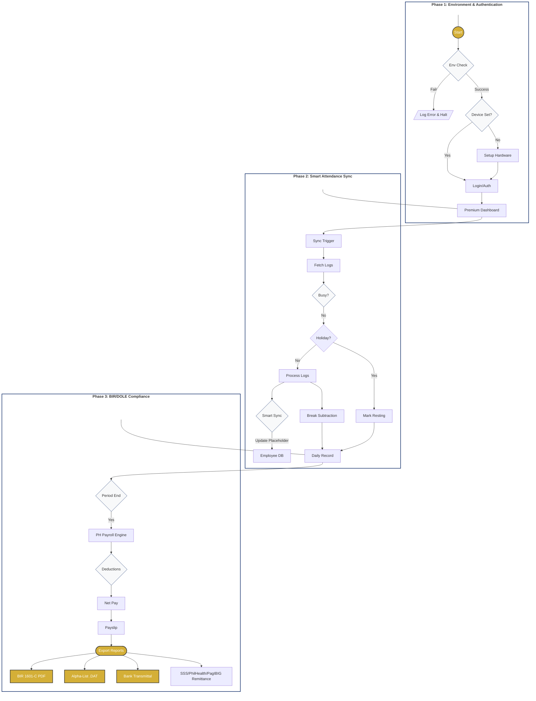
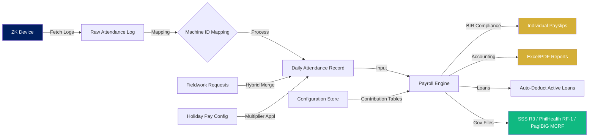
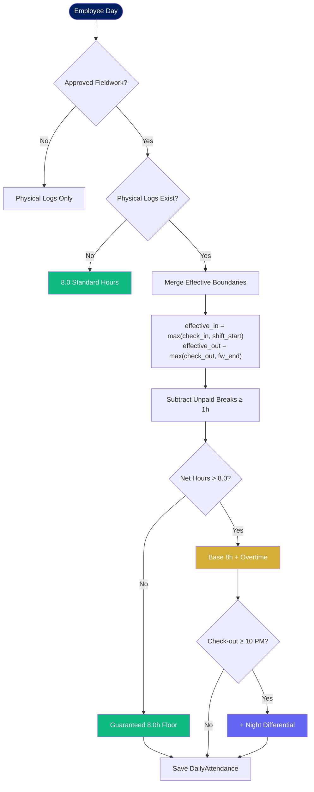
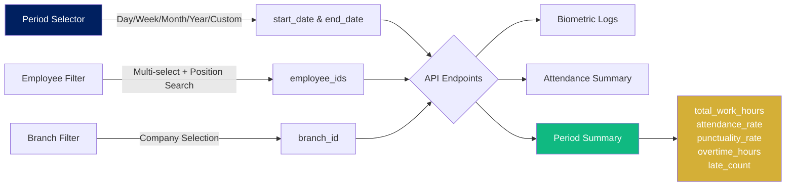
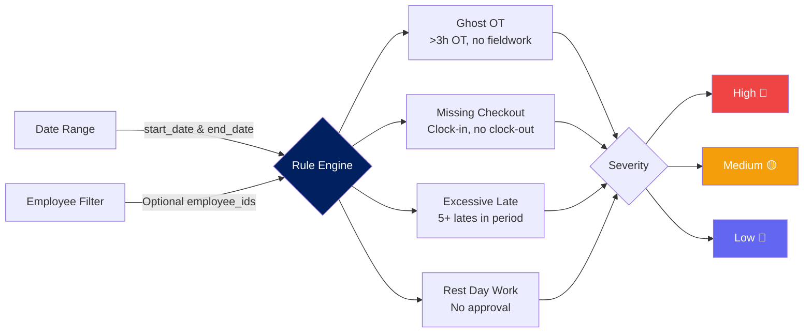
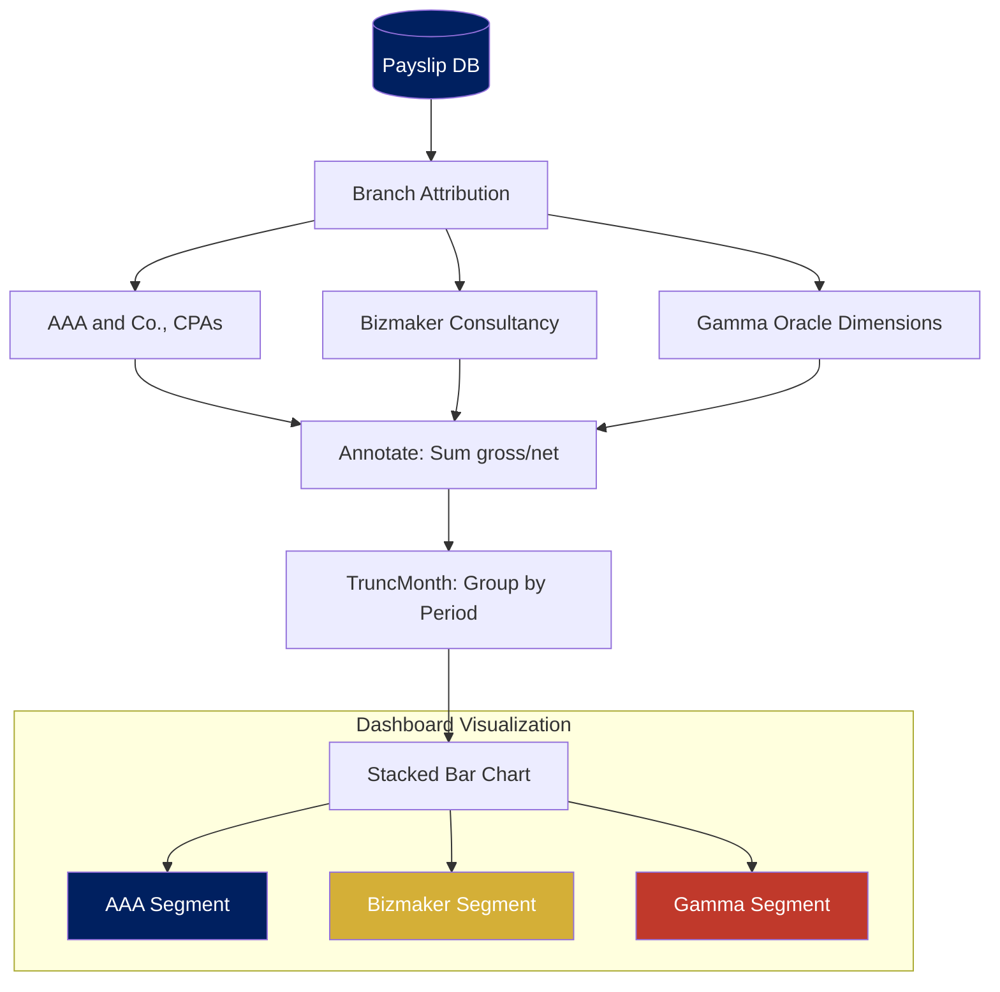
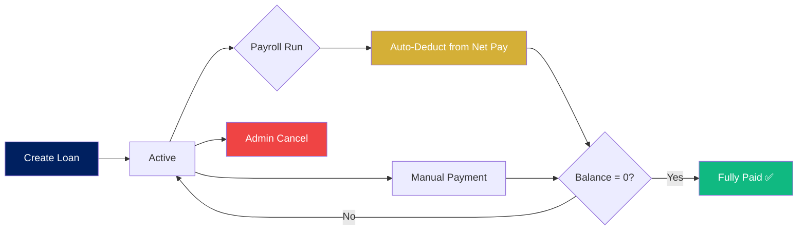
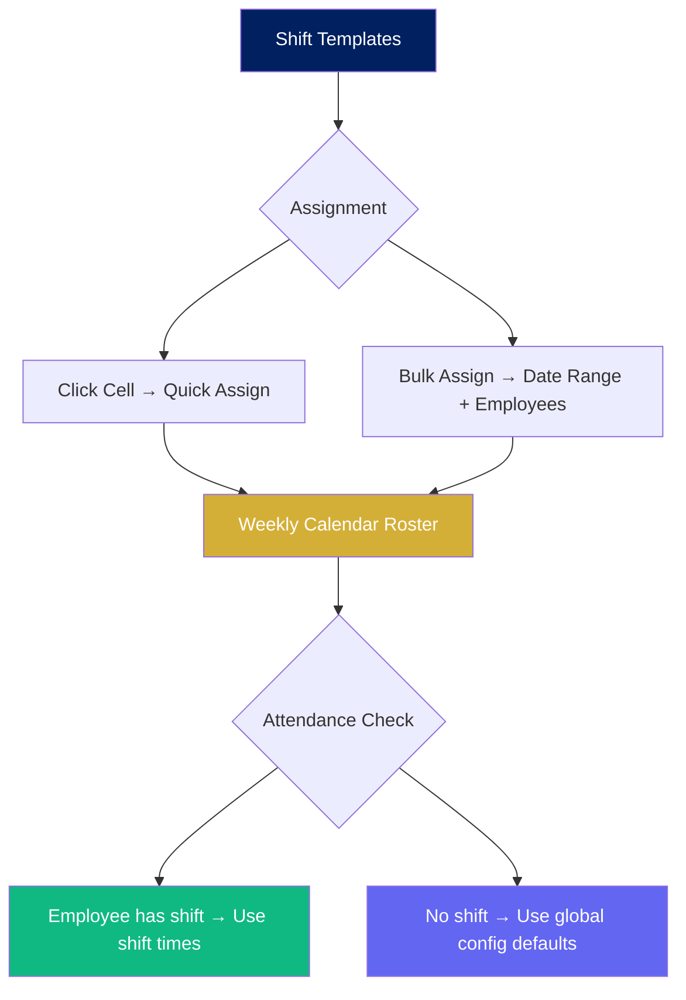
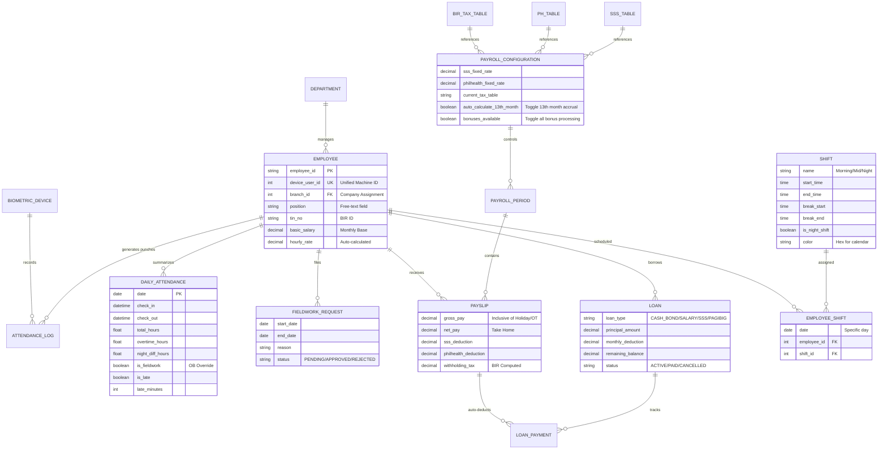
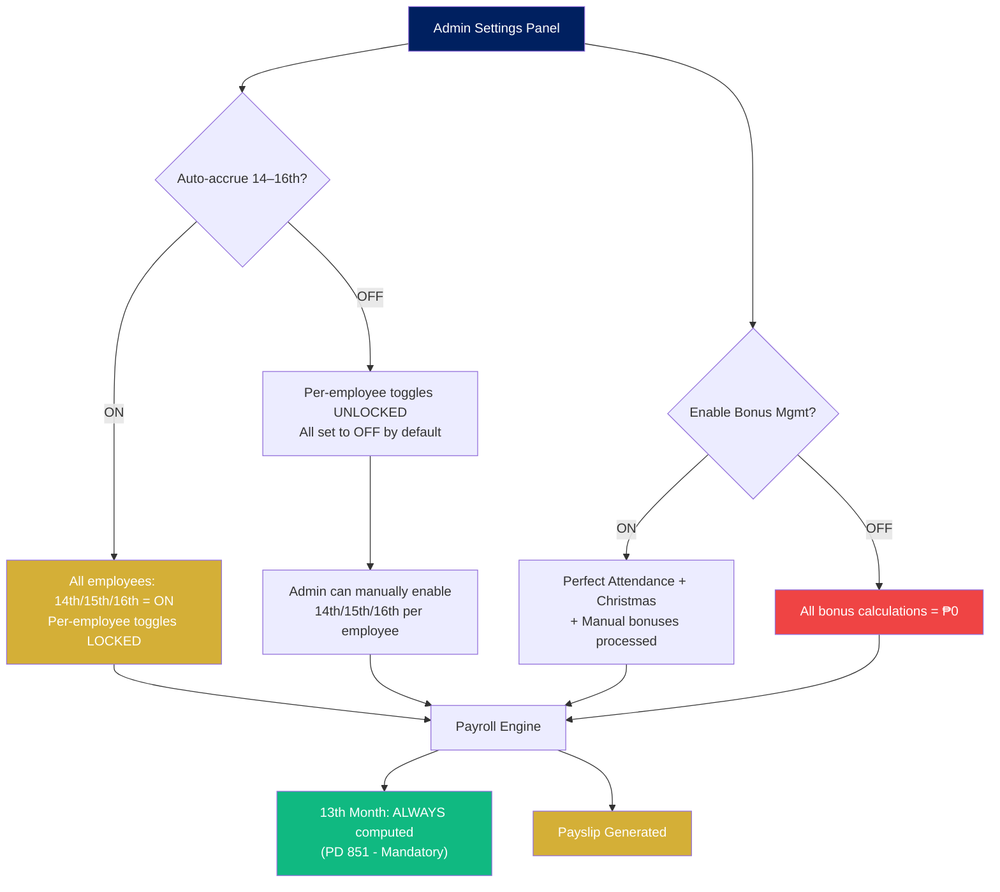

# BizMaker Payroll System

A comprehensive payroll management system designed for Philippine businesses, supporting ZKTeco biometric device integration, automated holiday pay calculations, loan tracking, shift scheduling, anomaly detection, and secured REST APIs.

## Project Overview

BizMaker Payroll is a full-stack application that synchronizes attendance data from biometric hardware to a centralized database, processes payroll according to Philippine labor laws (DOLE/BIR), and provides a modern web interface for administrative management.

## System Lifecycle Flowchart



## System Processes

### Attendance & Payroll Flow


### Fieldwork & Physical Attendance Overlap


### Attendance Analytics Pipeline


### Anomaly Detection Pipeline


### Labor Cost Aggregation (Stacked Analysis)


### Loan Lifecycle


### Shift Scheduling Flow


## Database Schema (ERD)



## Technical Stack

### Backend
- Framework: Django 5.2 (Python 3.12+)
- API: Django REST Framework (DRF)
- Authentication: JWT with Secure Blob Storage
- Reports: fpdf2 (Official PDF Generation)
- Database: PostgreSQL / SQLite
- Integration: PyZK for Biometric Devices

### Frontend
- Framework: Vue 3 (Composition API)
- UI Library: Element Plus (Premium Glassmorphism)
- Charts: ApexCharts (Vibrant Gradients)
- State Management: Pinia
- Icons: Element Plus Icons, Dicebear (Avatars)
- Utilities: Axios, Dayjs

## Core Features

### 1. Philippine Payroll Compliance
- **Semi-Monthly Processing**: Native support for 15-day pay cycles with period-specific financial summaries.
- **Official BIR Reporting**: 
  - **BIR Form 1601-C (PDF)**: Professional PDF summaries for monthly remittance.
  - **Annual Alpha-List (.DAT)**: Mandatory BIR-compliant file format for validation modules.
- **Bank Transmittal (CSV)**: Grouped salary disbursement files with period identifiers.
- **Holiday Pay Matrix**: Automated Regular (200%), Special (130%), and Rest Day premiums.
- **Government Tables**: Automated SSS, PhilHealth, and Pag-IBIG deduction rules.
- **Admin Configuration Toggles**:
  - **Auto-accrue 14th–16th Month Pay**: 13th month is always computed (mandatory under PD 851). When toggled ON, all employees automatically receive 14th–16th month accrual and per-employee switches are locked. When OFF, admins can manually enable 14th–16th month per employee.
  - **Enable Bonus Management**: When enabled, Perfect Attendance, Christmas, and manual bonuses are included in payroll processing. Disable to zero out all bonus calculations.

#### Admin Config Toggle Flow


### 2. Smart Biometric Integration
- **"Smart Sync" Profiling**: Automatically updates "Unknown" employee profiles with data from biometric logs, enriching the database on the fly.
- **Break Time Manager**: Global break intervals (e.g., 12:00-13:00) automatically subtracted from work hours if overlapped.
- **Real-time Monitoring**: Instant dashboard updates as employees punch in/out.
- **Hardware Protection**: Prevents "Device Busy" errors when external software (ZKAccess) is connected.

### 3. Advanced Attendance Analytics
- **Unified Period Picker**: Single selector with Day, Week, Month, Year, and Custom Range options. All selections are converted into `start_date` and `end_date` for unified backend filtering.
- **Branch-Level Organization**: A new dedicated Branch Filter allows admins to "sort" all attendance data by company (`AAA and Co., CPAs`, `Bizmaker Consultancy, Inc.`, or `Gamma Oracle Dimensions Inc.`), instantly updating logs and summaries.
- **Multi-Select Employee Filter**: Searchable dropdown supporting filtering by employee name or position. Select multiple employees to generate custom group analytics.
- **Period Summary Dashboard**: Aggregated metrics including total work hours, attendance rate, punctuality rate, overtime, late counts, and undertime — all dynamically scoped to the selected period.
- **Real-Time Period Capping**: If the selected month or year hasn't ended, the backend caps expected workdays to today's date, preventing inflated absence counts. A brief notification informs the admin that figures are still updating.
- **Dynamic Dashboard KPIs**: The "Logs" stat card on the main dashboard dynamically updates its label and count based on the selected trend period (Today/This Week/This Month/This Year).

### 4. Fieldwork & Hybrid Attendance
- **Admin-Controlled Approval**: All fieldwork requests default to `PENDING` status and require explicit admin approval, even if the admin initiated the request.
- **Guaranteed 8-Hour Baseline**: Approved fieldwork guarantees a minimum of 8.0 standard work hours for the day.
- **Custom Request Durations**: Admins can specify custom start/end times per fieldwork request, overriding standard shift windows for granular project-based tracking.
- **Hybrid Overlap Processing**: If an employee clocks into the biometric device on a fieldwork day, the engine merges the two timelines by unioning the shift boundaries (`max(check_in, shift_start)` to `max(check_out, fw_end)`), preventing double-counting while capturing all extended work.
- **Overtime on Extended Days**: Physical presence beyond the standard 8-hour threshold on a fieldwork day correctly generates overtime hours.
- **Night Differential Preservation**: Physical clock-out timestamps past 10 PM on fieldwork days still trigger night differential calculations.
- **Late Excusal**: Employees on approved fieldwork are automatically excused from late penalties.

### 5. Dynamic Attendance Logic
- **Early Punch Capping**: Biometric check-ins before the scheduled shift start (e.g., punching in at 7:00 AM for an 8:30 AM shift) are automatically capped to the shift start time. This prevents early arrivals from artificially inflating `total_hours` or triggering unintended overtime.
- **Dynamic Shift End Projection**: The system no longer assumes a fixed 9-hour gross shift. It dynamically calculates the shift end as `Shift Start + 8.0 (net hours) + Sum of all active unpaid breaks (≥ 1 hour)`.
- **Automated Break Subtraction**: Any active break defined in settings with a duration of 1 hour or more is automatically deducted from total hours if the employee's work interval overlaps with the break window.

### 6. Security & Reliability
- **Authenticated Exports**: All reports secured behind JWT, preventing unauthorized data access.
- **Encrypted Comm Keys**: AES-256 encryption for hardware communication keys stored in the database.
- **Defensive Downloads**: Blob-based download logic with race-condition protection.
- **Secure Password Change**: Verified identity check requiring current password for admin password resets.
- **Production Validation**: Enforced environment safety checks ensuring all encryption keys are present and valid before the system starts.
- **API Throttling**: Protection against brute-force and scraping.
- **Secure Headers**: HSTS, XSS Filter, and Content-Type Sniffing protection.

### 7. Cash Bond & Loan Tracker
- **Multiple Loan Types**: Cash Bond, Salary Loan, SSS Loan, Pag-IBIG Loan, Company Loan.
- **Auto-Deduction**: Active loans are automatically deducted from net pay during payroll processing (split by 2 for semi-monthly).
- **Payment Tracking**: Full payment history per loan — auto-deducted payments linked to payslips, manual payments with notes.
- **Auto-Close**: Loans automatically marked as "Fully Paid" when remaining balance hits zero.
- **Dashboard Summary**: Total active loans, outstanding balance, monthly deduction totals.

### 8. Shift Scheduling & Roster
- **Shift Templates**: Create reusable shifts (Morning, Mid, Night, Custom) with start/end times, break windows, and color coding.
- **Weekly Calendar Roster**: Visual grid showing all employees × 7 days. Click any cell to quick-assign a shift.
- **Bulk Assignment**: Assign a shift to multiple employees across a date range, with automatic rest-day skipping.
- **Global Fallback**: If no shift is assigned, the system falls back to the global `standard_shift_start/end` from PayrollConfiguration.

### 9. Anomaly Detection
  - **Zero AI / Zero RAM Overhead**: Pure SQL queries and threshold rules — no machine learning libraries.
  - **Unified Filtering**: Optimized to support the same date range and multi-employee filters as the rest of the analytics suite.
  - **Ghost OT Detection**: Flags overtime > 3 hours on days with no approved fieldwork.
  - **Missing Checkout**: Flags clock-in records with no corresponding clock-out.
  - **Excessive Lateness**: Flags employees late 5+ times in a single pay period.
  - **Unapproved Rest Day Work**: Flags work logged on rest days without fieldwork approval.
  - **Severity Badges**: High 🔴, Medium 🟡, Low 🔵 — sorted by priority.

### 10. Payroll Simulation Mode
- **Dry-Run Engine**: Preview payroll results without saving — no data is committed.
- **Salary Adjustments**: Apply percentage-based salary changes to see their impact.
- **Bonus Overrides**: Test bonus amounts before committing.
- **Comparison View**: Side-by-side simulated payslips with totals.

### 11. Real-Time Cost Dashboard
- **Privacy Guard**: Sensitive financial metrics (Branch Overview, Labor Cost, YTD Summary) are protected by a password-reveal lock.
  - **Branch Comparison**: Side-by-side cards comparing headcount, total gross, average salary, and overtime across branches.
  - **Monthly Labor Cost Chart**: Interactive **Stacked Bar Chart** showing payroll expenses segmented by branch (`AAA`, `Bizmaker`, and `Gamma`) for clear financial attribution.
  - **YTD Summary**: Gross, Net, Overtime, and Bonuses totals for the year.

### 12. Government Remittance Files
- **SSS R3 Report**: CSV export with EE/ER shares and EC contributions.
- **PhilHealth RF-1**: CSV export with premium splits per employee.
- **Pag-IBIG MCRF**: CSV export with contribution breakdowns.
- **One-Click Download**: Dropdown menu on processed payroll periods for instant generation.
- **Automatic Branch Cost Comparison**: Side-by-side analytics for `AAA and Co., CPAs`, `Bizmaker Consultancy, Inc.`, and `Gamma Oracle Dimensions Inc.`, including headcount, average salary, and budget utilization.
- **Monthly Total Aggregation**: Combines both semi-monthly cycles into a single remittance file, aggregating per employee.

### 13. Global Holiday Synchronization
- **Nager.Date API Integration**: Automatically synchronizes official Philippine public holidays for any given year into the local database.
- **Holy Week Readiness**: Native handling for Maundy Thursday, Good Friday, and Black Saturday.
- **"Resting" Logic**: Employees are automatically categorized as "Resting" instead of "Absent" on official holidays, preventing false-positive attendance reports.
- **One-Click Sync**: Admin-accessible sync button in settings to pull latest government-declared dates.

### 14. Premium Micro-Animations
- **Reactive Chart Re-renders**: Every analytics chart (Donut, Stacked Bar) utilizes a reactive-key strategy. When data loads, the chart performs a smooth "form-out" drawing animation rather than appearing statically.
- **Glassmorphic Feedback**: Smoother transitions and hover states for all interactive KPI cards.

## Getting Started

### Quick Start (Windows)
1. Ensure Python and Node.js are installed.
2. Run the startup script:
   - Double-click `Run_BizMaker.bat` in the root directory.
   - Alternatively, run `.\Run_BizMaker.ps1` in PowerShell.

### Required Dependencies

#### Backend (Python/Django)
- `django`, `djangorestframework`, `djangorestframework-simplejwt`
- `pyzk`: Critical for ZKTeco hardware communication.
- `Pillow`: Required for profile photo image processing.
- `django-cors-headers`: Enables frontend-backend cross-origin requests.
- `python-dotenv`: Management of environment variables.
- `openpyxl`, `pandas`: Powering the Excel and CSV export/import engines.

#### Frontend (Vue/Vite)
- `element-plus`: Core UI framework.
- `pinia`: Global state management.
- `apexcharts`: Interactive dashboard visualizations.
- `jspdf`, `jspdf-autotable`: PDF generation for payslips and reports.
- `xlsx`: Excel spreadsheet generation.

### Manual Setup

#### Backend
```bash
cd payroll_backend
# Set up virtual environment
python -m venv venv
.\venv\Scripts\activate
# Install dependencies
pip install -r requirements.txt
# Run migrations and start server
python manage.py migrate
python manage.py runserver
```

#### Frontend
```bash
cd payroll_frontend_new
npm install
npm run dev
```

## Security Configuration

The application uses environment variables for sensitive settings. Create a `.env` file in the root directory:

```env
SECRET_KEY=your_secure_key_here
DEBUG=True
DB_NAME=payroll_db
DB_USER=payroll_user
DB_PASSWORD=payroll_pass
DB_HOST=localhost
DB_PORT=5432
FIELD_ENCRYPTION_KEY=your_32_byte_base64_encoded_key # Mandatory for production
```

## Project Structure

- `payroll_backend/`: Django project housing logic for employees, attendance, payroll, loans, and shifts.
- `payroll_frontend_new/`: Vue 3 application for the administrative dashboard, scheduling, and reporting.
- `attendance_records/`: Local storage for raw biometric log backups.

## Code Quality & Reviews

This project uses **CodeRabbit AI** for automated pull request reviews. 

### Configuration
The review behavior is governed by the [.coderabbit.yaml](.coderabbit.yaml) file, which:
- Targets Django and Vue 3 best practices.
- Ignores irrelevant paths like `venv/`, `node_modules/`, and attendance log backups.
- Focuses on security and DOLE/BIR compliance.

### Enforcement Policy
To maintain high code quality, **every push must be reviewed by CodeRabbit before it is implemented (merged)** into the `main` branch. 
- While branch protection (blocking merge) is gated by GitHub Team/Enterprise for private repos, this project follows a strict **policy-based enforcement**.
- **Developers must not merge** until the CodeRabbit status check shows a "Success" or "Approved" state in the PR.
- All changes must go through a Pull Request for audit and AI review.

### How to use
When you open a Pull Request on GitHub, CodeRabbit will automatically analyze your changes and provide:
- High-level summaries of the PR.
- Line-by-line feedback and suggestions.
- Security and performance audits.

## License

Copyright (c) 2026 BizMaker. Private Repository.