# BizMaker Premium Payroll & ERP Suite

A high-performance, enterprise-grade payroll management system engineered for the Philippine regulatory landscape. Featuring seamless **ZKTeco Biometric Integration**, automated **PH Holiday Compliance**, multi-tenant **Branch Attribution & Payslip Header Branding**, and a stunning **Glassmorphic Analytics Dashboard**.

## Project Overview

BizMaker Payroll is a robust full-stack ecosystem that bridge-syncs real-time attendance data from edge devices to a secured cloud infrastructure. It automates the end-to-end payroll lifecycle—from raw biometric ingestion and anomaly detection to generating BIR-compliant reporting and bank-ready disbursement files.

### Technology Stack
- **Backend**: Django 5.2.12, Django REST Framework, PostgreSQL
- **Frontend**: Vue 3.5 (Composition API), Vite, Element Plus, Pinia, TypeScript
- **Performance & Asset Delivery**: Optimized heavy image payloads (reduced from >5MB to ~30KB), Vite Rollup manual chunking (dynamic on-demand loading of PDF/Excel/chart engines), preconnected Google fonts, explicit layout shift dimensions (CLS controls)
- **Biometric Integration**: ZK Access Protocol (via Python edge agent)
- **Security & Encryption**: Django Cryptography (AES-256 for PII), Content-Security-Policy (CSP), Strict-Transport-Security (HSTS), Rate Limiting, CSRF tokens

### Folder Structure
```text
Payroll/
├── CHANGELOG.md                # Append-only record of all system modifications
├── README.md                   # Core documentation (System overview, ERD, APIs)
├── bridge_agent/               # Python utility polling ZKTeco biometric edge devices
├── attendance_records/         # Local backups for physical device log dumps
├── gen_diagnostic.py          # Diagnostic overlay generator for BIR Form 2316 template
├── payroll_backend/            # Django monolithic backend application
│   ├── manage.py               # Django management CLI entrypoint
│   ├── core/                   # Central settings, routing, auth, bug reports, maintenance
│   ├── collaborators/          # Organization tenancy, collaborator invites, and RBAC models
│   ├── employees/              # Onboarding invites, PII database, branches, and departments
│   ├── attendance/             # Daily attendance, leave engine, biometric logs, fieldwork, OT
│   ├── shifts/                 # Work patterns, flexi schedules, and branch parameters
│   ├── loans/                  # Cash bond tracking and custom employee loan ledgers
│   ├── payroll/                # Statutory calculation engine (SSS/PH/HDMF, tax, 13th month, 2316)
│   └── subscriptions/          # SaaS billing tiers, PayMaya checkout sessions, feature gating
└── payroll_frontend_new/       # Vite-powered Vue 3 single page application (SPA)
    ├── vite.config.ts          # Build configuration and routing proxies
    ├── index.html              # SPA entry HTML page template
    ├── package.json            # NPM scripts, dependencies and versioning
    └── src/
        ├── App.vue             # Root component layout container
        ├── main.ts             # App bootstrap, element-plus imports, and mounting
        ├── router/             # Vue Router configuration and navigation guards
        ├── stores/             # Pinia stores (auth, employees, payroll, attendance, etc.)
        ├── components/         # Reusable UI widgets (Header, Sidebar, FeatureGate, TinInput)
        └── views/
            ├── admin/          # High-fidelity dashboard views (Employees, Payroll, Leaves, etc.)
            │   └── mobile/     # Mobile-optimized responsive fallback views
            ├── auth/           # Login, Register, Forgot Password, Profile Setup, Checkout
            └── legal/          # Privacy Policy, Terms of Service, Cookie Policy, DPA
```

## Entity Relationship Diagram (ERD)


```mermaid
erDiagram
    SystemMaintenanceConfig {
        string mode "HARD_LOCKOUT | READ_ONLY"
        string category "INFRASTRUCTURE | DATABASE_MIGRATION | SECURITY_PATCH | EMERGENCY_FIX | FEATURE_UPDATE"
        boolean is_enabled
        datetime scheduled_start
        datetime scheduled_end
        string title
        text message
        string support_contact
        text ip_whitelist
        string bypass_secret
        json bypass_roles
        boolean send_email_notifications
    }
    SubscriptionPlan ||--o{ TenantSubscription : "provides"
    SubscriptionPlan {
        string name
        string slug
        decimal monthly_price
        decimal annual_price
        int max_employees
        int max_branches
        json features "Marketing display strings"
        json feature_keys "Machine-readable enforcement keys"
        boolean is_active
        int sort_order
    }
    Tenant ||--o| TenantSubscription : "subscribes"
    TenantSubscription {
        string status "TRIAL | ACTIVE | PAST_DUE | CANCELED | EXPIRED"
        string billing_cycle "MONTHLY | ANNUAL"
        datetime current_period_start
        datetime current_period_end
        datetime grace_period_end
        boolean auto_renew
    }
    Tenant ||--o{ Branch : "owns"
    Tenant ||--o{ Department : "defines"
    Tenant ||--o{ Employee : "employs"
    Tenant ||--o{ Shift : "defines"
    Tenant ||--o{ PayrollConfiguration : "configures"
    Tenant ||--o{ LeavePolicy : "defines"
    Tenant ||--o{ PayrollPeriod : "schedules"
    Tenant ||--o{ BugReport : "tracks"
    Tenant ||--o{ Invitation : "issues"
    Tenant ||--o{ CollaboratorAccess : "grants"
    Tenant {
        string employer_registered_name
        string employer_tin "9-digit corporate base TIN"
        string employer_rdo_code "3-digit RDO code"
        string employer_address
        string employer_zip_code
        string header_logo "Background banner image"
        string company_logo "Side logo image"
        string header_text_alignment "LEFT | CENTER | RIGHT"
        string header_background_color "Hex color code"
        string header_text_color "Hex color code"
        boolean header_accent_enabled "Bottom accent line toggle"
        string header_accent_color "Hex color code"
        boolean header_gradient_enabled "Background gradient toggle"
        string header_gradient_color "Hex color code"
        string header_custom_tagline "Custom tagline text"
        boolean header_compact_mode "Compact 24mm vs 30mm height"
        string header_font_family "HELVETICA | TIMES"
        boolean hide_header_text "Hide header text toggle"
        string authorized_signature "Tenant default BIR 2316 signatory image"
    }
    Branch ||--o{ Employee : "assigned_to"
    Branch {
        string name
        string tin_extension "3-digit branch code"
        string address
        string region
        decimal default_meal_allowance
        boolean meal_allowance_is_daily_attendance_based
        decimal default_transportation_allowance
        boolean transportation_allowance_is_daily_attendance_based
        int tardy_grace_period_mins
        string tardy_grace_period_policy
        string header_logo
        string branch_logo
        string authorized_signature
    }
    Department ||--o{ Employee : "belongs_to"
    Department {
        string name
        string code
    }
    Employee ||--o{ EmployeeShift : "scheduled_for"
    Employee ||--o{ DailyAttendance : "logs"
    Employee ||--o{ LeaveBalance : "owns"
    Employee ||--o{ LeaveRequest : "submits"
    Employee ||--o{ OvertimeRequest : "files"
    Employee ||--o{ FieldworkRequest : "requests"
    Employee ||--o{ Loan : "holds"
    Employee ||--o{ Payslip : "receives"
    Employee {
        string employee_id
        string first_name
        string last_name
        string tin_no "9-digit individual TIN"
        date joining_date
        string employment_type "REGULAR | PROBATIONARY | CONTRACTUAL"
        decimal basic_salary
        string salary_type "MONTHLY | DAILY | HOURLY"
        boolean is_active
        boolean is_mwe "Minimum Wage Earner"
        boolean is_suspended "Disciplinary suspension flag"
        string suspension_reason
        int suspension_count
        int suspension_days
        int total_suspended_days
        date suspension_start_date
        date suspension_end_date
    }
    Shift ||--o{ EmployeeShift : "assigned_via"
    Shift {
        string name
        time start_time
        time end_time
        time break_start
        time break_end
        boolean is_night_shift
        int grace_period_mins
        string grace_period_policy
        boolean is_compressed_workweek
        string cww_type
        decimal regular_daily_hours
    }
    LeavePolicy ||--o{ LeaveBalance : "governs"
    LeavePolicy {
        string leave_type "SIL | VL | SL | MAT | PAT | etc"
        string name
        decimal days_per_year
        string accrual_mode "ANNUAL_FRONTLOAD | MONTHLY_ACCRUAL"
        boolean is_active
        boolean is_paid
        boolean allow_carry_over
        decimal max_carry_over_days
        boolean allow_cash_conversion
        decimal max_cash_conversion_days
        int requires_min_tenure_months
        int min_advance_notice_days
        boolean allow_retroactive_filing
        int max_retroactive_days
    }
    LeaveBalance {
        string leave_type
        int year
        decimal total_credits
        decimal carried_over
        decimal used_credits
        decimal converted_to_cash
        decimal cash_conversion_amount
        boolean is_year_end_processed
    }
    LeaveRequest {
        string leave_type
        date start_date
        date end_date
        decimal days_requested
        string status "PENDING | APPROVED | REJECTED | CANCELLED | CANCEL_REQUESTED"
        text reason
    }
    DailyAttendance {
        date date
        datetime time_in
        datetime time_out
        decimal total_hours
        decimal regular_hours
        decimal overtime_hours
        decimal night_diff_hours
        int late_minutes
        int undertime_minutes
        string status "PRESENT | ABSENT | REST_DAY | HOLIDAY | LEAVE | FIELDWORK"
        boolean is_anomaly
    }
    PayrollPeriod ||--o{ Payslip : "contains"
    PayrollPeriod {
        string name
        string schedule "SEMI_MONTHLY | MONTHLY | WEEKLY"
        date start_date
        date end_date
        boolean is_processed
    }
    Payslip {
        decimal basic_pay
        decimal overtime_pay
        decimal night_diff_pay
        decimal holiday_pay
        decimal hazard_pay
        decimal allowances
        decimal sss_deduction
        decimal philhealth_deduction
        decimal pagibig_deduction
        decimal withholding_tax
        decimal gross_pay
        decimal net_pay
        boolean is_annualized
    }
    Loan ||--o{ LoanPayment : "amortizes"
    Loan {
        string loan_type "COMPANY | CASH_ADVANCE | SSS | HDMF"
        decimal principal_amount
        decimal monthly_deduction
        decimal total_paid
        decimal remaining_balance
        string status "ACTIVE | FULLY_PAID | DEFAULTED"
    }
    LoanPayment {
        decimal amount
        date payment_date
        boolean is_auto_deducted
    }
    PayrollConfiguration {
        decimal overtime_multiplier
        decimal rest_day_multiplier
        decimal regular_holiday_multiplier
        decimal special_holiday_multiplier
        decimal night_diff_multiplier
        string holiday_pay_day_before_rule
        int tardy_grace_period_mins
        string tardy_grace_period_policy
        string proration_method
        boolean email_payslip_password_protect
        boolean disciplinary_policy_enabled
        int late_threshold_for_suspension
        int suspensions_for_termination
        int consecutive_absences_for_suspension
        int default_suspension_days
    }
```


## System Lifecycle Flowchart

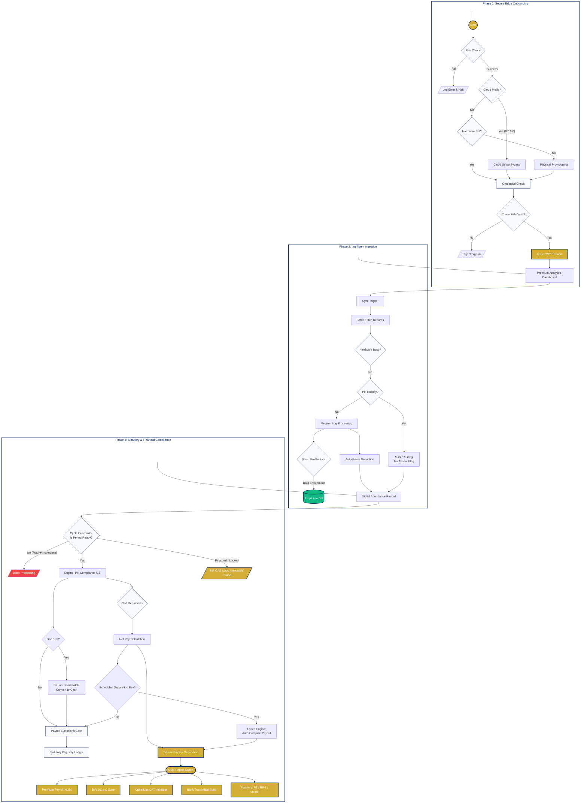
```mermaid
flowchart TD
    subgraph Init["Phase 1: Secure Edge Onboarding"]
        direction TB
        s1[ ] --- Start((Start))
        Start --> Env{Env Check}
        Env -- "Fail" --> Err1[/"Log Error & Halt"/]
        Env -- "Success" --> Mode{Cloud Mode?}
        Mode -- "Yes (0.0.0.0)" --> Bypass[Cloud Setup Bypass]
        Mode -- "No" --> Auth{Hardware Set?}
        Auth -- No --> Setup[Physical Provisioning]
        Auth -- Yes --> LoginCreds[Credential Check]
        Bypass --> LoginCreds
        Setup --> LoginCreds
        LoginCreds --> Login{Credentials Valid?}
        Login -- "No" --> Err2[/"Reject Sign-in"/]
        Login -- "Yes" --> Session[Issue JWT Session]
        Session --> Dashboard[Premium Analytics Dashboard]
    end

    subgraph Ops["Phase 2: Intelligent Ingestion"]
        direction TB
        s2[ ] --- Dashboard
        Dashboard --> Trigger[Sync Trigger]
        Trigger --> Sync[Batch Fetch Records]
        
        Sync --> Busy{Hardware Busy?}
        Busy -- No --> Hol{PH Holiday?}
        Hol -- Yes --> Resting["Mark 'Resting'<br/>No Absent Flag"]
        Hol -- No --> Proc["Engine: Log Processing"]
        
        Proc --> SmartSync{Smart Profile Sync}
        SmartSync -->|Data Enrichment| Emp[("Employee DB")]
        Proc --> BreakTime[Auto-Break Deduction]
        BreakTime --> Rec[Digital Attendance Record]
        Resting --> Rec
    end

    subgraph Final["Phase 3: Statutory & Financial Compliance"]
        direction TB
        s3[ ] --- Rec
        Rec --> Cycle{"Cycle Guardrails:<br/>Is Period Ready?"}
        Cycle -- "No (Future/Incomplete)" --> Block[/"Block Processing"/]
        Cycle -- "Yes" --> Engine["Engine: PH Compliance 5.2"]
        Cycle -- "Finalized / Locked" --> Lock[/"BIR CAS Lock: Immutable Period"/]
        Engine --> SIL_YE{Dec 31st?}
        SIL_YE -- Yes --> SIL_PROC["SIL Year-End Batch:<br/>Convert to Cash"]
        SIL_YE -- No --> EXCL[Payroll Exclusions Gate]
        SIL_PROC --> EXCL
        EXCL --> ELIG[Statutory Eligibility Ledger]
        Engine --> Tables{Grid Deductions}
        Tables --> Calc[Net Pay Calculation]
        Calc --> Gen[Secure Payslip Generation]
        Gen --> Export([Multi-Report Export])
        Export --> XLSX[Premium Payroll XLSX]
        Export --> PDF[BIR 1601-C Suite]
        Export --> DAT[Alpha-List .DAT Validator]
        Export --> CSV[Bank Transmittal Suite]
        Export --> REM["Statutory: R3 / RF-1 / MCRF"]
        
        Calc --> SEP{Scheduled Separation Pay?}
        SEP -- Yes --> SEP_L["Leave Engine:<br/>Auto-Compute Payout"]
        SEP_L --> Gen
        SEP -- No --> EXCL
    end

    classDef bizGold fill:#D4AF37,stroke:#002060,stroke-width:2px,color:#fff
    classDef bizNavy fill:none,stroke:#002060,stroke-width:2px,color:#002060
    classDef bizEmerald fill:#10b981,stroke:#002060,stroke-width:2px,color:#fff
    classDef process fill:#f8f9fa,stroke:#002060,stroke-width:1px
    classDef spacer fill:none,stroke:none,color:none
    
    class Start,Export,Gen,XLSX,PDF,DAT,CSV,REM,Session,Lock bizGold
    class Init,Ops,Final bizNavy
    class Emp bizEmerald
    class Env,Auth,Busy,SmartSync,Cycle,Tables,Mode,Hol,LoginCreds,Login process
    class EXCL,ELIG process
    class s1,s2,s3 spacer
    style Block fill:#ef4444,color:#fff
```

## System Processes

### Leave Management Flow

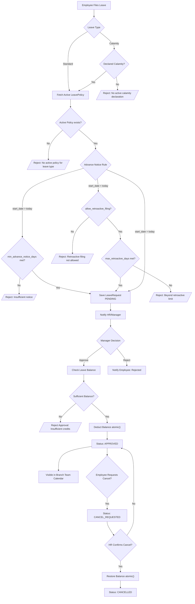
```mermaid
flowchart TD
    EMP[Employee Files Leave] --> TYPE{Leave Type}
    TYPE -->|Standard| POLICY[Fetch Active LeavePolicy]
    TYPE -->|Calamity| CAL_CHECK{Declared Calamity?}
    CAL_CHECK -- No --> ERR1[/"Reject: No active calamity declaration"/]
    CAL_CHECK -- Yes --> POLICY

    POLICY --> POLICY_CHK{Active Policy exists?}
    POLICY_CHK -- No --> ERR0[/"Reject: No active policy for leave type"/]
    POLICY_CHK -- Yes --> ADV{Advance Notice Rule}

    ADV -- "start_date > today" --> NOT_CHK{min_advance_notice_days met?}
    NOT_CHK -- No --> ERR2[/"Reject: Insufficient notice"/]
    NOT_CHK -- Yes --> SAVE
    ADV -- "start_date < today" --> RETRO{allow_retroactive_filing?}
    RETRO -- No --> ERR3[/"Reject: Retroactive filing not allowed"/]
    RETRO -- Yes --> RETRO_DAYS{max_retroactive_days met?}
    RETRO_DAYS -- No --> ERR4[/"Reject: Beyond retroactive limit"/]
    RETRO_DAYS -- Yes --> SAVE
    ADV -- "start_date = today" --> SAVE

    SAVE[Save LeaveRequest PENDING] --> NOTIFY["Notify HR/Manager"]
    NOTIFY --> REVIEW{Manager Decision}

    REVIEW -- Approve --> BAL_CHK[Check Leave Balance]
    BAL_CHK --> ENOUGH{Sufficient Balance?}
    ENOUGH -- No --> ERR5[/"Reject Approval: Insufficient credits"/]
    ENOUGH -- Yes --> DEDUCT["Deduct Balance atomic()"]
    REVIEW -- Reject --> REJ_NOTIFY["Notify Employee: Rejected"]

    DEDUCT --> APPROVED["Status: APPROVED"]
    APPROVED --> EMP_VIEW[Visible in Branch Team Calendar]
    APPROVED --> CANCEL_OPT{Employee Requests Cancel?}
    CANCEL_OPT -- Yes --> CR["Status: CANCEL_REQUESTED"]
    CR --> HR_REVIEW{HR Confirms Cancel?}
    HR_REVIEW -- Yes --> RESTORE["Restore Balance atomic()"]
    RESTORE --> CANCELLED["Status: CANCELLED"]
    HR_REVIEW -- No --> APPROVED
```

### Attendance & Payroll Flow
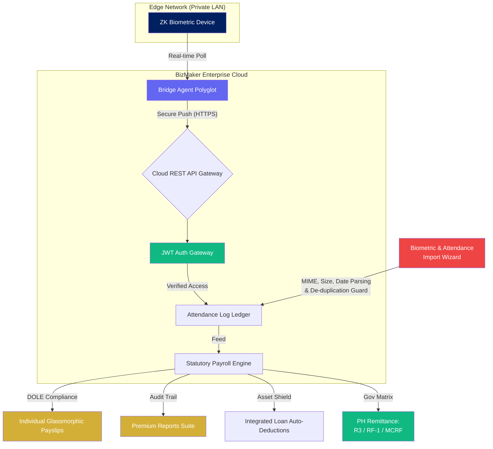
```mermaid
flowchart TD
    subgraph Local["Edge Network (Private LAN)"]
        direction LR
        HW[ZK Biometric Device]
    end
    
    subgraph Cloud["BizMaker Enterprise Cloud"]
        direction TB
        BRIDGE[Bridge Agent Polyglot]
        API{Cloud REST API Gateway}
        AUTH[JWT Auth Gateway]
        LOG[Attendance Log Ledger]
        PAY[Statutory Payroll Engine]
    end

    HW -->|Real-time Poll| BRIDGE
    BRIDGE -->|"Secure Push (HTTPS)"| API
    API --> AUTH
    AUTH -->|Verified Access| LOG
    
    LOG -->|Feed| PAY
    PAY -->|DOLE Compliance| SLIP[Individual Glassmorphic Payslips]
    PAY -->|Audit Trail| REP[Premium Reports Suite]
    PAY -->|Asset Shield| LOAN[Integrated Loan Auto-Deductions]
    PAY -->|Gov Matrix| REMIT["PH Remittance:<br/>R3 / RF-1 / MCRF"]
    
    UPL["Biometric & Attendance<br/>Import Wizard"] -->|"MIME, Size, Date Parsing<br/>& De-duplication Guard"| LOG

    style HW fill:#002060,color:#fff
    style SLIP fill:#D4AF37,color:#fff
    style REP fill:#D4AF37,color:#fff
    style REMIT fill:#10b981,color:#fff
    style UPL fill:#ef4444,color:#fff
    style BRIDGE fill:#6366f1,color:#fff
    style AUTH fill:#10b981,color:#fff
```

### Fieldwork & Physical Attendance Overlap
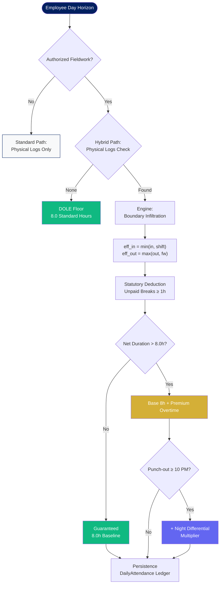
```mermaid
flowchart TD
    START([Employee Day Horizon]) --> FW{Authorized Fieldwork?}
    FW -- "No" --> PHYS["Standard Path:<br/>Physical Logs Only"]
    FW -- "Yes" --> LOGS{"Hybrid Path:<br/>Physical Logs Check"}
    
    LOGS -- "None" --> BASE["DOLE Floor<br/>8.0 Standard Hours"]
    LOGS -- "Found" --> MERGE["Engine:<br/>Boundary Infiltration"]
    
    MERGE --> EFF["eff_in = min(in, shift)<br/>eff_out = max(out, fw)"]
    EFF --> BREAKS["Statutory Deduction<br/>Unpaid Breaks ≥ 1h"]
    BREAKS --> CALC{"Net Duration > 8.0h?"}
    
    CALC -- "Yes" --> OT["Base 8h + Premium Overtime"]
    CALC -- "No" --> FLOOR["Guaranteed<br/>8.0h Baseline"]
    
    OT --> ND{Punch-out ≥ 10 PM?}
    FLOOR --> SAVE["Persistence<br/>DailyAttendance Ledger"]
    ND -- "Yes" --> NIGHT["+ Night Differential<br/>Multiplier"]
    ND -- "No" --> SAVE
    NIGHT --> SAVE

    style START fill:#002060,color:#fff
    style BASE fill:#10b981,color:#fff
    style OT fill:#D4AF37,color:#fff
    style NIGHT fill:#6366f1,color:#fff
    style FLOOR fill:#10b981,color:#fff
    style PHYS fill:#f8f9fa,stroke:#002060
```

### Progressive Discipline & Disciplinary Suspension Policy
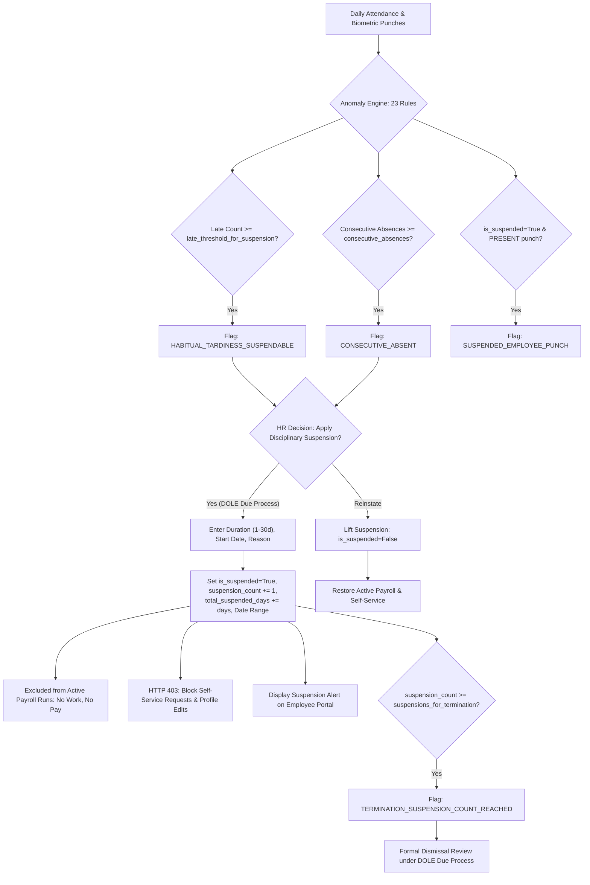
```mermaid
flowchart TD
    ATT[Daily Attendance & Biometric Punches] --> ANOM{"Anomaly Engine: 23 Rules"}
    ANOM --> TARD{"Late Count >= late_threshold_for_suspension?"}
    ANOM --> AWOL{"Consecutive Absences >= consecutive_absences?"}
    ANOM --> SUSP_PUNCH{"is_suspended=True & PRESENT punch?"}
    
    TARD -- Yes --> FLAG_SUSP["Flag: HABITUAL_TARDINESS_SUSPENDABLE"]
    AWOL -- Yes --> FLAG_AWOL["Flag: CONSECUTIVE_ABSENT"]
    SUSP_PUNCH -- Yes --> FLAG_VIOL["Flag: SUSPENDED_EMPLOYEE_PUNCH"]
    
    FLAG_SUSP --> HR_ACTION{"HR Decision: Apply Disciplinary Suspension?"}
    FLAG_AWOL --> HR_ACTION
    
    HR_ACTION -- "Yes (DOLE Due Process)" --> SUSP_MODAL["Enter Duration (1-30d), Start Date, Reason"]
    SUSP_MODAL --> DB_UPDATE["Set is_suspended=True, suspension_count += 1,<br/>total_suspended_days += days, Date Range"]
    
    DB_UPDATE --> PAY_EXCL["Excluded from Active Payroll Runs: No Work, No Pay"]
    DB_UPDATE --> ESS_BLOCK["HTTP 403: Block Self-Service Requests & Profile Edits"]
    DB_UPDATE --> PORTAL_BANNER[Display Suspension Alert on Employee Portal]
    
    DB_UPDATE --> TERM_CHECK{"suspension_count >= suspensions_for_termination?"}
    TERM_CHECK -- Yes --> FLAG_TERM["Flag: TERMINATION_SUSPENSION_COUNT_REACHED"]
    FLAG_TERM --> DOLE_DISMISSAL[Formal Dismissal Review under DOLE Due Process]
    
    HR_ACTION -- "Reinstate" --> LIFT["Lift Suspension: is_suspended=False"]
    LIFT --> RESTORE[Restore Active Payroll & Self-Service]
```

### Attendance Analytics Pipeline
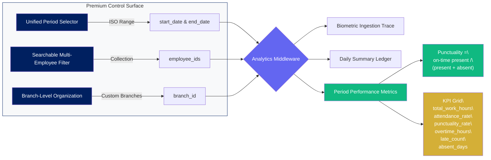
```mermaid
flowchart LR
    subgraph UI["Premium Control Surface"]
        direction TB
        P[Unified Period Selector] -->|ISO Range| DATES[start_date & end_date]
        E[Searchable Multi-Employee Filter] -->|Collection| IDS[employee_ids]
        B[Branch-Level Organization] -->|Custom Branches| BID[branch_id]
    end
    
    DATES --> API{Analytics Middleware}
    IDS --> API
    BID --> API
    
    API --> BIO[Biometric Ingestion Trace]
    API --> ATT[Daily Summary Ledger]
    API --> PER[Period Performance Metrics]

    PER --> PUNC["Punctuality =\\non-time present /\\n(present + absent)"]
    PER --> METRICS["KPI Grid\\ntotal_work_hours\\nattendance_rate\\npunctuality_rate\\novertime_hours\\nlate_count\\nabsent_days"]

    style UI fill:#f8f9fa,stroke:#002060
    style P fill:#002060,color:#fff
    style E fill:#002060,color:#fff
    style B fill:#002060,color:#fff
    style METRICS fill:#D4AF37,color:#fff
    style PUNC fill:#10b981,color:#fff
    style PER fill:#10b981,color:#fff
    style API fill:#6366f1,color:#fff
```

### Shift Intelligence, CWW (DOLE Advisory 02-2004) & Grace Period Evaluation
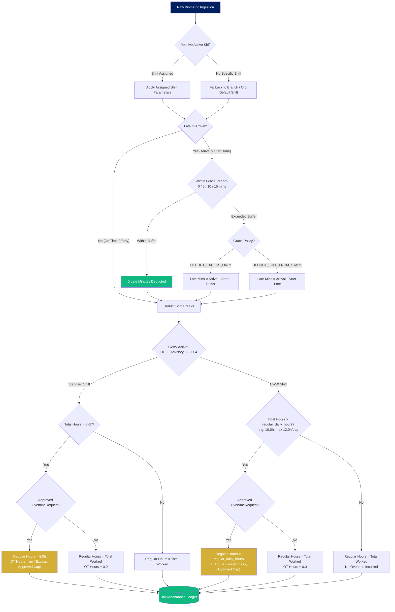
```mermaid
flowchart TD
    PUNCH[Raw Biometric Ingestion] --> RESOLVE{Resolve Active Shift}
    RESOLVE -->|Shift Assigned| S_DEF[Apply Assigned Shift Parameters]
    RESOLVE -->|No Specific Shift| B_DEF["Fallback to Branch / Org Default Shift"]
    
    S_DEF --> GRACE_CHK{Late In Arrival?}
    B_DEF --> GRACE_CHK
    
    GRACE_CHK -- "No (On Time / Early)" --> BREAK_PROC[Deduct Shift Breaks]
    GRACE_CHK -- "Yes (Arrival > Start Time)" --> BUFFER{"Within Grace Period?<br/>0 / 5 / 10 / 15 mins"}
    
    BUFFER -- "Within Buffer" --> NO_TARDY[0 Late Minutes Deducted]
    BUFFER -- "Exceeded Buffer" --> POLICY{Grace Policy?}
    
    POLICY -- "DEDUCT_EXCESS_ONLY" --> DED_EXCESS["Late Mins = Arrival - Start - Buffer"]
    POLICY -- "DEDUCT_FULL_FROM_START" --> DED_FULL["Late Mins = Arrival - Start Time"]
    
    NO_TARDY --> BREAK_PROC
    DED_EXCESS --> BREAK_PROC
    DED_FULL --> BREAK_PROC
    
    BREAK_PROC --> CWW_CHK{"CWW Active?<br/>DOLE Advisory 02-2004"}
    
    CWW_CHK -- "Standard Shift" --> STD_OT{"Total Hours > 8.0h?"}
    STD_OT -- "Yes" --> STD_OT_CHK{Approved OvertimeRequest?}
    STD_OT_CHK -- "Yes" --> OT_STD["Regular Hours = 8.0h<br/>OT Hours = min(Excess, Approved Cap)"]
    STD_OT_CHK -- "No" --> OT_STD_UNAPP["Regular Hours = Total Worked<br/>OT Hours = 0.0"]
    STD_OT -- "No" --> REG_STD["Regular Hours = Total Worked"]
    
    CWW_CHK -- "CWW Shift" --> CWW_THRESH{"Total Hours > regular_daily_hours?<br/>e.g. 10.0h, max 12.0h/day"}
    CWW_THRESH -- "Yes" --> CWW_OT_CHK{Approved OvertimeRequest?}
    CWW_OT_CHK -- "Yes" --> OT_CWW["Regular Hours = regular_daily_hours<br/>OT Hours = min(Excess, Approved Cap)"]
    CWW_OT_CHK -- "No" --> OT_CWW_UNAPP["Regular Hours = Total Worked<br/>OT Hours = 0.0"]
    CWW_THRESH -- "No" --> REG_CWW["Regular Hours = Total Worked<br/>No Overtime Incurred"]
    
    OT_STD --> PAYROLL_FEED[("DailyAttendance Ledger")]
    OT_STD_UNAPP --> PAYROLL_FEED
    REG_STD --> PAYROLL_FEED
    OT_CWW --> PAYROLL_FEED
    OT_CWW_UNAPP --> PAYROLL_FEED
    REG_CWW --> PAYROLL_FEED

    style PUNCH fill:#002060,color:#fff
    style PAYROLL_FEED fill:#10b981,color:#fff
    style OT_CWW fill:#D4AF37,color:#fff
    style OT_STD fill:#D4AF37,color:#fff
    style NO_TARDY fill:#10b981,color:#fff
```

## Role-Based Access Control (RBAC)

BizMaker features a tiered permission architecture designed for multi-tenant scalability and secure data isolation.

### System Roles
1.  **Superadmin**:
    *   **Scope**: Global System.
    *   **Capabilities**: Manual tenant provisioning, sales summary analytics, global configuration management, and cross-tenant auditing.
2.  **Admin (Business Owner)**:
    *   **Scope**: Specific Tenant Workspace.
    *   **Capabilities**: Full management of the payroll ecosystem (Employees, Attendance, Payroll, Shifts, etc.) within their own organization.
3.  **Employee**:
    *   **Scope**: Personal Self-Service.
    *   **Capabilities**: View own payslips, attendance history, and leave balances via the dedicated Employee Portal.

### User Lifecycle & Role Transition
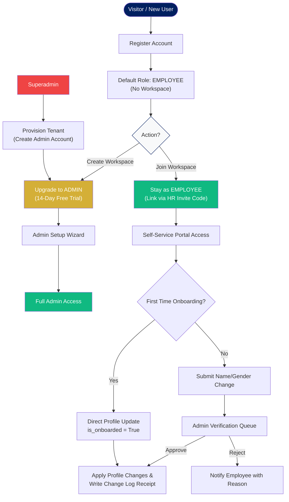
```mermaid
flowchart TD
    START([Visitor / New User]) --> REG[Register Account]
    REG --> DEFAULT["Default Role: EMPLOYEE<br/>(No Workspace)"]
    
    DEFAULT --> CHOICE{Action?}
    
    CHOICE -- "Create Workspace" --> UPGRADE["Upgrade to ADMIN<br/>(14-Day Free Trial)"]
    CHOICE -- "Join Workspace" --> LINK["Stay as EMPLOYEE<br/>(Link via HR Invite Code)"]
    
    UPGRADE --> WIZARD[Admin Setup Wizard]
    WIZARD --> READY[Full Admin Access]
    
    LINK --> PORTAL[Self-Service Portal Access]
    PORTAL --> FIRST_ONB{First Time Onboarding?}
    FIRST_ONB -- "Yes" --> SAVE_BYPASS["Direct Profile Update<br/>is_onboarded = True"]
    FIRST_ONB -- "No" --> SUBMIT_REQ["Submit Name/Gender Change"]
    SUBMIT_REQ --> ADMIN_QUEUE[Admin Verification Queue]
    ADMIN_QUEUE -->|Approve| UPDATE_DB["Apply Profile Changes &<br/>Write Change Log Receipt"]
    ADMIN_QUEUE -->|Reject| NOTIFY_REJECT[Notify Employee with Reason]
    SAVE_BYPASS --> UPDATE_DB
    
    SUPER[Superadmin] --> PROV["Provision Tenant<br/>(Create Admin Account)"]
    PROV --> UPGRADE

    style START fill:#002060,color:#fff
    style UPGRADE fill:#D4AF37,color:#fff
    style LINK fill:#10b981,color:#fff
    style READY fill:#10b981,color:#fff
    style SUPER fill:#ef4444,color:#fff
    style CHOICE fill:#f8f9fa,stroke:#002060
```

### Subscription & Trial Lifecycle
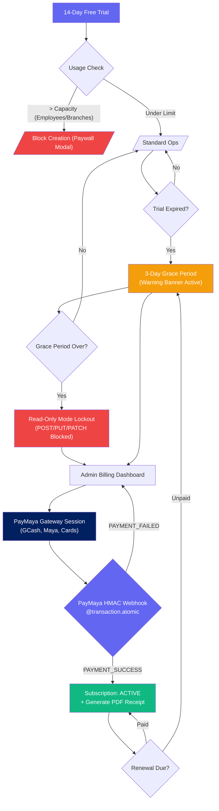
```mermaid
flowchart TD
    TRIAL[14-Day Free Trial] --> LIMITS{Usage Check}
    LIMITS -- "> Capacity (Employees/Branches)" --> BLOCK[/"Block Creation (Paywall Modal)"/]
    LIMITS -- "Under Limit" --> ALLOW[/"Standard Ops"/]
    
    ALLOW --> EXP{Trial Expired?}
    EXP -- "No" --> ALLOW
    EXP -- "Yes" --> GRACE["3-Day Grace Period<br/>(Warning Banner Active)"]
    
    GRACE --> GRACE_EXP{Grace Period Over?}
    GRACE_EXP -- "No" --> ALLOW
    GRACE_EXP -- "Yes" --> FROZEN["Read-Only Mode Lockout<br/>(POST/PUT/PATCH Blocked)"]
    
    FROZEN --> BILL[Admin Billing Dashboard]
    GRACE --> BILL
    BILL --> MAYA_CHECKOUT["PayMaya Gateway Session<br/>(GCash, Maya, Cards)"]
    MAYA_CHECKOUT --> WEBHOOK{"PayMaya HMAC Webhook<br/>@transaction.atomic"}
    
    WEBHOOK -- "PAYMENT_SUCCESS" --> ACTIVE["Subscription: ACTIVE<br/>+ Generate PDF Receipt"]
    WEBHOOK -- "PAYMENT_FAILED" --> BILL
    
    ACTIVE --> RENEW{Renewal Due?}
    RENEW -- "Paid" --> ACTIVE
    RENEW -- "Unpaid" --> GRACE
    
    style TRIAL fill:#6366f1,color:#fff
    style BLOCK fill:#ef4444,color:#fff
    style FROZEN fill:#ef4444,color:#fff
    style GRACE fill:#f59e0b,color:#fff
    style ACTIVE fill:#10b981,color:#fff
    style MAYA_CHECKOUT fill:#002060,color:#fff
    style WEBHOOK fill:#6366f1,color:#fff
```

### SaaS Subscription Plans, Granular Feature Gating & Superadmin Management

BizMaker operates a hybrid capacity and granular feature-gating model:
- **Operational Capacity**: Enforces `max_employees` and `max_branches` per plan tier.
- **Granular Feature Gating**: Backed by `SubscriptionPlan.feature_keys` and the DRF `HasPlanFeature(key)` permission factory.
  - **HTTP 402 (Payment Required)**: Raised when an active subscriber attempts to access a premium feature endpoint (e.g. `audit_logs`, `bulk_imports`, `tax_annualization`, `bir_dat_export`, `custom_branding`) not included in their tier.
  - **HTTP 403 (Forbidden)**: Reserved for expired trial / locked workspaces (`IsSubscriptionActiveForMutation`).
  - **Frontend UI Gates**: Shared `<FeatureGate>` components and computed store getters (`store.hasFeature(key)`) show contextual upgrade prompts and prevent unentitled API mutations.

The platform includes a dynamic **Superadmin Plan Management UI** (accessible via `/superadmin/plans`), allowing system administrators to manage pricing tiers, capacity limits, display features (`features`), and machine-readable enforcement keys (`feature_keys`) on the fly.

The default seeded plans (managed via `python manage.py seed_plans`) include:

1. **Starter Plan** (`₱1,500/mo` / `₱15,300/yr`)
   * **Limits**: Up to 10 Employees & 1 Branch
   * **Feature Keys**: `thirteenth_month_calc`
   * **Features**: Standard Payroll Processing, PH Holiday Pay Compliance, 13th-Month & SIL Computation, Payslip PDF Generation, SSS / PhilHealth / HDMF Deductions, Basic Shift Management, Leave & Absence Tracking
2. **Pro Plan** (`₱5,000/mo` / `₱51,000/yr`)
   * **Limits**: Up to 50 Employees & 3 Branches
   * **Feature Keys**: `thirteenth_month_calc`, `bir_dat_export`
   * **Features**: Everything in Starter, Advanced Overtime Stacking, Automated Bio-Device Sync, BIR 1601-C & 1604-C DAT Export, Statutory PDF Payslips & Reports, Loan Management, Fieldwork & Compressed Work-Week, Priority Support
3. **Enterprise Plan** (`₱15,000/mo` / `₱153,000/yr`)
   * **Limits**: Up to 1,000 Employees & 20 Branches
   * **Feature Keys**: `thirteenth_month_calc`, `bir_dat_export`, `tax_annualization`, `audit_logs`, `bulk_imports`, `dpa_archiving`, `custom_branding`
   * **Features**: Everything in Pro, Tax Annualization & BIR Form 2316, Audit Trail & Compliance Logs, Bulk Employee & Attendance Import, XLSX & CSV Data Export, Collaborator Role Management, DPA Retention & Auto-Archive, Custom Payslip Header Branding, Priority 24/7 Support

### Anomaly Detection Pipeline

```mermaid
flowchart LR
    PERIOD[Temporal Context] -->|start_date & end_date| RULES{Logic Heuristics}
    EMP[Entity Context] -->|employee_ids| RULES
    
    RULES --> R1["Ghost Overtime<br/>>3h OT, no OB/FW"]
    RULES --> R2["Segment Fragmentation<br/>Missing Punctures"]
    RULES --> R3["Chronic Lateness<br/>Threshold: 5+ events"]
    RULES --> R4["Rest Day Boundary Violation<br/>Unauthorized Presence"]
    
    R1 --> SEV{Integrity Sort}
    R2 --> SEV
    R3 --> SEV
    R4 --> SEV
    
    SEV --> HIGH[High Criticality 🔴]
    SEV --> MED[Moderate Alert 🟡]
    SEV --> LOW[Standard Variance 🔵]

    style RULES fill:#002060,color:#fff
    style PERIOD fill:#f8f9fa,stroke:#002060
    style EMP fill:#f8f9fa,stroke:#002060
    style HIGH fill:#ef4444,color:#fff
    style MED fill:#f59e0b,color:#fff
    style LOW fill:#6366f1,color:#fff
```

### Labor Cost Aggregation (Stacked Analysis)
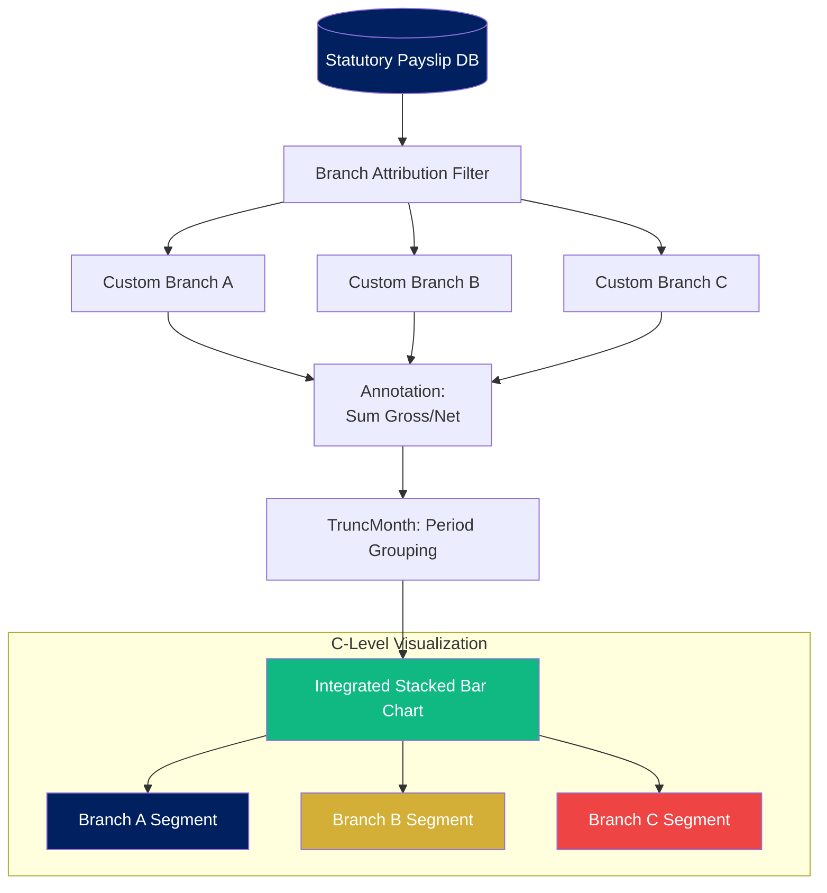
```mermaid
flowchart TD
    DB[("Statutory Payslip DB")] --> ATTR[Branch Attribution Filter]
    ATTR --> BR1[Custom Branch A]
    ATTR --> BR2[Custom Branch B]
    ATTR --> BR3[Custom Branch C]
    
    BR1 --> SUM["Annotation:<br/>Sum Gross/Net"]
    BR2 --> SUM
    BR3 --> SUM
    
    SUM --> TRUNC["TruncMonth: Period Grouping"]
    TRUNC --> CHART[Integrated Stacked Bar Chart]
    
    subgraph View["C-Level Visualization"]
        CHART --> SEG1[Branch A Segment]
        CHART --> SEG2[Branch B Segment]
        CHART --> SEG3[Branch C Segment]
    end

    style DB fill:#002060,color:#fff
    style SEG1 fill:#002060,color:#fff
    style SEG2 fill:#D4AF37,color:#fff
    style SEG3 fill:#ef4444,color:#fff
    style CHART fill:#10b981,color:#fff
```

### Loan Lifecycle
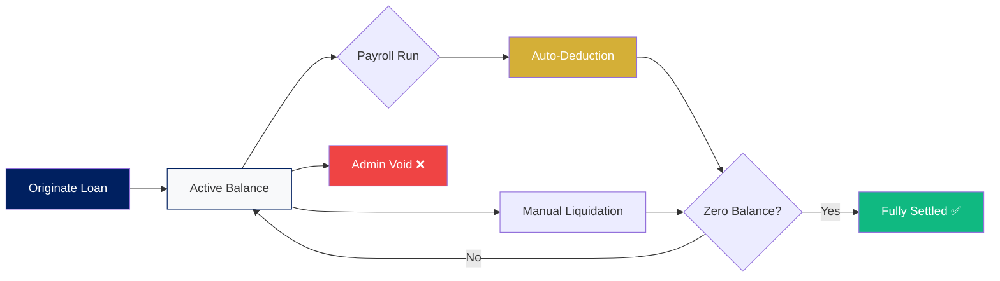
```mermaid
flowchart LR
    CREATE[Originate Loan] --> ACTIVE[Active Balance]
    ACTIVE --> PAYROLL{Payroll Run}
    PAYROLL --> DEDUCT[Auto-Deduction]
    DEDUCT --> BAL{Zero Balance?}
    BAL -- "Yes" --> PAID[Fully Settled ✅]
    BAL -- "No" --> ACTIVE
    ACTIVE --> MANUAL[Manual Liquidation]
    MANUAL --> BAL
    ACTIVE --> CANCEL[Admin Void ❌]

    style CREATE fill:#002060,color:#fff
    style PAID fill:#10b981,color:#fff
    style CANCEL fill:#ef4444,color:#fff
    style DEDUCT fill:#D4AF37,color:#fff
    style ACTIVE fill:#f8f9fa,stroke:#002060
```

### Shift Scheduling & Branch Archetypes
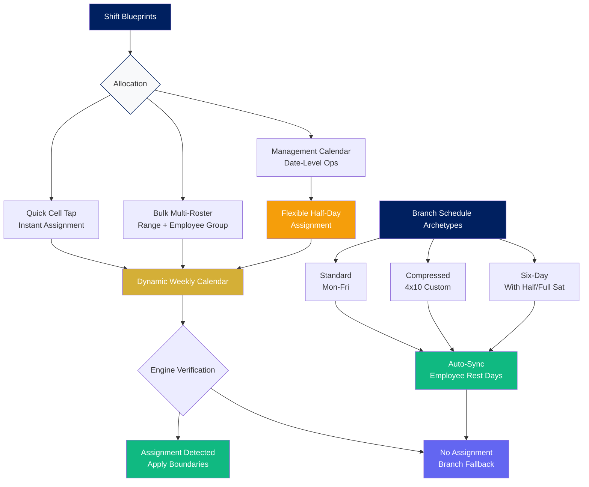
```mermaid
flowchart TD
    ARCH[Branch Schedule Archetypes] --> STD["Standard\nMon-Fri"]
    ARCH --> COMP["Compressed\n4x10 Custom"]
    ARCH --> SIX["Six-Day<br/>With Half/Full Sat"]
    
    STD --> SYNC["Auto-Sync<br/>Employee Rest Days"]
    COMP --> SYNC
    SIX --> SYNC
    
    SHIFT[Shift Blueprints] --> ASSIGN{Allocation}
    ASSIGN --> SINGLE["Quick Cell Tap<br/>Instant Assignment"]
    ASSIGN --> BULK["Bulk Multi-Roster<br/>Range + Employee Group"]
    ASSIGN --> MGMT["Management Calendar<br/>Date-Level Ops"]
    
    SINGLE --> ROSTER[Dynamic Weekly Calendar]
    BULK --> ROSTER
    MGMT --> HALF["Flexible Half-Day<br/>Assignment"]
    HALF --> ROSTER
    
    ROSTER --> ATT{Engine Verification}
    ATT --> HAS["Assignment Detected<br/>Apply Boundaries"]
    ATT --> NO["No Assignment<br/>Branch Fallback"]
    
    SYNC --> NO

    style ARCH fill:#002060,color:#fff
    style SHIFT fill:#002060,color:#fff
    style ROSTER fill:#D4AF37,color:#fff
    style HALF fill:#f59e0b,color:#fff
    style HAS fill:#10b981,color:#fff
    style NO fill:#6366f1,color:#fff
    style SYNC fill:#10b981,color:#fff
    style ASSIGN fill:#f8f9fa,stroke:#002060
```

### Leave Management & OT Integration
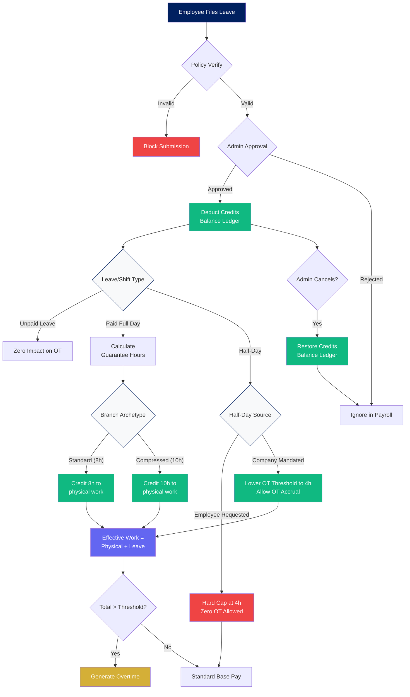
```mermaid
flowchart TD
    FILE[Employee Files Leave] --> POLICY{Policy Verify}
    POLICY -- "Invalid" --> REJECT_UI[Block Submission]
    POLICY -- "Valid" --> APPROVAL{Admin Approval}
    
    APPROVAL -- "Approved" --> DEDUCT["Deduct Credits<br/>Balance Ledger"]
    DEDUCT --> TYPE{"Leave/Shift Type"}
    
    APPROVAL -- "Rejected" --> IGNORE[Ignore in Payroll]
    
    TYPE -- "Unpaid Leave" --> NO_OT[Zero Impact on OT]
    TYPE -- "Paid Full Day" --> HOURS["Calculate<br/>Guarantee Hours"]
    TYPE -- "Half-Day" --> HALF{Half-Day Source}
    
    HOURS --> ARCH{Branch Archetype}
    ARCH -- "Standard (8h)" --> CRED_8["Credit 8h to<br/>physical work"]
    ARCH -- "Compressed (10h)" --> CRED_10["Credit 10h to<br/>physical work"]
    
    CRED_8 --> CALC["Effective Work =<br/>Physical + Leave"]
    CRED_10 --> CALC
    
    HALF -- "Employee Requested" --> CAP["Hard Cap at 4h<br/>Zero OT Allowed"]
    HALF -- "Company Mandated" --> LOWER["Lower OT Threshold to 4h<br/>Allow OT Accrual"]
    
    LOWER --> CALC
    CAP --> BASE[Standard Base Pay]

    CALC --> OT_THRESH{"Total > Threshold?"}
    OT_THRESH -- "Yes" --> OT_GEN[Generate Overtime]
    OT_THRESH -- "No" --> BASE
    
    CANCEL{Admin Cancels?}
    DEDUCT --> CANCEL
    CANCEL -- "Yes" --> RESTORE["Restore Credits<br/>Balance Ledger"]
    RESTORE --> IGNORE

    style FILE fill:#002060,color:#fff
    style REJECT_UI fill:#ef4444,color:#fff
    style DEDUCT fill:#10b981,color:#fff
    style RESTORE fill:#10b981,color:#fff
    style TYPE fill:#f8f9fa,stroke:#002060
    style ARCH fill:#f8f9fa,stroke:#002060
    style HALF fill:#f8f9fa,stroke:#002060
    style CAP fill:#ef4444,color:#fff
    style LOWER fill:#10b981,color:#fff
    style CRED_8 fill:#10b981,color:#fff
    style CRED_10 fill:#10b981,color:#fff
    style CALC fill:#6366f1,color:#fff
    style OT_GEN fill:#D4AF37,color:#fff
```

### Real-Time SPA Synchronization (Requests & Profile Photos)
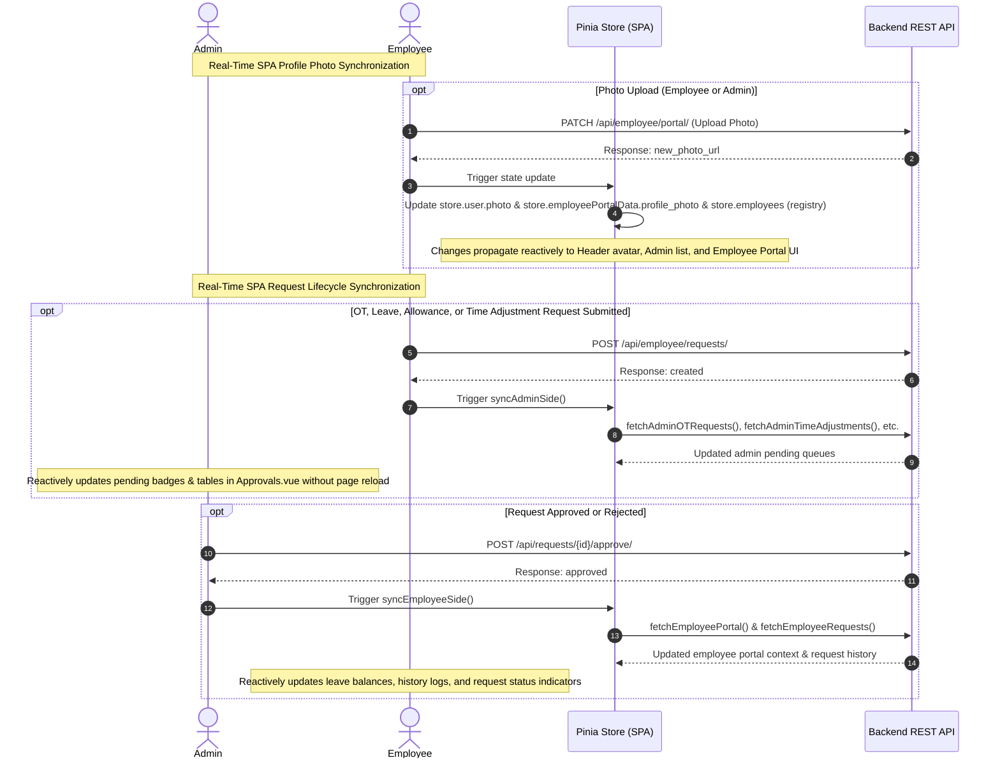
```mermaid
sequenceDiagram
    autonumber
    actor Admin
    actor Employee
    participant Store as Pinia Store (SPA)
    participant API as Backend REST API

    Note over Admin, Employee: Real-Time SPA Profile Photo Synchronization
    opt Photo Upload (Employee or Admin)
        Employee->>API: PATCH /api/employee/portal/ (Upload Photo)
        API-->>Employee: Response: new_photo_url
        Employee->>Store: Trigger state update
        Store->>Store: Update store.user.photo & store.employeePortalData.profile_photo & store.employees (registry)
        Note over Store: Changes propagate reactively to Header avatar, Admin list, and Employee Portal UI
    end

    Note over Admin, Employee: Real-Time SPA Request Lifecycle Synchronization
    opt OT, Leave, Allowance, or Time Adjustment Request Submitted
        Employee->>API: POST /api/employee/requests/
        API-->>Employee: Response: created
        Employee->>Store: Trigger syncAdminSide()
        Store->>API: fetchAdminOTRequests(), fetchAdminTimeAdjustments(), etc.
        API-->>Store: Updated admin pending queues
        Note over Admin: Reactively updates pending badges & tables in Approvals.vue without page reload
    end

    opt Request Approved or Rejected
        Admin->>API: POST /api/requests/{id}/approve/
        API-->>Admin: Response: approved
        Admin->>Store: Trigger syncEmployeeSide()
        Store->>API: fetchEmployeePortal() & fetchEmployeeRequests()
        API-->>Store: Updated employee portal context & request history
        Note over Employee: Reactively updates leave balances, history logs, and request status indicators
    end
```

### Single Active Session Concurrency Control
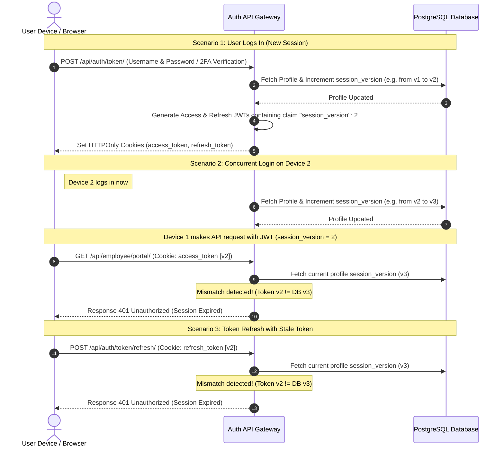
```mermaid
sequenceDiagram
    autonumber
    actor User as User Device / Browser
    participant API as Auth API Gateway
    participant DB as PostgreSQL Database

    Note over User, DB: Scenario 1: User Logs In (New Session)
    User->>API: POST /api/auth/token/ (Username & Password / 2FA Verification)
    API->>DB: Fetch Profile & Increment session_version (e.g. from v1 to v2)
    DB-->>API: Profile Updated
    API->>API: Generate Access & Refresh JWTs containing claim "session_version": 2
    API-->>User: Set HTTPOnly Cookies (access_token, refresh_token)

    Note over User, DB: Scenario 2: Concurrent Login on Device 2
    Note right of User: Device 2 logs in now
    API->>DB: Fetch Profile & Increment session_version (e.g. from v2 to v3)
    DB-->>API: Profile Updated
    Note over User, DB: Device 1 makes API request with JWT (session_version = 2)
    User->>API: GET /api/employee/portal/ (Cookie: access_token [v2])
    API->>DB: Fetch current profile session_version (v3)
    Note over API: Mismatch detected! (Token v2 != DB v3)
    API-->>User: Response 401 Unauthorized (Session Expired)

    Note over User, DB: Scenario 3: Token Refresh with Stale Token
    User->>API: POST /api/auth/token/refresh/ (Cookie: refresh_token [v2])
    API->>DB: Fetch current profile session_version (v3)
    Note over API: Mismatch detected! (Token v2 != DB v3)
    API-->>User: Response 401 Unauthorized (Session Expired)
```

### Secure Bug Reporting & Superadmin Triaging Workflow
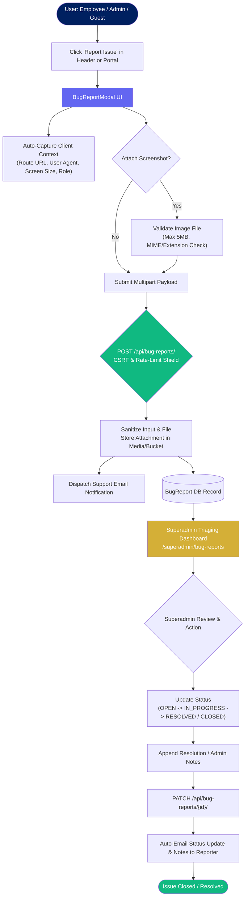
```mermaid
flowchart TD
    USER([User: Employee / Admin / Guest]) --> OPEN[Click 'Report Issue' in Header or Portal]
    OPEN --> MODAL[BugReportModal UI]
    
    MODAL --> CAPTURE["Auto-Capture Client Context<br/>(Route URL, User Agent, Screen Size, Role)"]
    MODAL --> ATTACH{Attach Screenshot?}
    
    ATTACH -- "Yes" --> VALIDATE["Validate Image File<br/>(Max 5MB, MIME/Extension Check)"]
    ATTACH -- "No" --> SUBMIT[Submit Multipart Payload]
    VALIDATE --> SUBMIT
    
    SUBMIT --> API{"POST /api/bug-reports/<br/>CSRF & Rate-Limit Shield"}
    
    API --> SANITIZE["Sanitize Input & File<br/>Store Attachment in Media/Bucket"]
    SANITIZE --> NOTIFY_SUPPORT[Dispatch Support Email Notification]
    SANITIZE --> DB[("BugReport DB Record")]
    
    DB --> QUEUE["Superadmin Triaging Dashboard<br/>/superadmin/bug-reports"]
    
    QUEUE --> TRIAGE{Superadmin Review & Action}
    TRIAGE --> STATUS["Update Status<br/>(OPEN -> IN_PROGRESS -> RESOLVED / CLOSED)"]
    STATUS --> NOTES["Append Resolution / Admin Notes"]
    
    NOTES --> SAVE["PATCH /api/bug-reports/{id}/"]
    SAVE --> EMAIL_REPORTER[Auto-Email Status Update & Notes to Reporter]
    EMAIL_REPORTER --> DONE([Issue Closed / Resolved])

    style USER fill:#002060,color:#fff
    style MODAL fill:#6366f1,color:#fff
    style API fill:#10b981,color:#fff
    style QUEUE fill:#D4AF37,color:#fff
    style DONE fill:#10b981,color:#fff
```


### Overtime Request Approval & Capping Workflow
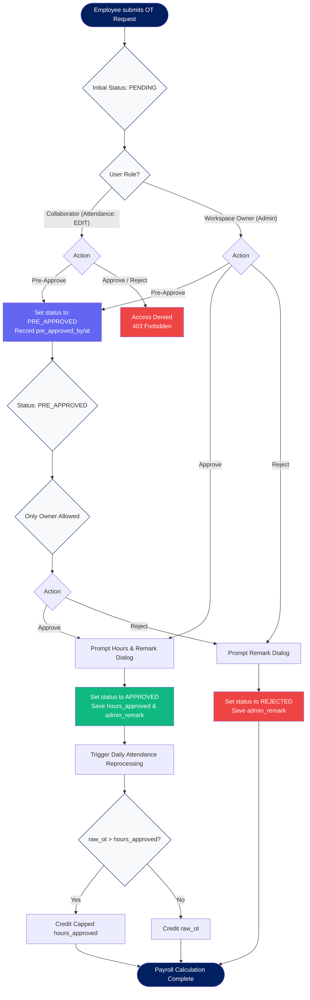
```mermaid
flowchart TD
    Start([Employee submits OT Request]) --> Status{"Initial Status: PENDING"}
    
    Status --> RoleCheck{User Role?}
    
    RoleCheck -- "Collaborator (Attendance: EDIT)" --> CollabAction{Action}
    CollabAction -- "Pre-Approve" --> PreApprove["Set status to PRE_APPROVED<br/>Record pre_approved_by/at"]
    CollabAction -- "Approve / Reject" --> CollabDenied["Access Denied<br/>403 Forbidden"]
    
    RoleCheck -- "Workspace Owner (Admin)" --> OwnerAction{Action}
    OwnerAction -- "Pre-Approve" --> PreApprove
    OwnerAction -- "Approve" --> OwnerApproveDialog[Prompt Hours & Remark Dialog]
    OwnerAction -- "Reject" --> OwnerRejectDialog[Prompt Remark Dialog]
    
    PreApprove --> Status2{"Status: PRE_APPROVED"}
    Status2 --> OwnerOnly{Only Owner Allowed}
    OwnerOnly --> OwnerAction2{Action}
    
    OwnerAction2 -- "Approve" --> OwnerApproveDialog
    OwnerAction2 -- "Reject" --> OwnerRejectDialog
    
    OwnerApproveDialog --> Approved["Set status to APPROVED<br/>Save hours_approved & admin_remark"]
    OwnerRejectDialog --> Rejected["Set status to REJECTED<br/>Save admin_remark"]
    
    Approved --> Recalc[Trigger Daily Attendance Reprocessing]
    Recalc --> CapCheck{"raw_ot > hours_approved?"}
    CapCheck -- "Yes" --> Cap[Credit Capped hours_approved]
    CapCheck -- "No" --> Raw[Credit raw_ot]
    
    Cap --> End([Payroll Calculation Complete])
    Raw --> End
    Rejected --> End

    style Start fill:#002060,color:#fff
    style End fill:#002060,color:#fff
    style Approved fill:#10b981,color:#fff
    style Rejected fill:#ef4444,color:#fff
    style PreApprove fill:#6366f1,color:#fff
    style CollabDenied fill:#ef4444,color:#fff
    style Status fill:#f8f9fa,stroke:#002060
    style Status2 fill:#f8f9fa,stroke:#002060
    style RoleCheck fill:#f8f9fa,stroke:#002060
    style OwnerOnly fill:#f8f9fa,stroke:#002060
    style CapCheck fill:#f8f9fa,stroke:#002060
```

### Payroll Validation & Processing Workflow
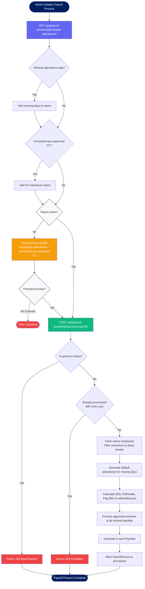
```mermaid
flowchart TD
    Start([Admin initiates Payroll Process]) --> CheckVal["GET /api/payroll-periods/{id}/validate-attendance/"]
    
    CheckVal --> CheckAttendance{Missing attendance logs?}
    CheckAttendance -- "Yes" --> MarkMissing[Add missing days to report]
    CheckAttendance -- "No" --> CheckOT
    
    MarkMissing --> CheckOT{Unresolved pre-approved OT?}
    
    CheckOT -- "Yes" --> AppendOT[Add OT warning to report]
    CheckOT -- "No" --> ReportStatus
    
    AppendOT --> ReportStatus{Report clean?}
    
    ReportStatus -- "No" --> AlertAdmin["Show warning modal:<br/>Incomplete attendance / unresolved pre-approved OT"]
    ReportStatus -- "Yes" --> PostProcess["POST /api/payroll-periods/{id}/process-payroll/"]
    
    AlertAdmin --> Confirm{Proceed Anyway?}
    Confirm -- "No (Cancel)" --> Stop([Flow Cancelled])
    Confirm -- "Yes" --> PostProcess
    
    PostProcess --> FutureCheck{Is period in future?}
    FutureCheck -- "Yes" --> ErrorFuture[Return 400 Bad Request]
    FutureCheck -- "No" --> LockCheck{"Already processed?<br/>BIR CAS Lock"}
    
    LockCheck -- "Yes" --> ErrorLocked[Return 403 Forbidden]
    LockCheck -- "No" --> LoadEmployees["Fetch active employees<br/>Filter exclusions & study breaks"]
    
    LoadEmployees --> GenMissing[Generate default attendance for missing days]
    GenMissing --> ComputeStat[Calculate SSS, PhilHealth, Pag-IBIG & withholding tax]
    ComputeStat --> ComputeOT[Process approved overtime & de minimis benefits]
    ComputeOT --> SavePayslip[Generate & save Payslips]
    SavePayslip --> MarkDone[Mark PayrollPeriod as processed]
    MarkDone --> End([Payroll Process Complete])
    
    ErrorFuture --> End
    ErrorLocked --> End

    style Start fill:#002060,color:#fff
    style End fill:#002060,color:#fff
    style Stop fill:#ef4444,color:#fff
    style ErrorFuture fill:#ef4444,color:#fff
    style ErrorLocked fill:#ef4444,color:#fff
    style AlertAdmin fill:#f59e0b,color:#fff
    style PostProcess fill:#10b981,color:#fff
    style CheckVal fill:#6366f1,color:#fff
    style ReportStatus fill:#f8f9fa,stroke:#002060
    style Confirm fill:#f8f9fa,stroke:#002060
```

### Employee Separation & Archival Lifecycle
```mermaid
flowchart TD
    REGISTRY[Personnel Registry] --> ACTION{Admin Action}
    
    ACTION --> STUDY[Toggle Study Break]
    STUDY --> PAY_GATE{Payroll Engine}
    PAY_GATE -- "Is on Study Break?" --> SKIP[/"Bypass Processing"/]
    PAY_GATE -- "No" --> PROC[Standard Calculation]
    
    ACTION --> SEP["Resign / Terminate"]
    SEP --> DIALOG[Separation Logic]
    
    DIALOG --> PERIOD["Select Scheduled<br/>Final Pay Period"]
    DIALOG --> LEAVE{"Manual Payout?"}
    
    LEAVE -- No --> AUTO["Leave Engine:<br/>Auto-Compute Unused SIL/VL"]
    LEAVE -- Yes --> MANUAL["Manual Entry Override"]
    
    PERIOD --> ENGINE["Payroll Engine: Final Run"]
    AUTO --> ENGINE
    MANUAL --> ENGINE
    
    ENGINE --> FLOOR["Apply 1-Month<br/>Minimum Floor (Art. 298)"]
    FLOOR --> ARCHIVE[Archive Employee Profile]
    
    STUDY --> GATE[/"Self-Service Gate:<br/>Access Locked"/]
    ARCHIVE --> GATE
    GATE --> VAULT[Immutable Archival Vault]
    
    VAULT --> HISTORY[Read-Only Payroll History]
    VAULT -- "DOLE Policy" --> PROTECT[Hover to Reveal Policy]

    style REGISTRY fill:#002060,color:#fff
    style ACTION fill:#f8f9fa,stroke:#002060
    style STUDY fill:#6366f1,color:#fff
    style SEP fill:#ef4444,color:#fff
    style ARCHIVE fill:#10b981,color:#fff
    style VAULT fill:#D4AF37,color:#fff
    style PROTECT fill:#ef4444,color:#fff
    style HISTORY fill:#10b981,color:#fff
    style GATE fill:#ef4444,color:#fff
```

### Bulk Employee Import & Biometric ID Auto-Resolution
```mermaid
flowchart TD
    Start([Upload Employees CSV]) --> Loop[For each Row in CSV]
    
    Loop --> ReqCheck{"Required Fields?<br/>first_name, last_name, employee_id"}
    ReqCheck -- No --> ErrorRow[Record validation error for Row]
    ReqCheck -- Yes --> IDCheck{employee_id exists?}
    
    IDCheck -- Yes --> ErrorRow
    IDCheck -- No --> DeviceCheck{device_user_id provided?}
    
    DeviceCheck -- No / Invalid --> AutoGen["Calculate candidate:<br/>max(DB, current_batch) + 1"]
    DeviceCheck -- Yes --> DupCheck{"device_user_id exists in DB<br/>or current_batch?"}
    
    AutoGen --> UniqueCheck{"candidate is unique in DB<br/>and current_batch?"}
    UniqueCheck -- No --> IncCandidate["candidate += 1"]
    IncCandidate --> UniqueCheck
    UniqueCheck -- Yes --> SetDevice["Assign device_user_id = candidate"]
    
    DupCheck -- Yes --> IncDup["device_user_id += 1"]
    IncDup --> DupCheck
    DupCheck -- No --> SetDevice
    
    SetDevice --> AddBatch[Add resolved device_user_id to batch_device_user_ids]
    AddBatch --> CreateEmp[Create Employee record]
    CreateEmp --> NextRow[Next Row]
    NextRow --> Loop
    
    style Start fill:#002060,color:#fff
    style CreateEmp fill:#10b981,color:#fff
    style ErrorRow fill:#ef4444,color:#fff
    style ReqCheck fill:#f8f9fa,stroke:#002060
    style IDCheck fill:#f8f9fa,stroke:#002060
    style DeviceCheck fill:#f8f9fa,stroke:#002060
    style UniqueCheck fill:#f8f9fa,stroke:#002060
    style DupCheck fill:#f8f9fa,stroke:#002060
```

### Hazard Pay Calculation Workflow
```mermaid
flowchart TD
    Start([Hazard Pay Engine Start]) --> SectorCheck{"hazard_pay_sector != 'NONE'?"}
    SectorCheck -- No --> NoHazard["hazard_pay = 0.00<br/>taxable = 0.00<br/>exempt = 0.00"] --> End([Engine End])
    
    SectorCheck -- Yes --> LoadFields["Load: rate, type, proration, taxable, salary_grade"]
    LoadFields --> SectorSwitch{Sector?}
    
    SectorSwitch -- PUBLIC_HEALTH --> SGCheck{"salary_grade <= 19?"}
    SGCheck -- Yes --> SG19["rate = 25%<br/>type = PERCENTAGE<br/>prorated = True"]
    SGCheck -- No --> SG20["rate = 5%<br/>type = PERCENTAGE<br/>prorated = True"]
    SG19 --> CalcRaw
    SG20 --> CalcRaw
    
    SectorSwitch -- PUBLIC_TEACHER --> SGTeacher["rate = 25%<br/>type = PERCENTAGE<br/>prorated = True"] --> CalcRaw
    SectorSwitch -- PUBLIC_SCIENCE --> SGScience["type = PERCENTAGE<br/>prorated = True"] --> CalcRaw
    SectorSwitch -- PUBLIC_OTHER --> SGOther["prorated = True"] --> CalcRaw
    SectorSwitch -- PNP --> SGPNP["taxable = False"] --> CalcRaw
    SectorSwitch -- AFP --> SGAFP["taxable = True"] --> CalcRaw
    SectorSwitch -- PRIVATE / Other --> CalcRaw
    
    CalcRaw{Type?} -- PERCENTAGE --> Percent["raw_amount = rate % * period_base_pay"]
    CalcRaw -- FIXED --> Fixed{Period schedule?}
    Fixed -- SEMI_MONTHLY --> FixedSemi["raw_amount = rate / 2"]
    Fixed -- MONTHLY / DAILY --> FixedFull["raw_amount = rate"]
    
    Percent --> ProrateCheck
    FixedSemi --> ProrateCheck
    FixedFull --> ProrateCheck
    
    ProrateCheck{prorated is True?} -- Yes --> ApplyProration["calculated = (raw_amount * actual_workdays) / expected_workdays<br/>hazard_pay = min(raw_amount, calculated)"]
    ProrateCheck -- No --> SetRaw["hazard_pay = raw_amount"]
    
    ApplyProration --> Quantize["hazard_pay = round(hazard_pay, 2)"]
    SetRaw --> Quantize
    
    Quantize --> TaxCheck{taxable is True?}
    TaxCheck -- Yes --> SetTaxable["taxable_amount = hazard_pay<br/>exempt_amount = 0.00"]
    TaxCheck -- No --> SetExempt["taxable_amount = 0.00<br/>exempt_amount = hazard_pay"]
    
    SetTaxable --> AddToGross["Add hazard_pay to Gross Pay<br/>Add taxable_amount to Taxable Income"]
    SetExempt --> AddToGrossExempt["Add hazard_pay to Gross Pay<br/>Exclude exempt_amount from Taxable Income"]
    
    AddToGross --> End
    AddToGrossExempt --> End

    style Start fill:#002060,color:#fff
    style End fill:#002060,color:#fff
    style NoHazard fill:#6366f1,color:#fff
    style Percent fill:#10b981,color:#fff
    style FixedSemi fill:#10b981,color:#fff
    style FixedFull fill:#10b981,color:#fff
    style ApplyProration fill:#D4AF37,color:#fff
    style SetRaw fill:#10b981,color:#fff
    style SetTaxable fill:#ef4444,color:#fff
    style SetExempt fill:#10b981,color:#fff
```

### Employee Profile Photo Self-Service Flow

To manage an employee's profile photo, the application supports optional `profile_photo` and `remove_profile_photo` fields. Clients should only include them when actively changing or removing a photo. These fields are mutually exclusive and must **never** be sent together in the same request. For details on the payload structure, see the [Employee Self-Service (ESS) Portal API Reference](#employee-self-service-ess-portal).

```mermaid
flowchart TD
    Start([Employee Portal Profile Tab]) --> Action{Action?}
    
    Action -- "Upload / Change Photo" --> SelectFile[Select Image File]
    SelectFile --> SizeCheck{"File Size > 5MB?"}
    SizeCheck -- Yes --> AlertSize["ElMessage Error: Exceeds 5MB"] ----> Halt([Halt])
    SizeCheck -- No --> ExtCheck{"Format is JPG/PNG/WEBP?"}
    ExtCheck -- No --> AlertExt["ElMessage Error: Invalid Format"] --> Halt
    ExtCheck -- Yes --> SetPreview[Set Local Preview & Store selectedFile] --> SaveProfile
    
    Action -- "Remove Photo" --> ClickRemove[Click Remove Photo]
    ClickRemove --> ClearPreview["Clear Preview, set isPhotoRemoved = True"] --> SaveProfile
    
    SaveProfile([Click Save Profile]) --> FormPayload[Construct FormData Payload]
    FormPayload --> CheckRemoved{isPhotoRemoved is True?}
    CheckRemoved -- Yes --> AppendRemoveFlag["Append 'remove_profile_photo': 'true'"] --> Request
    CheckRemoved -- No --> CheckFile{selectedFile present?}
    CheckFile -- Yes --> AppendFile["Append 'profile_photo': file"] --> Request
    CheckFile -- No --> Request
    
    Request["PATCH /api/employee/portal/"] --> BackendSerializer{Backend Serializer Check}
    BackendSerializer -- "Invalid (Format/Size/Content)" --> Response400[Return 400 Bad Request] --> ShowError[ElMessage Error]
    BackendSerializer -- "Valid" --> OnboardedCheck{Employee is_onboarded?}
    
    OnboardedCheck -- "No (First Time Onboarding)" --> SaveDirectOnb["Direct Save All Fields & set is_onboarded = True"] --> Response200[Return 200 OK]
    OnboardedCheck -- "Yes" --> SaveDirectPhoto[Direct Save profile_photo Field] --> Response200
    
    Response200 --> ResetState[Clear selectedFile, photoPreview, isPhotoRemoved]
    ResetState --> RefreshData[Reload employeeProfileData & Form] --> End([Process Complete])

    style Start fill:#002060,color:#fff
    style End fill:#002060,color:#fff
    style SaveProfile fill:#D4AF37,color:#fff
    style AlertSize fill:#ef4444,color:#fff
    style AlertExt fill:#ef4444,color:#fff
    style Response400 fill:#ef4444,color:#fff
    style Response200 fill:#10b981,color:#fff
    style SizeCheck fill:#f8f9fa,stroke:#002060
    style ExtCheck fill:#f8f9fa,stroke:#002060
    style OnboardedCheck fill:#f8f9fa,stroke:#002060
```

### Employee Self-Service Allowance Request Validation Flow

```mermaid
flowchart TD
    Start([Employee submits Allowance Request]) --> BodyCheck{Is Request Body an Object?}
    BodyCheck -- No --> ErrBody[Return 400 Bad Request] --> Halt([Halt])
    BodyCheck -- Yes --> TypeCheck{Is allowance_type a Valid String Choice?}
    TypeCheck -- No --> ErrType[Return 400 Bad Request] --> Halt
    TypeCheck -- Yes --> CatCheck{Employee Category?}
    
    CatCheck -- "Managerial / Supervisory" --> Process[Try to Save to Database]
    CatCheck -- "Rank & File" --> AuthCheck{allowance_type is PER_DIEM or MEAL?}
    
    AuthCheck -- No --> ErrAuth["Return 403 Forbidden<br/>Unauthorized Category"] --> Halt
    AuthCheck -- Yes --> Process
    
    Process --> SaveCheck{Save Successful?}
    SaveCheck -- No --> ErrSave["Return 400 Bad Request<br/>Database ValidationError"] --> Halt
    SaveCheck -- Yes --> Success["Return 201 Created<br/>Allowance Request Submitted"] --> End([Process Complete])

    style Start fill:#002060,color:#fff
    style End fill:#002060,color:#fff
    style Success fill:#10b981,color:#fff
    style ErrBody fill:#ef4444,color:#fff
    style ErrType fill:#ef4444,color:#fff
    style ErrAuth fill:#ef4444,color:#fff
    style ErrSave fill:#ef4444,color:#fff
    style BodyCheck fill:#f8f9fa,stroke:#002060
    style TypeCheck fill:#f8f9fa,stroke:#002060
    style CatCheck fill:#f8f9fa,stroke:#002060
    style AuthCheck fill:#f8f9fa,stroke:#002060
    style SaveCheck fill:#f8f9fa,stroke:#002060
```

### Digital Signature & Profile Update Request Approval Pipeline

```mermaid
flowchart TD
    SUBMIT([Employee submits or updates profile change request]) --> TRANS1{transaction.atomic}
    TRANS1 --> LOCK["select_for_update: Lock PENDING Request"]
    LOCK --> TYPE_SWITCH{Action Type Switched?}
    
    TYPE_SWITCH -- "Yes" --> PURGE[Purge Stale Signature URL & Data]
    TYPE_SWITCH -- "No" --> MERGE[Merge requested_changes & old_values]
    PURGE --> MERGE
    
    MERGE --> SAVE_REQ[Save ProfileUpdateRequest DB Record]
    
    SAVE_REQ --> GATED_SERIALIZER{Serializer URL Access?}
    GATED_SERIALIZER -- "Status == PENDING" --> RETURN_URL[Return active pending_digital_signature_url]
    GATED_SERIALIZER -- "Status != PENDING" --> HIDE_URL["Return Null / Omit URL"]
    
    SAVE_REQ --> ADMIN_REVIEW[Admin Approval Queue]
    ADMIN_REVIEW --> ADMIN_ACTION{Admin Decision?}
    
    ADMIN_ACTION -- "Reject" --> SET_REJECT["Set Status: REJECTED"]
    ADMIN_ACTION -- "Approve" --> TRANS2{transaction.atomic}
    
    TRANS2 --> CAPTURE[Capture Previous Signature State & URL]
    CAPTURE --> APPLY_DB[Apply Changes to Employee DB Record]
    APPLY_DB --> SET_APP["Set Request Status: APPROVED"]
    
    SET_APP --> ON_COMMIT{transaction.on_commit Registered Hooks}
    ON_COMMIT -- "DB Commit Success" --> WRITE_FILE[Promote File & Purge Old Storage Media]
    ON_COMMIT -- "DB Commit Fail / Rollback" --> ROLLBACK[Retain Files in Storage for Atomic Retry]
    
    WRITE_FILE --> DONE([Approval Complete])
    ROLLBACK --> FAIL([Transaction Aborted])
    SET_REJECT --> DONE

    style SUBMIT fill:#002060,color:#fff
    style DONE fill:#10b981,color:#fff
    style FAIL fill:#ef4444,color:#fff
    style WRITE_FILE fill:#10b981,color:#fff
    style ROLLBACK fill:#ef4444,color:#fff
    style TRANS1 fill:#6366f1,color:#fff
    style TRANS2 fill:#6366f1,color:#fff
    style LOCK fill:#D4AF37,color:#fff
    style TYPE_SWITCH fill:#f8f9fa,stroke:#002060
    style GATED_SERIALIZER fill:#f8f9fa,stroke:#002060
    style ADMIN_ACTION fill:#f8f9fa,stroke:#002060
```

## Database Schema (ERD)

```mermaid
erDiagram
    DEPARTMENT ||--o{ EMPLOYEE : manages
    BRANCH ||--o{ EMPLOYEE : "assigned to"
    
    EMPLOYEE ||--o{ ATTENDANCE_LOG : "generates punches"
    BIOMETRIC_DEVICE ||--o{ ATTENDANCE_LOG : records
    
    EMPLOYEE ||--o{ DAILY_ATTENDANCE : summarizes
    EMPLOYEE ||--o{ FIELDWORK_REQUEST : files
    EMPLOYEE ||--o{ HALF_DAY_SCHEDULE : assigned
    EMPLOYEE ||--o{ LEAVE_REQUEST : files
    EMPLOYEE ||--o{ OVERTIME_REQUEST : files
    EMPLOYEE ||--o{ TIME_ADJUSTMENT : files
    EMPLOYEE ||--o{ ALLOWANCE_REQUEST : files
    EMPLOYEE ||--o{ LEAVE_BALANCE : "has credits"
    LEAVE_POLICY ||--o{ LEAVE_BALANCE : "defines rules"
    
    PAYROLL_PERIOD ||--o{ PAYSLIP : contains
    EMPLOYEE ||--o{ PAYSLIP : receives
    
    PAYROLL_CONFIGURATION ||--o{ PAYROLL_PERIOD : controls
    SSS_TABLE ||--o{ PAYROLL_CONFIGURATION : references
    PH_TABLE ||--o{ PAYROLL_CONFIGURATION : references
    BIR_TAX_TABLE ||--o{ PAYROLL_CONFIGURATION : references
    USER ||--o{ LEAVE_REQUEST : approves
    USER ||--o{ OVERTIME_REQUEST : approves
    USER ||--o{ TIME_ADJUSTMENT : approves
    USER ||--o{ ALLOWANCE_REQUEST : approves
    USER ||--o{ INVITATION : "sends (as inviter)"
    USER ||--o{ INVITATION : "accepts"
    USER ||--o{ COLLABORATOR_ACCESS : "grants (as inviter)"
    USER ||--o{ COLLABORATOR_ACCESS : "receives (as collaborator)"
    INVITATION ||--o| COLLABORATOR_ACCESS : "results in"
    USER ||--o{ COLLABORATOR_AUDIT_LOG : "performs action"
    USER ||--o{ EMAIL_VERIFICATION_CODE : receives
    EMPLOYEE ||--o{ PROFILE_UPDATE_REQUEST : "submits change request"
    USER ||--o{ PROFILE_UPDATE_REQUEST : "creates/reviews"
    EMPLOYEE ||--o{ EMPLOYEE_CHANGE_LOG : "has change logs"
    USER ||--o{ EMPLOYEE_CHANGE_LOG : "modified by"
    USER ||--|| PROFILE : "has profile"

    TENANT ||--o| TENANT_SUBSCRIPTION : holds
    SUBSCRIPTION_PLAN ||--o{ TENANT_SUBSCRIPTION : defines
    TENANT ||--o{ PAYMENT_TRANSACTION : "makes payments"
    TENANT ||--o{ INVOICE : receives
    PAYMENT_TRANSACTION ||--o| INVOICE : generates

    TENANT {
        string name
        string slug UK
        string payment_status "TRIAL/ACTIVE/PAST_DUE/etc"
        datetime trial_ends_at
        string employer_registered_name
        string employer_tin "Encrypted (TIN)"
        string employer_rdo_code
        string employer_address
        string employer_zip_code
    }

    TENANT_SUBSCRIPTION {
        string status "ACTIVE/EXPIRED/TRIAL"
        string billing_cycle "MONTHLY/ANNUAL"
        datetime current_period_start
        datetime current_period_end
    }

    PROFILE {
        int id PK
        int user_id FK
        string role "SUPERADMIN/ADMIN/EMPLOYEE"
        int session_version "Active session version tracking"
    }

    OVERTIME_REQUEST {
        date date
        decimal hours_requested
        string status "PENDING/PRE_APPROVED/APPROVED/REJECTED"
        string reason
        decimal hours_approved
        string admin_remark
        int pre_approved_by_id
        datetime pre_approved_at
    }

    TIME_ADJUSTMENT {
        string adjustment_type "MISSED_IN/MISSED_OUT/CORRECTION"
        date date
        time requested_time
        string status "PENDING/APPROVED/REJECTED"
    }

    ALLOWANCE_REQUEST {
        date date
        string allowance_type "PER_DIEM/MEAL/REPRESENTATION/TRANSPORTATION/COLA/FIXED_HOUSING/DIRECTORS_FEES"
        decimal amount
        string reason
        string status "PENDING/APPROVED/REJECTED"
        datetime approved_at
    }

    EMPLOYEE {
        string employee_id PK
        int device_user_id UK "Unified Machine ID"
        int branch_id FK "Mandatory Company Branch Assignment"
        string position "Free-text field"
        string sss_no "Encrypted (SSS Number)"
        string tin_no "Encrypted (TIN)"
        string philhealth_no "Encrypted (PhilHealth Number)"
        string pagibig_no "Encrypted (Pag-IBIG Number)"
        string bank_name "Bank Name"
        string bank_account_no "Encrypted (Bank Account Number)"
        decimal basic_salary "Monthly Base"
        decimal hourly_rate "Auto-calculated"
        string employee_category "MANAGERIAL/SUPERVISORY/RANK_AND_FILE"
        string employment_type "REGULAR/PROVISIONAL/PART_TIME"
        boolean applies_no_work_no_pay_special
        decimal de_minimis_allowance "Total De Minimis sum"
        decimal de_minimis_rice_subsidy "Monthly Rice Subsidy"
        decimal de_minimis_laundry "Monthly Laundry Allowance"
        decimal de_minimis_medical "Monthly Medical Cash"
        decimal de_minimis_uniform "Monthly Uniform Allowance"
        decimal de_minimis_actual_medical "Actual Medical Assistance"
        decimal de_minimis_vacation_leave "Monetized Vacation Leave"
        decimal de_minimis_achievement_awards "Achievement Awards"
        decimal de_minimis_gifts "Holiday & Anniversary Gifts"
        decimal de_minimis_meals "Overtime/Night Shift Meals"
        decimal de_minimis_productivity "Productivity & CBA Schemes"
        string salary_type "MONTHLY/DAILY"
        string daily_salary_factor "395/313/305/261"
        string employment_status "ACTIVE/RESIGNED/TERMINATED/ARCHIVED"
        string separation_type "RESIGNATION/LABOR_SAVING/etc"
        date separation_date
        decimal leave_conversion_amount "SIL/VL Cash Value"
        int maternity_delivery_count "RA 8187 Cap Tracker"
        boolean is_on_study_break "Payroll Exclusion Flag"
        boolean is_mwe "Minimum Wage Earner (tax-exempt)"
        string invite_code UK "Portal Linkage Code"
        datetime invite_expires_at "Security TTL"
        datetime archived_at
        string hazard_pay_sector "NONE/PRIVATE/PUBLIC_HEALTH/PNP/etc"
        string hazard_pay_type "FIXED/PERCENTAGE"
        decimal hazard_pay_rate "Rate or fixed amount"
        boolean hazard_pay_is_prorated "Prorate by actual workdays"
        boolean hazard_pay_taxable "BIR withholding flag"
        int salary_grade "For RA 7305 SG-based rate"
        boolean is_first_job "First job in current tax year"
        string prev_employer_name "Prior Employer Name"
        string prev_employer_tin "Prior Employer TIN"
        string prev_employer_address "Prior Employer Address"
        string prev_employer_zip "Prior Employer ZIP Code"
        decimal prev_taxable_compensation "Prior Employer YTD Taxable Pay"
        decimal prev_tax_withheld "Prior Employer YTD Tax Withheld"
    }
    
    DAILY_ATTENDANCE {
        date date PK
        string status "PRESENT/ABSENT/FW/HOLIDAY/REST"
        datetime check_in
        datetime check_out
        float total_hours
        float overtime_hours
        float night_diff_hours
        boolean is_fieldwork "OB Override"
        boolean is_late
    }
    
    FIELDWORK_REQUEST {
        date start_date
        date end_date
        time start_time "Optional Boundary"
        time end_time "Optional Boundary"
        string status "PENDING/APPROVED/REJECTED"
    }

    HALF_DAY_SCHEDULE {
        date date
        string schedule_type "AM/PM"
    }

    LEAVE_REQUEST {
        string leave_type "SIL/VL/SL/MATERNITY/etc"
        date start_date
        date end_date
        boolean is_paid
        boolean is_half_day
        string half_day_period "AM/PM"
        string status "PENDING/APPROVED/REJECTED"
        datetime approved_at
    }
    
    LEAVE_POLICY {
        string leave_type "SIL/VL/SL"
        decimal annual_credits
        string year_end_rule "CASH_CONVERT/CARRY_OVER/FORFEIT"
        boolean is_mandatory "DOLE SIL Flag"
        boolean is_active
        int min_tenure_months
    }
    
    LEAVE_BALANCE {
        int year "Fiscal Year"
        string leave_type "Policy reference"
        decimal total_credits
        decimal carried_over "From prev year"
        decimal used_credits
        decimal converted_to_cash
        decimal cash_conversion_amount
        boolean is_year_end_processed
        decimal remaining_credits "Property: total - used"
    }
    
    PAYSLIP {
        decimal basic_pay "Base Salary for Period"
        decimal overtime_pay "OT Pay"
        decimal night_diff_pay "Night Differential"
        decimal holiday_pay "Holiday Premium"
        decimal allowances "Standard Allowances"
        decimal de_minimis "Total De Minimis sum"
        decimal de_minimis_exempt "Tax-Exempt De Minimis"
        decimal de_minimis_taxable_excess "Taxable De Minimis Excess"
        json de_minimis_breakdown "Persisted category-by-category benefits breakdown"
        decimal bonuses "PA/Christmas/Manual"
        decimal daily_rate "Daily Rate at calculation"
        decimal hourly_rate "Hourly Rate at calculation"
        decimal separation_pay "DOLE Art. 298/299 severance"
        decimal retirement_pay "DOLE Art. 302 retirement"
        decimal sss_maternity_benefit "SSS-reimbursable portion"
        decimal maternity_salary_differential "Employer-paid differential"
        decimal service_charge_share "RA 11360 share"
        decimal hazard_pay "Hazard Pay Amount"
        decimal hazard_pay_taxable_amount "Taxable portion of Hazard Pay"
        decimal hazard_pay_exempt_amount "Exempt portion of Hazard Pay"
        decimal sss_deduction "Employee SSS share"
        decimal philhealth_deduction "Employee PhilHealth share"
        decimal pagibig_deduction "Employee Pag-IBIG share"
        decimal withholding_tax "BIR 1601-C Computed Tax"
        decimal other_deductions "Absences/Late/etc"
        decimal absence_days "Number of days absent"
        integer late_minutes "Number of minutes late"
        decimal absence_deduction "Total deduction for absences"
        decimal late_deduction "Total deduction for lateness"
        decimal employer_sss_share "Employer SSS Share"
        decimal employer_ec_contribution "Employer EC Contribution"
        decimal employer_philhealth_share "Employer PhilHealth Share"
        decimal employer_pagibig_share "Employer Pag-IBIG Share"
        decimal gross_pay "Total Earnings"
        decimal net_pay "Net Take-Home Pay"
        decimal taxable_representation "Taxable Representation (FBT)"
        decimal taxable_transportation "Taxable Transportation (FBT)"
        decimal taxable_cola "Taxable COLA (FBT)"
        decimal taxable_fixed_housing "Taxable Fixed Housing (FBT)"
        decimal taxable_directors_fees "Taxable Directors Fees (FBT)"
        decimal grossed_up_fringe_benefits "GMV = MV / 0.65 for managerial/supervisory"
        decimal fringe_benefit_tax "FBT = GMV x 35%"
        decimal taxable_de_minimis_excess "De minimis excess routed per classification"
        datetime generated_at
    }

    PAYROLL_PERIOD {
        string name
        string schedule "WEEKLY/BIWEEKLY/SEMI_MONTHLY/MONTHLY"
        date start_date
        date end_date
        boolean is_processed
    }

    PAYROLL_CONFIGURATION {
        int branch_id FK
        string work_schedule_type "STANDARD/COMPRESSED/SIX_DAY_HALF/SIX_DAY_FULL"
        string saturday_half_day_session "AM/PM"
        boolean auto_calculate_13th_month "Accrual Toggle"
        boolean bonuses_available "Bonus Global Kill-switch"
        decimal late_deduction_per_minute
        string monthly_salary_basis "CALENDAR/WORKING_DAYS"
        int working_days_per_month
        time day_cutoff_time "Logical Day Cutoff"
        decimal de_minimis_max_monthly "Monthly de minimis cap"
        decimal holiday_rest_day_multiplier ">= 2.60 statutory floor"
        decimal special_rest_day_multiplier ">= 1.50 statutory floor"
        decimal overtime_rest_day_multiplier ">= 1.69 statutory floor"
        decimal overtime_holiday_multiplier ">= 2.60 statutory floor"
        string payroll_schedule "WEEKLY/BIWEEKLY/SEMI_MONTHLY/MONTHLY"
        int cycle1_start_day
        int cycle1_end_day
        int cycle2_start_day
        int cycle2_end_day
    }

    EMPLOYEE ||--o{ LOAN : borrows
    LOAN ||--o{ LOAN_PAYMENT : tracks
    PAYSLIP ||--o{ LOAN_PAYMENT : "auto-deducts"
    
    SHIFT ||--o{ EMPLOYEE_SHIFT : assigned
    EMPLOYEE ||--o{ EMPLOYEE_SHIFT : scheduled

    LOAN {
        string loan_type "CASH_BOND/SALARY/SSS/PAGIBIG"
        decimal principal_amount
        decimal remaining_balance
        string status "ACTIVE/PAID/CANCELLED"
    }

    COLLABORATOR_ACCESS {
        int id PK
        int inviter_id FK
        int collaborator_id FK
        string employees_permission "NONE/VIEW/EDIT"
        string attendance_permission "NONE/VIEW/EDIT"
        string shifts_permission "NONE/VIEW/EDIT"
        string payroll_permission "NONE/VIEW/EDIT"
        string loans_permission "NONE/VIEW/EDIT"
        string tax_tables_permission "NONE/VIEW/EDIT"
        string settings_permission "NONE/VIEW/EDIT"
        string leaves_permission "NONE/VIEW/EDIT"
        string devices_permission "NONE/VIEW/EDIT"
        string billing_permission "NONE/VIEW/EDIT"
        string approvals_permission "NONE/VIEW/EDIT"
        string data_transfer_permission "NONE/VIEW/EDIT"
        string allowances_permission "NONE/VIEW/EDIT"
        string status "ACTIVE/REVOKED/SUSPENDED"
        datetime created_at
        datetime updated_at
        datetime revoked_at
        int invitation_used_id FK
    }

    INVITATION {
        int id PK
        int inviter_id FK
        string email
        boolean is_link_invite
        string invite_code
        string qr_code "Base64 PNG"
        string status "PENDING/ACCEPTED/EXPIRED/REVOKED"
        boolean is_used
        int accepted_by_id FK
        datetime accepted_at
        datetime created_at
        datetime expires_at
        string employees_permission "NONE/VIEW/EDIT"
        string attendance_permission "NONE/VIEW/EDIT"
        string shifts_permission "NONE/VIEW/EDIT"
        string payroll_permission "NONE/VIEW/EDIT"
        string loans_permission "NONE/VIEW/EDIT"
        string tax_tables_permission "NONE/VIEW/EDIT"
        string settings_permission "NONE/VIEW/EDIT"
        string leaves_permission "NONE/VIEW/EDIT"
        string devices_permission "NONE/VIEW/EDIT"
        string billing_permission "NONE/VIEW/EDIT"
        string approvals_permission "NONE/VIEW/EDIT"
        string data_transfer_permission "NONE/VIEW/EDIT"
        string allowances_permission "NONE/VIEW/EDIT"
    }

    COLLABORATOR_AUDIT_LOG {
        int id PK
        int inviter_id FK
        int collaborator_id FK
        string action "INVITE_SENT/ACCEPTED/REVOKED/etc"
        json previous_permissions
        json new_permissions
        string reason
        int performed_by_id FK
        datetime performed_at
        string ip_address
    }

    SHIFT {
        string name "Morning/Mid/Night"
        time start_time
        time end_time
        boolean is_night_shift
        string color "Glassmorphic Theme Color"
    }

    EMAIL_VERIFICATION_CODE {
        int id PK
        int user_id FK
        string purpose "login/register/password_reset"
        string code_hash
        datetime expires_at
        datetime consumed_at
        string pending_email
        int failed_attempts
    }

    PENDING_REGISTRATION {
        int id PK
        string username
        string email
        string password_hash
        datetime expires_at
    }

    PROFILE_UPDATE_REQUEST {
        int id PK
        int employee_id FK
        int requested_by_id FK
        int reviewed_by_id FK
        json requested_changes "Encrypted JSON"
        json old_values "Encrypted JSON"
        string status "PENDING/APPROVED/REJECTED"
        datetime created_at
        datetime reviewed_at
        string rejection_reason
    }

    EMPLOYEE_CHANGE_LOG {
        int id PK
        int employee_id FK
        int changed_by_id FK
        json changed_fields "Encrypted JSON"
        datetime created_at
    }
```

## Technical Stack

### Backend
- **Engine**: Django 5.2.12 on Python 3.12
- **API Architecture**: Django REST Framework (DRF) with JWT
- **Cloud Infrastructure**: Render web services with PostgreSQL and Redis
- **Resilience**: Integrated Recovery & Import Restoration Logic
- **Hardening**: AES-256 Field Encryption + 5MB/25MB Multi-Layer Guard
- **Integration**: ZKAccess & PyZK Bridge Agent

### Frontend
- **Framework**: Vue 3.5 with Composition API
- **UI System**: Element Plus (Premium Glassmorphic Theme)
- **Visualization**: ApexCharts Enterprise (Reactive Transitions)
- **Deployment**: Vercel with hashed assets and stale-chunk auto-recovery
- **State Engine**: Pinia 3
- **Bundler**: Vite 8
- **Icons**: Element Plus, Lucide Vue, Dicebear Initials

## Core Features

### Smart Bulk Import & Validation Engine

BizMaker incorporates a highly resilient, multi-step **Bulk Import & Verification** engine for importing employee rosters and biometric attendance punches. It features formula injection protection, dry-run schema validation, timezone-safe punch pairing, and database upsert transactions.

```mermaid
flowchart TD
    Start([Upload CSV File]) --> CSV{CSV Parsing & Normalization}
    CSV -->|Detect Extra Columns| BadCSV[HTTP 400 Bad Request]
    CSV -->|Strip Neutralizing Apostrophes| CleanRows[Normalized Row Data]
    
    CleanRows --> Step1{"Step 1: Header Mapping"}
    Step1 -->|Bypass first_name/last_name check for existing| ValidateMapping{Required Fields Mapped?}
    ValidateMapping -- "No" --> BlockNext[Disable Next Button]
    ValidateMapping -- "Yes" --> Step2["Step 2: Dry-Run Ingestion & Validation"]
    
    Step2 --> GroupPunches[Group punches by local date calendar components]
    GroupPunches --> PairingCheck[Pair check-in & check-out chronologically]
    PairingCheck -->|Missing check-out| WarnPunch[Add warning message]
    
    Step2 --> CompareDB[Compare values against existing employees]
    CompareDB -->|Critical Change? sss_no, name, bank, etc.| WarnCrit["Add warning: Value will change from X to Y"]
    
    Step2 --> Step3{"Step 3: Preview Grid & Confirmation"}
    Step3 --> CheckWarns{Has Critical Warnings?}
    CheckWarns -- "Yes" --> RequireConfirm[Require global confirmation checkbox]
    CheckWarns -- "No" --> AllowImport[Enable Start Import Button]
    RequireConfirm -->|Checkbox Checked| AllowImport
    RequireConfirm -->|Checkbox Unchecked| BlockImport[Disable Start Import Button]
    
    AllowImport --> Execute["Step 4: Execute DB Persistence"]
    Execute --> Trans[Wrap in Atomic Transaction]
    Trans --> SaveRows{Save row-by-row}
    SaveRows -->|Existing employee_id| Upsert["Upsert: Update non-blank fields only"]
    SaveRows -->|New employee_id| Create[Create new employee]
    Create -->|Unique device_user_id Conflict?| AutoRetry[Auto-increment device_user_id & retry]
    AutoRetry -->|Retry Success| SaveRows
    AutoRetry -->|Retry Failed| AddError[Record Row Error]
    Upsert -->|Save/Clean Error| RestoreObj[Restore cached employee to original state] --> AddError
    SaveRows -->|Complete| Done([Display Results Summary & stats])

    classDef bizGold fill:#D4AF37,stroke:#002060,stroke-width:2px,color:#fff
    classDef process fill:#f8f9fa,stroke:#002060,stroke-width:1px
    class Start,Done,AllowImport bizGold
    class CSV,Step1,ValidateMapping,Step2,CheckWarns,SaveRows,Create process
```

- **Dry-Run Validation & Cross-Row Pairing**: Incoming data is dynamically checked in the frontend before write execution. Employee files flag critical field modifications (TIN, SSS, Bank Accounts) to require global confirmation, while attendance files run chronological check-in/check-out pairings using local Date calendar variables to flag unmatched punch events.
- **Fail-Safe Cache Protection**: If validation (`full_clean()`) or database write fails for a row during employee upsert, the engine restores the cached employee object's in-memory state to protect the registry from dirty updates.
- **Auto-Allocation on Device ID Conflicts**: Database creations are wrapped inside an atomic transaction. If a `device_user_id` unique key constraint triggers a conflict, the system auto-allocates the next available machine ID and retries saving.
- **Formula Injection Shield**: Strips formula-neutralizing single-quotes (`'=`, `'+`, `'-`, `'@`) during cell normalization to ingest raw values correctly, and wraps export generation fields to prevent spreadsheet macro exploits.

### DOLE EEMR & Schedule-Aware Salary Engine (2026)

```mermaid
graph TD
    A["Employee Profile"] --> B{"Salary Type?"}
    
    B --> C{"Monthly Basis?"}
    C -- "Calendar" --> C1["Factor 365"]
    C -- "Working Days" --> C2["Custom Working Days (1-31)"]
    
    B --> D["Daily Paid: Branch Schedule"]
    D --> E["Standard: Factor 261"]
    D --> F["Six-Day: Factor 313"]
    D --> G["Compressed: Factor 209"]
    
    C1 --> H["Calculation Engine"]
    C2 --> H
    E --> H
    F --> H
    G --> H
    
    H --> I["Basic Monthly Salary"]
```

- **Live EEMR Forecasting**: The Personnel Registry features a **real-time reactive engine** that computes EEMR Monthly and Daily rates instantly as you type. 
- **Schedule-Aware Multipliers**: The system automatically detects the **Branch Archetype** (Standard, Compressed, or Six-Day) and applies official DOLE mathematical factors (**30.42, 26.08, 21.75, 17.42**) for perfect monthly forecasting.

### Multi-Tenant Branch & Company Header Branding

BizMaker supports multi-tier corporate and branch-level payslip header branding. System administrators can configure distinct header logos for individual branches or set a default company-wide header logo, complete with customizable text overlay toggles in the administrative preview.

```mermaid
flowchart TD
    Start([Generate Payslip PDF / Web Preview]) --> FetchTenant[Resolve Workspace Tenant & Branch]
    FetchTenant --> RefreshDB["Refresh Models from DB: Branch & Tenant"]
    RefreshDB --> CheckBranchLogo{Branch has header_logo?}
    CheckBranchLogo -- "Yes & Exists" --> UseBranchLogo["Set banner_path = branch.header_logo.path"]
    CheckBranchLogo -- "No / Missing" --> CheckTenantLogo{Tenant has header_logo?}
    CheckTenantLogo -- "Yes & Exists" --> UseTenantLogo["Set banner_path = tenant.header_logo.path"]
    CheckTenantLogo -- "No" --> NoLogo[No Banner Image - Fallback Text Header]
    UseBranchLogo --> RenderBanner[Render Full-Width Banner with Cover Scaling]
    UseTenantLogo --> RenderBanner
    RenderBanner --> DarkOverlay[Apply Dark Navy Overlay for Text Contrast]
    DarkOverlay --> RenderText[Overlay Centered Company Name & Branch Label]
    NoLogo --> Output([Deliver Payslip Output])
    RenderText --> Output
```

- **Dynamic Model Refresh**: During PDF generation (in both ReportLab and FPDF `payslip_pdf.py` engines), `Branch` and `Tenant` model instances execute explicit `refresh_from_db()` queries. This bypasses Django ORM memory caching and guarantees that newly uploaded admin logos reflect immediately without server restarts.
- **Cover-Scaled Canvas & Dark Overlay**: The PDF generator inspects logo image dimensions via Pillow and applies cover scaling (`max(box_width / img_w, box_height / img_h)`), clipping overflow and applying a dark navy semi-transparent overlay (`#0f172a`, 55% alpha) for optimal text contrast.
- **Unified Text & Branding Overlay**: Company name (centered, bold white) and `BRANCH | PAYSLIP` label are drawn directly over the banner image in both admin web previews, admin PDF exports, and password-protected employee PDF downloads.
- **Resilient Fallback PDF Rendering**: If layout rendering fails or non-standard attributes occur, the engine falls back gracefully to an itemized text-stream PDF (`_generate_simple_pdf`), listing all earnings (night diff, holiday pay, allowances, de minimis, bonuses), statutory deductions, and itemized deductions (absences, lateness, loan repayments) reconciled with NET TAKE-HOME PAY.
- **Bi-Directional Editing**: Admins can enter a target value in any field (e.g., Target Monthly Salary), and the system will **inverse-calculate** the required Hourly Rate while preserving mathematical integrity for OT/Holiday pay.
- **Interactive Factor Selection**: Seamlessly toggle between DOLE-suggested factors (**395, 313, 305, 261**) based on company policy and witness the salary impact in real-time.
- **DOLE Handbook Alignment**: All implemented formulas are strictly derived from Section 6, Chapter I of the Rules Implementing Republic Act No. 6727, including 10-hour day support for compressed work weeks.

### Intelligent Logical Day Cutoff (Graveyard Shifts)

To fully support graveyard shifts (e.g., shifts starting at 10:00 PM and ending at 7:00 AM the next day), BizMaker implements a customizable, branch-level **Logical Day Cutoff Time** configuration (defaulting to `06:00:00`). This ensures that check-ins and check-outs across overnight shifts are correctly consolidated into a single logical workday.

```mermaid
flowchart TD
    PUNCH[Raw Biometric Punch] --> LOCAL[Convert UTC timestamp to local Manila Time]
    LOCAL --> CUTOFF["Retrieve Branch Cutoff Time<br/>Default: 06:00 AM"]
    CUTOFF --> COMP{"Punch Time < Cutoff?"}
    COMP -- "Yes (Overnight Shift Continuation)" --> PREV["Logical Date = Calendar Date - 1 Day"]
    COMP -- "No (Standard Day Shift)" --> CURR["Logical Date = Calendar Date"]
    PREV --> SAVE["Stage (Employee, Logical Date)<br/>for DailyAttendance processing"]
    CURR --> SAVE
```

- **Branch-Specific Flexibility**: Cutoffs are configured on a per-branch basis to accommodate differing shift requirements across locations.
- **Unified Processing Ingestion**: The logical day calculation is applied uniformly across all ingestion methods—including the Web/Mobile Clock-In, Biometric Hardware Sync tasks, Bulk CSV Imports, and API Push Logs.

### Minimum Wage Earner (MWE) Tax Exemption Logic

Under Philippine tax regulations, Minimum Wage Earners (MWEs) are exempt from withholding tax on their basic salary, overtime pay, holiday pay, night shift differential, and hazard pay. To enforce this, the payroll engine checks the MWE classification of the employee prior to tax calculations.

```mermaid
flowchart TD
    Start([Payroll Engine: Compute deductions & tax]) --> MWE{Is employee MWE?}
    
    MWE -- "Yes" --> TaxExempt["Withholding Tax = ₱0.00<br/>Bypass BIR Tax Table Lookup"]
    MWE -- "No" --> TaxableIncome["Calculate Taxable Income<br/>Gross Pay - SSS/PH/HDMF - Exempt De Minimis"]
    
    TaxableIncome --> TableLookup["Look up BIR Tax Table<br/>Based on Frequency & Bracket"]
    TableLookup --> TaxCalc["Compute Withholding Tax<br/>Base Tax + % over Threshold"]
    
    TaxExempt --> PostTax[Compute Net Pay]
    TaxCalc --> PostTax
    
    PostTax --> End([Generate Payslip])
    
    style Start fill:#002060,color:#fff
    style MWE fill:#f59e0b,color:#fff
    style TaxExempt fill:#10b981,color:#fff
    style End fill:#002060,color:#fff
```

#### Automated MWE Status Classification

```mermaid
flowchart TD
    Input["Input Employee Salary Details<br/>Hourly Rate, Salary Type, Factor"] --> CalcRate["Compute Daily Rate<br/>Daily Rate = Hourly Rate * Hours per Day"]
    CalcRate --> FetchConfig["Fetch Branch Payroll Configuration<br/>Fallback to NCR Default: ₱695.00"]
    FetchConfig --> Compare{"Daily Rate <= Minimum Wage?"}
    Compare -- "Yes" --> SetTrue["is_mwe = True<br/>Locked Tax-Exempt Status"]
    Compare -- "No" --> SetFalse["is_mwe = False<br/>Standard Withholding Tax Applies"]
    SetTrue --> SaveProfile[Save Employee Profile]
    SetFalse --> SaveProfile
```

#### MWE Form 2316 Compensation Routing (BIR RR 29-2025 / TRAIN Law)

For MWEs, Overtime Pay and Night Differential must be routed to the **non-taxable** section of Form 2316 (Part IV-A), not the taxable supplementary section (Part IV-B), as they are fully exempt from withholding tax. For non-MWE employees, these components follow the standard taxable routing.

```mermaid
flowchart TD
    PAYSLIP([Payslip Data]) --> MWE{Is employee MWE?}

    MWE -- "Yes" --> MWE_OT["Route OT Pay → Part IV-A\n(Non-Taxable: MWE Overtime)"]
    MWE_OT --> MWE_ND["Route Night Differential → Part IV-A\n(Non-Taxable: MWE Night Differential)"]
    MWE_ND --> MWE_SKIP["Exclude OT & ND from\nPart IV-B Taxable Supplementary"]
    MWE_SKIP --> MWE_END([Form 2316 Fields Populated])

    MWE -- "No" --> STD_OT["Route OT Pay → Part IV-B\n(Taxable Supplementary)"]
    STD_OT --> STD_ND["Route Night Differential → Part IV-B\n(Taxable Supplementary)"]
    STD_ND --> MWE_END

    style PAYSLIP fill:#002060,color:#fff
    style MWE fill:#f59e0b,color:#fff
    style MWE_OT fill:#10b981,color:#fff
    style MWE_ND fill:#10b981,color:#fff
    style MWE_SKIP fill:#10b981,color:#fff
    style STD_OT fill:#6366f1,color:#fff
    style STD_ND fill:#6366f1,color:#fff
    style MWE_END fill:#002060,color:#fff
```

### 1. Hybrid Cloud Edge Architecture
- **Statutory Backend**: Django 5.2 hosted on **Render** (Auto-scaling, Global Edge).
- **Glassmorphic Frontend**: Vue 3.4 hosted on **Vercel** (Global CDN, 100ms deployments).
- **Persistent Data**: **PostgreSQL** for cloud-native transactional storage.
- **Enterprise Bridge**: Biometric records are pushed from private office networks to the cloud via the **BizMaker Multi-Platform Bridge Agent** using secured HTTPS endpoints.
- **Resilience Layer**: The system features an integrated "Finalized Recovery" mechanism to restore mission-critical imports and logic automatically if repository corruption is detected.

### 2. Philippine Payroll Compliance
- **Payroll XLSX Export (Premium)**: Multi-sheet Excel workbook with live formulas, a Master Summary, and dynamic statutory contribution lookups (SSS/PH/HDMF). Individual employee calculation sheets are generated but securely hidden to ensure a clean, executive-level layout without breaking complex formulas.
- **EEMR Logic:** All salary computations for both monthly-paid and daily-paid employees now follow the official DOLE EEMR formulas, with selectable factors and UI visibility for computed values.
- **Configurable Monthly Salary Basis**: Fully implements configurable monthly salary basis options—`CALENDAR` (365 days / 12 months) and `WORKING_DAYS` (custom number of working days per month, ranging from 1 to 31). Updates daily and basic salary rates dynamically when settings are toggled.
- **Employee Classifications & Managerial/Supervisory Compliance**: Supports category classifications (`MANAGERIAL` vs `SUPERVISORY` vs `RANK_AND_FILE`) and employment types (`REGULAR`, `PROVISIONAL`, `PART_TIME`). Managerial and supervisory employees are subject to Fringe Benefits Tax (FBT) rules for allowances. Managerial employees bypass all attendance-based payroll computations (overtime, night differential, holiday premiums) to receive a fixed rate. Supervisory employees retain attendance-based computations (OT, holiday, night differential) while having their allowances routed via FBT. Provisional and part-time categories support optional "no work, no pay" special holiday rules.
- **Minimum Wage Earner (MWE) Exemption**: Automated classification of Minimum Wage Earners based on computed daily rates against branch regional minimum wage configurations (supporting 'non-agri' and 'agri' categories with preset region dropdowns, defaulting to ₱695.00), displayed as a read-only switch in the Compensation tab. The classification completely bypasses standard withholding tax calculations (remitting ₱0.00 tax) while maintaining full statutory contribution tracking and compliance.
- **Holiday Eligibility & Premium Protection**: Optimized holiday eligibility lookup routines to streamline queries, while ensuring managers are not double-paid holiday premiums under statutory rules.
- **Perfect Attendance Bonus Eligibility**: Excludes employees on study-break or those who are offboarded from perfect attendance eligibility checks.
- **Flexible Processing Schedules**: Enforces standard Weekly, Biweekly, Semi-Monthly (e.g., 6th–20th / 21st–5th), and Monthly pay cycles configurable via the Global Configuration.
- **Official BIR Reporting**: 
  - **BIR Form 1601-C (PDF)**: Professional PDF summaries for monthly remittance.
  - **BIR Form 2316 (PDF)**: Annual tax certificate generated per employee with full annualization reconciliation, prior employer YTD merging, and non-taxable component segregation.
  - **BIR Form 1603Q (PDF)**: Quarterly Fringe Benefits Tax return for managerial/supervisory employees (see Feature 24).
  - **Annual Alpha-List (.DAT)**: Mandatory BIR-compliant file format for validation modules.
- **De Minimis & FBT Routing (BIR RR 29-2025)**: The engine enforces the 2026 annual de minimis caps. Excess de minimis is routed by employee classification — rank-and-file excess flows into compensation-taxable income (→ Form 2316); managerial/supervisory excess is pooled into the FBT/GMV computation (→ Form 1603Q).
- **Bank Transmittal (CSV)**: Grouped salary disbursement files with period identifiers.
- **Holiday Pay Matrix**: Automated Regular (200%), Special (130%), Local (130%), and Rest Day (130%) premiums with full DOLE-compliant stacking for double holidays, holiday+rest day combos, and mixed-type overlaps.
- **Unworked Regular Holiday Pay**: Eligible daily-paid employees who do not work on a single regular holiday automatically receive a 100% daily rate unworked premium to fulfill the DOLE "no work, still paid" mandate.
- **Service Charge Distribution**: 100% of collected service charges are distributed equally among covered employees in a locked, atomic transaction during payroll generation (RA 11360).
- **Separation Pay Minimums**: The engine enforces a strict minimum floor—regardless of the authorized cause (e.g., retrenchment at 0.5x, or labor-saving devices at 1.0x), separation pay will never be less than one month's basic salary (Art. 298/299).
- **13th Month Pay Base**: Basic salary is calculated strictly according to PD 851, explicitly excluding overtime pay, night shift differential, holiday premiums, COLA, leave equivalents, and profit-sharing from the annualized base.
- **DOLE Overtime Stacking**: Dynamic OT multiplier computed from the day rate — handles all combinations automatically:

  | Day Type | Day Rate | OT Rate | Example (₱100/hr) |
  |----------|:---:|:---:|:---:|
  | Normal | 1.00× | 1.25× | ₱125 |
  | Rest Day | 1.30× | 1.69× | ₱169 |
  | Special Holiday | 1.30× | 1.69× | ₱169 |
  | Special + Rest Day | 1.50× | 1.95× | ₱195 |
  | Regular Holiday | 2.00× | 2.60× | ₱260 |
  | Regular + Special | 2.30× | 2.99× | ₱299 |
  | Holiday + Rest Day | 2.60× | 3.38× | ₱338 |
  | Double Holiday | 3.00× | 3.90× | ₱390 |
  | Dbl Holiday + Rest | 3.90× | 5.07× | ₱507 |

- **Night Shift Differential (NSD)**: 10% premium stacks multiplicatively on top of the applicable rate per DOLE:

  | Scenario | Rate | +NSD 10% | Total/hr (₱100) |
  |----------|:---:|:---:|:---:|
  | Normal OT + NSD | 1.25× | +₱12.50 | ₱137.50 |
  | Rest Day OT + NSD | 1.69× | +₱16.90 | ₱185.90 |
  | Holiday OT + NSD | 2.60× | +₱26.00 | ₱286.00 |
  | Special + Rest OT + NSD | 1.95× | +₱19.50 | ₱214.50 |
  | Double Holiday OT + NSD | 3.90× | +₱39.00 | ₱429.00 |
  | Dbl Holiday + Rest OT + NSD | 5.07× | +₱50.70 | ₱557.70 |

### 3. Employee Self-Service (ESS) & Modern SaaS Onboarding
- **Unified Registration Portal**: All users enter through a single, streamlined registration flow. The system intelligently forks their experience based on whether they are joining a workspace or starting their own.
- **Interactive "Empty State" Dashboard**: New users who haven't yet joined a company are greeted with a premium glassmorphic dashboard featuring two primary paths:
  - **Join Company**: Link to an existing HR profile using a secure, 12-character Invite Code.
  - **Start Workspace**: Instantly provision a new Tenant, upgrade to Admin role, and launch the Setup Wizard.
- **Secure Employee Invite System**:
  - **Frictionless Quick-Draft Add**: Admins can instantly register a tenant-isolated placeholder employee named `Employee #[Count+1]` with default basic parameters with a single click, generating a secure onboarding Invite Code (e.g. `BIZ-XXXX-YYYY`) immediately.
  - **Invites Lifecycle**: Codes are valid for 7 days, and are automatically invalidated/cleared in the database as soon as the employee joins, preventing reuse or unauthorized linkage.
  - **Robust Fallback**: If invite generation fails, the system automatically rolls back database operations by deleting the draft placeholder, preventing orphaned, code-less employees.
- **Restricted Access for Offboarded & Study Break Employees**: Self-service requests (Leave, Overtime, Fieldwork, Time Adjustment, and Allowance filings) and direct profile edits are strictly blocked for offboarded (Resigned, Terminated, Archived) and study-break employees to preserve historical and operational data integrity.
- **Self-Service Profile Management & Admin Verification**:
  - **First-time Onboarding Bypass**: When employees log in for the first time using their Invite Code, they can set their names (including middle name), gender, and bank/tax details immediately without requiring approval, ensuring a smooth setup.
  - **Employee Photo Uploads**: Under the "My Profile" tab of the Employee Portal, employees can upload, preview, and delete their own profile photos with instant client-side size (5MB) and type (JPG/PNG/WEBP) validation, which updates their employee details record directly.
  - **Admin Approval Queue**: After initial onboarding, any subsequent changes to legal name (First, Middle, Last) or Gender are routed to the **Verification Requests Queue** for Admin approval. Bank accounts, SSS, PhilHealth, TIN, and Pag-IBIG numbers update directly.
  - **Locked Contract Parameters**: Employees can transparently view their basic salary, rates (daily, hourly), department, branch, and position under lock indicators, but cannot edit them.
  - **Real-Time Change Receipts (`EmployeeChangeLog`)**: Every direct profile modification by an admin or approved request creates a detailed log. Employees see a historical side-by-side comparison (strike-through of old values next to new highlighted ones) showing exactly who changed their profile parameters and when.
- **Comprehensive Transparency**:
  - **Digital Payslips**: Instant access to historical payslips with detailed earnings and deduction breakdowns.
  - **Attendance History**: View past 30 days of clock-in/out records with daily status indicators.
  - **Real-Time Leave Credits**: Track remaining SIL/VL/SL balances with interactive progress visualization.
- **Self-Service Filing (ESS)**:
  - **Leave Filing**: Submit leave requests with auto-verification against credit balances.
  - **Overtime Filing**: Record OT hours for specific dates with reason tracking.
  - **Time Adjustments**: File corrections for missed clock-ins/outs to ensure accurate payroll.
  - **Allowances (Fringe Benefits)**: File Per Diem, Meal, Representation, Transportation, COLA, Fixed Housing, and Directors' Fees allowance requests via the dedicated **Allowances** tab. Rank-and-file employees are permitted to request only `PER_DIEM` and `MEAL` allowance types; other fringe benefit allowances are restricted to managerial and supervisory categories. Requests are routed to the FBT pipeline for managerial/supervisory employees and to compensation tax for rank-and-file.
  - **Loan Applications**: Apply for salary or emergency loans directly from the portal.

### 4. Enterprise SaaS & Billing (2026)
- **14-Day Free Trial**: Every new workspace starts with a full-featured 14-day trial to explore the ecosystem.
- **SaaS Guardrails**:
  - **Employee Cap**: Trial accounts are limited to **10 employees**.
  - **Branch Cap**: Trial accounts are limited to **1 branch**.
  - **Feature Freeze**: Upon trial expiry, the system enters a **read-only mode**. Admins can view data but cannot create new employees, attendance, or payroll until a subscription is active.
- **Flexible Subscription Plans**:
  - **Starter / Pro / Enterprise** tiers with tiered pricing and capacity limits.
  - **Monthly & Annual Billing**: Automated cycle management and discounts for annual commitments.
- **Self-Serve Billing Dashboard**: Manage plan selection, view current usage vs limits, and track payment history.
- **Automated Invoicing**: Professional invoice generation for every transaction, tracking subtotal, tax, and total payments.

#### DOLE Pay Stacking Engine
```mermaid
flowchart TD
    DAY([Employee Work Day]) --> TYPE{Day Type?}
    
    TYPE -- "Normal" --> BASE1["Day Rate = 1.00×"]
    TYPE -- "Rest Day" --> BASE2["Day Rate = 1.30×"]
    TYPE -- "Special Holiday" --> BASE3["Day Rate = 1.30×"]
    TYPE -- "Special + Rest" --> BASE4["Day Rate = 1.50×"]
    TYPE -- "Regular Holiday" --> BASE5["Day Rate = 2.00×"]
    TYPE -- "Holiday + Rest" --> BASE6["Day Rate = 2.60×"]
    TYPE -- "Double Holiday" --> BASE7["Day Rate = 3.00×"]
    TYPE -- "Dbl Holiday + Rest" --> BASE8["Day Rate = 3.90×"]

    BASE1 --> HOURS{"Hours > 8?"}
    BASE2 --> HOURS
    BASE3 --> HOURS
    BASE4 --> HOURS
    BASE5 --> HOURS
    BASE6 --> HOURS
    BASE7 --> HOURS
    BASE8 --> HOURS

    HOURS -- "No" --> REG["Regular Pay<br/>hourly × day_rate × 8h"]
    HOURS -- "Yes" --> OT{OT Multiplier}
    
    OT -- "Normal Day" --> OT1["OT Rate = 1.25×<br/>(+25% of hourly)"]
    OT -- "Premium Day" --> OT2["OT Rate = day_rate × 1.30<br/>(+30% of day rate)"]

    OT1 --> ND{Work past 10 PM?}
    OT2 --> ND
    REG --> ND

    ND -- "No" --> FINAL[Total Day Pay]
    ND -- "Yes" --> NSD["+ NSD 10%<br/>of applicable rate<br/>(OT rate × 0.10)"]
    NSD --> FINAL

    style DAY fill:#002060,color:#fff
    style FINAL fill:#D4AF37,color:#fff
    style NSD fill:#6366f1,color:#fff
    style OT1 fill:#10b981,color:#fff
    style OT2 fill:#10b981,color:#fff
    style REG fill:#f8f9fa,stroke:#002060
    style BASE5 fill:#ef4444,color:#fff
    style BASE6 fill:#ef4444,color:#fff
    style BASE7 fill:#ef4444,color:#fff
    style BASE8 fill:#ef4444,color:#fff
```

- **Government Tables**: Automated SSS, PhilHealth, and Pag-IBIG deduction rules. The engine now records both employee deductions and **Employer Statutory Contributions** (including EC) on the payslip to facilitate precise remittance reporting.
- **Resilience Recovery**: The engine includes a surgical self-healing layer that restores missing Python imports and logic (e.g., `loans/views.py`, `shifts/views.py`) to prevent system-wide payroll failures during codebase migrations.
- **Admin Configuration Toggles**:
    - **Auto-accrue 14th–16th Month Pay**: 13th month accrues from earned basic pay across the year and is released during December payroll periods. When toggled ON, all employees receive 14th–16th accrual eligibility and toggles are LOCKED.
  - **Enable Bonus Management**: Master switch for Christmas, Perfect Attendance, and Manual bonuses.

#### Admin Config Toggle Flow
```mermaid
flowchart TD
    CFG[Admin Settings Panel] --> A13{Auto-accrue 14–16th?}
    
    A13 -- ON --> LOCK["All employees: 14th–16th ON<br/>Per-employee toggles LOCKED"]
    A13 -- OFF --> MANUAL["Per-employee toggles UNLOCKED<br/>All set to OFF by default"]
    MANUAL --> ADMIN["Admin can manually enable<br/>14th–16th per employee"]
    
    LOCK --> ENGINE[Payroll Engine]
    ADMIN --> ENGINE
    
    CFG --> BONUS{Enable Bonus Mgmt?}
    BONUS -- ON --> BPROC["PA + Christmas + Manual<br/>Bonuses processed"]
    BONUS -- OFF --> BSKIP["All bonus calculations = ₱0"]
    
    BPROC --> ENGINE
    BSKIP --> ENGINE
    
    ENGINE --> ACCRUAL["13th Month Accrual<br/>= earned basic pay / 12"]
    ACCRUAL --> DEC{December Payroll Period?}
    DEC -- Yes --> RELEASE["Release 13th Month<br/>+ optional 14th–16th"]
    DEC -- No --> HOLD[Regular Payslip Only]
    RELEASE --> SLIP[Payslip Generated]
    HOLD --> SLIP

    style CFG fill:#002060,color:#fff
    style ACCRUAL fill:#10b981,color:#fff
    style RELEASE fill:#D4AF37,color:#fff
    style LOCK fill:#D4AF37,color:#fff
    style SLIP fill:#D4AF37,color:#fff
    style BSKIP fill:#ef4444,color:#fff
    style HOLD fill:#f8f9fa,stroke:#002060
```

### 5. Smart Biometric Integration & Import Wizard
- **Physical Hardware Sync Suspension (Coming Soon State)**: Direct live ZKTeco physical hardware synchronization endpoints and background tasks are temporarily set to a **"Coming Soon"** UX state (greyed-out controls, diagonal hazard-tape ribbon overlays) across Onboarding, Device Setup, Dashboard, and Attendance views, awaiting cloud enterprise infrastructure deployment. All backend models, models API, and bridge agent logic remain completely intact.
- **CSV/Excel Attendance Import Wizard**: Serves as the primary production pipeline for attendance ingestion. Re-engineered import verification handles multi-format dates (`MM/DD/YY`, `/`, `-`, `.`), Excel time objects, and automatic deduplication of duplicate punch rows.
- **"Smart Sync" Profiling**: Automatically updates "Unknown" employee profiles with data from biometric logs, enriching the database on the fly.
- **Break Time Manager**: Global break intervals (e.g., 12:00-13:00) automatically subtracted from work hours if overlapped.
- **Real-time Monitoring**: Instant dashboard updates as employees punch in/out.
- **Hardware Protection**: Prevents "Device Busy" errors when external software (ZKAccess) is connected.
- **Robust Biometric & Attendance Import Wizard**:
  - Re-engineered import verification, handling 2-digit years (e.g., `MM/DD/YY`), various date separators (`/`, `-`, `.`), and Excel time formatting.
  - Automatic de-duplication of duplicate rows during the import process to avoid "400 Bad Request" errors.
  - Returns detailed transaction summaries listing the counts and lists of created and skipped records.
  - Dynamic Import UI: Conditionally shows "Import Finished" or "Bulk Import Finished" depending on the context of the upload.
  - **Standardized CSV Templates**: The downloadable CSV template for the attendance import wizard includes multiple aligned sample records (a check-in at 8:00 AM and a check-out at 5:00 PM with punch types `0` and `1` respectively) matching the UI preview table to ensure clean, conforming administrative uploads.
- **Returning Admin Welcome Back Choice Screen**: Minimizes onboarding friction for returning admins accessing the system from a new browser/device. Instead of forcing them to register a biometric device immediately, the system displays a glassmorphic Welcome Back screen with dual choices (Go directly to dashboard, or Set up biometric device).

#### Admin Device Onboarding & Skip Flow
```mermaid
flowchart TD
    LOGIN([Admin Logs In]) --> DEVICE_CHECK{Device Configured in Local Cache?}
    DEVICE_CHECK -- "Yes" --> DASH[Dashboard Wrapper]
    DEVICE_CHECK -- "No" --> ONBOARD_CHECK{Is First Time Onboarding?}
    
    ONBOARD_CHECK -- "Yes (isActivated = False)" --> SETUP[Connect Biometric Device Form]
    ONBOARD_CHECK -- "No (isActivated = True)" --> CHOICE{Welcome Back Choice}
    
    CHOICE -- "Go to Dashboard" --> SKIP["Skip Biometric Setup & Set configured = true"]
    CHOICE -- "Set Up Biometric" --> SETUP
    
    SETUP --> REGISTER[Register Serial Number & Device Name]
    REGISTER --> DASH
    SKIP --> DASH
    
    style LOGIN fill:#002060,color:#fff
    style DASH fill:#10b981,color:#fff
    style SETUP fill:#D4AF37,color:#fff
    style SKIP fill:#10b981,color:#fff
    style CHOICE fill:#f8f9fa,stroke:#002060
```


### 6. Advanced Attendance Analytics
- **Unified Period Picker**: Single selector with Day, Week, Month, Year, and Custom Range options. All selections are converted into `start_date` and `end_date` for unified backend filtering.
- **Branch-Level Organization**: A new dedicated Branch Filter allows admins to "sort" all attendance data by customizable company branches, instantly updating logs and summaries.
- **Multi-Select Employee Filter**: Searchable dropdown supporting filtering by employee name or position. Select multiple employees to generate custom group analytics.
- **Period Summary Dashboard**: Aggregated metrics including total work hours, attendance rate, punctuality rate, overtime, late counts, and undertime — all dynamically scoped to the selected period.
- **Punctuality Formula**: Punctuality now reflects both lateness and absences. The rate is calculated from on-time present days over total expected workdays (`present + absent`).
- **Real-Time Period Capping**: If the selected month or year hasn't ended, the backend caps expected workdays to today's date, preventing inflated absence counts. A brief notification informs the admin that figures are still updating.
- **Dynamic Dashboard KPIs**: The "Logs" stat card on the main dashboard dynamically updates its label and count based on the selected trend period (Today/This Week/This Month/This Year).

### 7. Fieldwork & Hybrid Attendance
- **Admin-Controlled Approval**: All fieldwork requests default to `PENDING` status and require explicit admin approval, even if the admin initiated the request.
- **Guaranteed 8-Hour Baseline**: Approved fieldwork guarantees a minimum of 8.0 standard work hours for the day.
- **Custom Request Durations**: Admins can specify custom start/end times per fieldwork request, overriding standard shift windows for granular project-based tracking.
- **Hybrid Overlap Processing**: If an employee clocks into the biometric device on a fieldwork day, the engine merges the two timelines by unioning the shift boundaries (`max(check_in, shift_start)` to `max(check_out, fw_end)`), preventing double-counting while capturing all extended work.
- **Overtime on Extended Days**: Physical presence beyond the standard 8-hour threshold on a fieldwork day correctly generates overtime hours.
- **Night Differential Preservation**: Physical clock-out timestamps past 10 PM on fieldwork days still trigger night differential calculations.
- **Late Excusal**: Employees on approved fieldwork are automatically excused from late penalties.

### 8. Dynamic Attendance Logic
- **Early Punch Capping**: Biometric check-ins before the scheduled shift start (e.g., punching in at 7:00 AM for an 8:30 AM shift) are automatically capped to the shift start time. This prevents early arrivals from artificially inflating `total_hours` or triggering unintended overtime.
- **Explicit Shift Boundaries**: The system no longer assumes fixed 8 or 9-hour shifts. Shift durations are strictly bound by the `standard_shift_start` and `standard_shift_end` times configured per branch, allowing for highly flexible custom timeframes (e.g., 6, 8, or 10-hour shifts).
- **Intelligent Break Subtraction**: Any active break defined in settings with a duration of 1 hour or more is automatically deducted from `total_hours` only if the employee's physical presence actually *overlaps* with the designated break window.
- **Overtime Gating**: Overtime pay is strictly gated behind approved `OvertimeRequest` entries. Approving an overtime request automatically triggers recalculation and reprocessing of the corresponding daily attendance records.
- **Manual Batch Reprocessing (Recalculate)**: Administrators can manually trigger batch reprocessing of daily attendance summaries for any selected date range and branch. This ensures retroactively updated configurations (e.g., modified shift hours, branch cutoff thresholds, or employee schedule re-allocations) are accurately applied to existing historical summaries.

### 9. Security & Reliability
- **Single Active Session Policy (Concurrency Control)**: Restricts account sessions to one active device at a time. Upon login, the user's `session_version` in the database is incremented and stored as a claim in the JWT. Any requests or refresh attempts using older JWTs (possessing an outdated `session_version`) are automatically rejected with a `401 Unauthorized` response, forcing the concurrent device to log out.
- **Direct JWT Sign-In**: Login uses credential-based JWT token issuance through the standard `/api/token/` endpoint — no email OTP required.
- **DPA (RA 10173) Field-Level Encryption**: Enforces encryption at rest for sensitive employee personal identifiable information (PII) including SSS, TIN, PhilHealth, Pag-IBIG numbers, and bank account numbers using the Fernet protocol (AES-128-CBC with HMAC-SHA256). Also secures corporate identification numbers (`Tenant.employer_tin`), and audit/change request histories (`ProfileUpdateRequest.requested_changes`, `ProfileUpdateRequest.old_values`, and `EmployeeChangeLog.changed_fields`) via `EncryptedJSONField`. Plaintext values are decoupled and transparently decrypted at the ORM layer on verified model access.
- **PostgreSQL Row-Level Security (RLS)**: Secures all multi-tenant tables by isolating data at the database level. A custom `TenantRLSMiddleware` initializes PostgreSQL session variables (`app.current_user_id`) on each connection. PostgreSQL policies restrict queries to only allow tenants to access records belonging to their context. Admin operations and background tasks utilize a thread-safe `bypass_rls` context manager.
- **BIR CAS (RMO 9-2006) Immutable Payroll Locking**: Once a payroll period is finalized (`is_processed=True`), the system locks the period automatically. Direct modifications, deletion (`perform_destroy`), or reprocessing of the period are strictly blocked at the API view level to fulfill computerized accounting auditing standards. Secondary read-only serializing enforces data integrity.
- **Email-Verified Sign-Up**: New account creation requires a 6-digit email verification code. Registration data is held in a `PendingRegistration` record until the code is confirmed, preventing unverified accounts from being created.
- **Secure File Uploads**:
  - **Size Hardening**: Integrated 5MB (photos) / 25MB (imports) enforced limits on both frontend (immediate feedback) and backend (security boundary).
  - **MIME & Extension Guards**: Strict verification of file contents for images (photos) and CSV/Excel (rosters).
  - **Filename Obfuscation**: Personal employee photos are automatically renamed to non-predictable UUIDs to prevent directory traversal and metadata leakage.
  - **Storage Isolation**: Media files are stored in `payroll_uploads/` outside the project root for better data isolation.
- **Authenticated Exports**: All reports secured behind JWT, preventing unauthorized data access.
- **Encrypted Comm Keys**: AES-256 encryption for hardware communication keys stored in the database.
- **Defensive Downloads**: Blob-based download logic with race-condition protection.
- **Frontend Deploy Recovery**: The SPA auto-reloads once when a stale Vite chunk is requested after a new deploy, reducing blank-screen failures.
- **Secure Password Change**: Verified identity check requiring current password for admin password resets.
- **Production Validation**: Enforced environment safety checks ensuring all encryption keys are present and valid before the system starts.
- **API Throttling**: Protection against brute-force and scraping. Added specific throttles (e.g. `AllowanceRequestThrottle`) to prevent spam and resource exhaustion on self-service endpoints.
- **Stricter Self-Service Request Approvals**: Enforced database and model-level constraints requiring `approved_by` to be set for all approved requests (Fieldwork, Leave, Overtime, Time Adjustment, and Allowance requests).
- **Allowance Request Validations**: Enforced model-level and view-level constraints preventing requests with amounts less than or equal to zero.
- **Allowance Rejection Endpoint Flow**: Support rejecting both pending and already-approved allowance requests, automatically clearing the approval fields (`approved_by` and `approved_at`) to ensure consistency.
- **Secure Headers**: HSTS, XSS Filter, and Content-Type Sniffing protection.
- **Forgot Password Verification Security**: The forgot password verification endpoint prevents email enumeration by returning a generic `Invalid reset request.` error response across all failure paths (user not found, active code record not found, and incorrect code entered).
- **Cookie Security Startup Validation**: Django configuration startup validation raises an explicit configuration error if `COOKIE_SAMESITE == 'None'` and cross-origin security requirements are not satisfied (i.e. `COOKIE_SECURE` is false in production).
- **Payroll Period Guardrails**: Enforces database-level and view-level rules to block the processing of future or incomplete payroll periods, protecting the ledger from draft or out-of-bounds calculations.

### 10. Cash Bond & Loan Tracker
- **Multiple Loan Types**: Cash Bond, Salary Loan, SSS Loan, Pag-IBIG Loan, Company Loan.
- **Auto-Deduction**: Active loans are automatically deducted from net pay during payroll processing (split by 2 for semi-monthly).
- **Payment Tracking**: Full payment history per loan — auto-deducted payments linked to payslips, manual payments with notes.
- **Auto-Close**: Loans automatically marked as "Fully Paid" when remaining balance hits zero.
- **Dashboard Summary**: Total active loans, outstanding balance, monthly deduction totals.

### 11. Shift Scheduling & Roster
- **Branch-Specific Work Schedules (Archetypes)**: Enforce Standard (5-day), Compressed (4/10), or Six-Day (Half/Full Saturday) schedules at the branch level. Changing an archetype automatically syncs rest days for all employees in that branch.
- **Shift Templates**: Create reusable shifts (Morning, Mid, Night, Custom) with start/end times, break windows, and color coding.
- **Weekly Calendar Roster**: Visual grid showing all employees × 7 days. Click any cell to quick-assign a shift.
- **Bulk Assignment**: Assign a shift to multiple employees across a date range, with automatic rest-day skipping.
- **Management Calendar Actions**: Click any date in the management calendar to open day-level controls and summaries.
- **Flexible Half-Day Assignment**: From the date drawer or attendance log, apply half-day to employees and choose the time slot (`Morning` or `Afternoon`). The time slots seamlessly adjust their boundaries based on the branch's configuration.
- **Branch Fallback Configuration**: If no shift is assigned, the system relies on the branch-specific work schedule archetype and standard shift boundaries.

### 12. DOLE-Compliant Leave Management System
- **Configurable Policy Engine**: Define rules for each leave type across the company.
  - Set **Annual Credits** (e.g., 5 days for SIL, 15 for VL/SL).
  - Configure **Year-End Rules**: Convert to Cash (Monetize), Carry Over, or Forfeit ("Use it or lose it").
  - Flag **Mandatory Leaves** (like DOLE Service Incentive Leave - SIL) which automatically integrate with payroll and separation pay.
- **Persistent Balance Tracking**: Each employee has yearly ledgers (`LeaveBalance`) for every active policy.
  - Real-time tracking of `total_credits`, `used_credits`, `remaining_credits`, and `carried_over_credits`.
  - Approved leaves automatically deduct from the remaining balance. Cancelling an approved leave restores the credits seamlessly.
- **10 Statutory Leave Types**: Native support for SIL, Vacation, Sick, Maternity (RA 11210), Paternity (RA 8187 with auto-tracking for the 4-delivery cap), Solo Parent (RA 8972), VAWC (RA 9262), Magna Carta (RA 9710), Bereavement, and Emergency leaves.
- **Year-End Batch Processing**: 
  - Executes the configured policies across the entire organization at the end of the fiscal year.
  - Mandated SIL credits are converted to cash and directly injected into the December payslip as a non-taxable (if under ₱90k limit) bonus.
  - Generates comprehensive previews (cash conversion totals, carry-over days) before committing.
- **Integrated Separation Payout**: When an employee is marked as Resigned or Terminated, the system queries all monetizable unused credits (e.g., SIL, VL) and automatically calculates the `leave_conversion_amount` to be included in their final payslip.
- **Integrated Overtime Calculation**: Paid leave hours are intelligently credited toward the employee's daily OT threshold. Taking a paid leave (or half-day paid leave) physically counts as "worked hours" when stacking with actual physical presence to calculate overtime.
  - **Dynamic OT Thresholds**: The threshold adapts to the branch archetype. A full-day paid leave on a 4/10 compressed schedule credits 10 hours toward OT, while standard schedules credit 8 hours.
  - **Half-Day Overtime Compliance**: 
    - **Employee-Requested Half-Days**: Hard-capped at 4 physical hours to prevent unauthorized OT accrual per DOLE standard.
    - **Company-Mandated Half-Days (SIX_DAY_HALF)**: Dynamically lowers the OT threshold to 4.0 for that specific day, allowing any extra physical hours to overflow natively into Overtime payout.
- **Approval Workflow**: Leaves are filed as PENDING and require explicit approval by an administrator with `leaves_permission`. Rejected or cancelled leaves have zero impact on payroll.
- **Leave Dashboard**: Glassmorphic UI featuring live balance cards with animated meters, policy management, and year-end processing tools.

#### Leave Credit Lifecycle
```mermaid
flowchart TD
    POLICY[Company Leave Policy] --> |Initialize| BAL[("Employee Balance Ledger")]
    
    FILE[Employee Files Request] --> BAL_CHECK{Check Balance}
    BAL_CHECK -- Insufficient --> REJECT_UI[Block Submission]
    BAL_CHECK -- Sufficient --> PENDING[Pending Request]
    
    PENDING --> APPROVAL{Admin Review}
    APPROVAL -- Reject --> END1[No Action]
    APPROVAL -- Approve --> DEDUCT["Deduct Credits<br/>(remaining = remaining - days)"]
    
    DEDUCT --> CANCEL{Admin Cancels?}
    CANCEL -- Yes --> RESTORE["Restore Credits<br/>(remaining = remaining + days)"]
    
    YEAREND[December Year-End] --> RULE{Policy Rule?}
    RULE -- Cash Convert --> CASH["Convert to Cash<br/>(remaining × daily_rate)"]
    RULE -- Carry Over --> CARRY["Carry Over<br/>to Next Year Balance"]
    RULE -- Forfeit --> FORFEIT["Credits Zeroed"]
    
    CASH --> PAYROLL["Inject to<br/>December Payslip"]
    
    SEP[Employee Separation] --> EVAL["Evaluate Unused<br/>Monetizable Credits"]
    EVAL --> CALC_SEP["Calculate Cash Value"]
    CALC_SEP --> FINAL_PAY["Inject to<br/>Final Payslip"]

    style POLICY fill:#002060,color:#fff
    style BAL fill:#10b981,color:#fff
    style FILE fill:#f8f9fa,stroke:#002060
    style REJECT_UI fill:#ef4444,color:#fff
    style PENDING fill:#f59e0b,color:#fff
    style APPROVAL fill:#f8f9fa,stroke:#002060
    style DEDUCT fill:#10b981,color:#fff
    style RESTORE fill:#10b981,color:#fff
    style CASH fill:#D4AF37,color:#fff
    style CARRY fill:#6366f1,color:#fff
    style FORFEIT fill:#ef4444,color:#fff
    style PAYROLL fill:#D4AF37,color:#fff
    style SEP fill:#ef4444,color:#fff
    style FINAL_PAY fill:#D4AF37,color:#fff
```

### 13. Payroll Exclusions in Payroll Center
- **Centralized Exclusions Panel**: Payroll Exclusions now live in Payroll Center above Statutory Eligibility for faster payroll-run validation.
- **Branch-Scoped Visibility**: Exclusions list follows the selected branch context.
- **Post-Processing Refresh**: Exclusions auto-refresh after payroll processing to keep the table synchronized with the latest server state.

### 14. Anomaly Detection
  - **Zero AI / Zero RAM Overhead**: Pure SQL queries and threshold rules — no machine learning libraries.
  - **Unified Filtering**: Optimized to support the same date range and multi-employee filters as the rest of the analytics suite.
  - **Ghost OT Detection**: Flags overtime > 3 hours on days with no approved fieldwork.
  - **Missing Checkout**: Flags clock-in records with no corresponding clock-out.
  - **Excessive Lateness**: Flags employees late 5+ times in a single pay period.
  - **Unapproved Rest Day Work**: Flags work logged on rest days without fieldwork approval.
  - **Severity Badges**: High 🔴, Medium 🟡, Low 🔵 — sorted by priority.

### 15. Payroll Simulation Mode
- **Dry-Run Engine**: Preview payroll results without saving — no data is committed.
- **Salary Adjustments**: Apply percentage-based salary changes to see their impact.
- **Bonus Overrides**: Test bonus amounts before committing.
- **Fully-Absent Protection**: If an employee earns no basic pay in the selected period, the simulation keeps gross, net, and statutory deductions at `₱0.00` instead of producing negative net pay.
- **December-Only 13th Month Release**: Accrual is tracked from earned basic pay, but simulated payout only appears in December payroll periods.
- **SC Preview Column**: The simulation table groups SSS, PhilHealth, and Pag-IBIG into a single **SC (Statutory Contribution)** view for faster review.
- **Comparison View**: Side-by-side simulated payslips with totals.

### 16. Responsive Mobile Architecture
- **Dedicated Mobile UX**: Complete parallel mobile interface utilizing dynamically injected wrapper components, preserving the integrity of the desktop UI.
- **Floating Glassmorphic Navbar**: Enhanced bottom navigation matching premium native mobile app paradigms.
- **Intelligent Switching**: Components and data views dynamically pivot between desktop tables and mobile-optimized cards based on viewport detection.
- **Smart Data Culling**: Dense matrices like Payroll ledgers provide clear CTA redirects to the desktop view, ensuring mobile device rendering stays fast and lightweight.

### 17. Real-Time Analytics & Privacy Guard
- **Strategic Visualization**: Glassmorphic analytics suite with reactive-key transitions for Donut and Stacked Bar charts.
- **Multi-Tenant Privacy Guard**: Sensitive financial metrics (Branch Overview, Labor Cost, YTD) are protected by a master password-reveal lock.
  - **Session Persistence**: 3-hour auto-reveal window for convenience.
  - **Instant Lockdown**: Dedicated 🔒 button for immediate re-blurring.
  - **Branch Cost Attribution**: Interactive **Stacked Bar Chart** for multi-branch labor cost comparison dynamically aggregating your custom branches.
  - **System Override Integration**: Secure password protection (`B!zm@k3r2026`) for critical data purging and system overrides.

### 18. Government Remittance Files & BIR Compliance Engine
- **SSS R3 Report (`GET /api/payroll-analytics/remittance/sss/`)**: CSV export consuming database-persisted payslip statutory values (`sss_deduction`, `employer_sss_share`, `employer_ec_contribution`) with optional `branch_id` query parameter for branch-level manager access isolation.
- **PhilHealth RF-1 (`GET /api/payroll-analytics/remittance/philhealth/`)**: CSV export detailing employee basic compensation, employee share (`philhealth_deduction`), and employer share (`employer_philhealth_share`) with multi-branch filter support.
- **Pag-IBIG MCRF (`GET /api/payroll-analytics/remittance/pagibig/`)**: CSV export breaking down monthly compensation, employee contribution (`pagibig_deduction`), and employer contribution (`employer_pagibig_share`) with `branch_id` scoping.
- **BIR Form 1601-C PDF Export (`GET /api/payslips/export-1601c/`)**: Formatted BIR Form 1601-C PDF return outputting itemized line-item breakdowns of Gross Compensation (Item 14), Mandatory Statutory Contributions (Item 17a), De Minimis Benefits (Item 17b), MWE Exempt Compensation, Total Non-Taxable Compensation (Item 18), Net Taxable Compensation (Item 19), and Total Tax Required to be Withheld (Item 20).
- **Annual Alpha-List DAT Export (`GET /api/payslips/export-alpha-list/`)**: DAT file generator aggregating annual employee gross income, statutory deductions, non-taxable de minimis benefits, net taxable compensation, and total tax withheld alongside employee TIN details.
- **DOLE 13th-Month Compliance Report (`GET /api/payslips/export-dole-report/`)**: Formatted DOLE PD 851 XLSX compliance report detailing 13th, 14th, and 15th-month bonuses, mid-year split accruals, performance multipliers, and total earned basic pay. Accepts `year` and `branch_id`.
- **Statutory E-Filing Suite (`GET /api/payslips/export-statutory-efiling/`)**: Batch remittance file generator supporting `portal` options: `sss` (SSS SAMS `.txt`), `philhealth` (PhilHealth EPRSI `.csv`), and `pagibig` (Pag-IBIG eSRS `.csv`). Accepts `period_id`.
- **Direct Deposit Bank Transmittal Suite (`GET /api/payslips/export-bank-transmittal-suite/`)**: Multi-bank corporate transmittal generator supporting `bank` options: `bdo`, `bpi`, `unionbank`, `metrobank`, `landbank`, and `securitybank`. Accepts `period_id`.
- **Tax & Bonus Simulator (`POST /api/payslips/simulate-bonus-tax/`)**: HR tax impact simulator evaluating 13th/14th/15th-month bonus payouts against the ₱90,000 BIR TRAIN Law (RA 10963) exemption ceiling and computing net taxable excess and withholding tax.
- **De Minimis Optimization Advisor (`POST /api/payslips/optimize-deminimis/`)**: Scans employee compensation structures under BIR RR 29-2025 to optimize tax-exempt de minimis allowance allocations and surface taxable excess.
- **Password-Protected Payslip Email (`POST /api/payslips/{id}/email-payslip/`)**: Dispatches encrypted PDF payslips to employee email accounts, locked with DOB (`YYYYMMDD`) or Employee ID password hints in compliance with Data Privacy Act (RA 10173).
- **One-Click Download & Multi-Branch Filtering**: Dropdown controls on processed payroll periods and analytics panels enable instant generation scoped by tenant owner and branch.

### 19. Global Holiday Synchronization
- **Nager.Date API Integration**: Automatically synchronizes official Philippine public holidays for any given year into the local database.
- **Holy Week Readiness**: Native handling for Maundy Thursday, Good Friday, and Black Saturday.
- **"Resting" Logic**: Employees are automatically categorized as "Resting" instead of "Absent" on official holidays, preventing false-positive attendance reports.
- **Dynamic Action Bar**: The **Sync Official PH Holidays** and **Translate Names** controls are relocated to the top search bar for permanent visibility, ensuring they remain accessible even as the holiday list grows.
- **One-Click Sync**: Admin-accessible sync button in settings to pull latest government-declared dates.

### 20. Motion Strategy
- **Reactive Chart Re-renders**: Analytics charts (Donut, Stacked Bar) keep their controlled load animations because they help data readability.
- **Reduced Motion UI**: Hover lift effects were removed from tabs, cards, and standard controls so the interface stays visually stable during navigation.

### 21. Employee Registry & Branch Operations
- **Mandatory Branch Assignment**: Every employee is strictly required to be assigned to a valid company branch. Creating, importing, or editing an employee without a branch or unassigning a branch is blocked by model, serializer API, and UI form validation.
- **Bulk Branch Transfer**: Move selected employees to another branch from the registry using a single bulk action. Target branch is strictly required.
- **Same-Branch Guard**: Employees already assigned to the target branch are skipped automatically to prevent no-op moves.
- **Registry Pagination**: The Employees registry paginates at 20 records per page for cleaner browsing and faster scanning.
- **DOLE-Compliant Separation & Archival**:
  - **Final Pay Automation**: Admins select a future payroll period for final pay. The engine automatically excludes the employee from all periods *except* the designated one.
  - **Leave Conversion**: Unused leave credits (SIL/VL) are automatically computed by the **Leave Engine** based on persistent balances and daily rates, ensuring DOLE-compliant final pay with zero manual entry required.
  - **Study Break Logic**: Direct toggle to exclude employees from payroll for study leaves without formally separating them.
  - **Immutable Registry**: Archived employees are moved to a separate vault where their records and payroll history become read-only.
  - **Interactive Compliance Badge**: The **DOLE Compliant** badge in the archive now features a hover-reveal disclosure ("Archived records and payroll history cannot be deleted") to maintain a clean interface while ensuring legal transparency.
- **Delete Loading Guards**: Both single-row and bulk delete actions display loading spinners and disable all delete controls while the API call is in flight, preventing duplicate deletion requests from repeated clicks.
- **Standardized Compliance Tooltips**: Replaced verbose helper text under input fields with compact, hover-reveal SVG question-mark circle tooltips (`TooltipIcon` component) for 33 employee form inputs (including category, solo parent, de minimis benefits, salary basis parameters, and hazard pay configuration) to optimize vertical space and improve interface readability while retaining explicit regulatory/BIR guidance.

#### Employee Branch Transfer Flow
```mermaid
flowchart LR
    SELECT[Select Employees] --> TARGET[Choose Target Branch]
    TARGET --> CHECK{Already in Target Branch?}
    CHECK -- Yes --> SKIP[Skip Those Employees]
    CHECK -- No --> CONFIRM[Confirm Bulk Move]
    SKIP --> CONFIRM
    CONFIRM --> API["POST<br/>/api/employees/bulk-move-branch/"]
    API --> UPDATE["Update employee.branch<br/>for eligible rows"]
    UPDATE --> REFRESH["Refresh Registry +<br/>Keep 20-row Pages"]

    style SELECT fill:#002060,color:#fff
    style TARGET fill:#6366f1,color:#fff
    style CHECK fill:#f8f9fa,stroke:#002060
    style SKIP fill:#f59e0b,color:#fff
    style CONFIRM fill:#D4AF37,color:#fff
    style API fill:#10b981,color:#fff
    style UPDATE fill:#10b981,color:#fff
    style REFRESH fill:#002060,color:#fff
```

#### Employee Delete Safety Flow
```mermaid
flowchart TD
    ACTION{Delete Action} --> SINGLE[Single Row Delete]
    ACTION --> BULK[Bulk Delete Selected]

    SINGLE --> GUARD1{Already Deleting?}
    GUARD1 -- Yes --> BLOCK1["Action Blocked<br/>Button Disabled + Spinner"]
    GUARD1 -- No --> CONFIRM1[Confirm Dialog]
    CONFIRM1 --> SPIN1["Show Row Spinner<br/>Disable All Delete Controls"]
    SPIN1 --> API1["DELETE<br/>/api/employees/:id/"]
    API1 --> CLEAN1["Clear Loading State<br/>Deselect Row<br/>Refresh List"]

    BULK --> GUARD2{Already Deleting?}
    GUARD2 -- Yes --> BLOCK2["Action Blocked<br/>Button Disabled + Spinner"]
    GUARD2 -- No --> CONFIRM2[Confirm Dialog]
    CONFIRM2 --> SPIN2["Show Bulk Spinner<br/>Disable All Delete Controls"]
    SPIN2 --> API2["DELETE Each Selected<br/>Employee"]
    API2 --> CLEAN2["Clear Loading State<br/>Clear Selection<br/>Refresh List"]

    style ACTION fill:#002060,color:#fff
    style BLOCK1 fill:#ef4444,color:#fff
    style BLOCK2 fill:#ef4444,color:#fff
    style SPIN1 fill:#f59e0b,color:#fff
    style SPIN2 fill:#f59e0b,color:#fff
    style API1 fill:#10b981,color:#fff
    style API2 fill:#10b981,color:#fff
    style CLEAN1 fill:#D4AF37,color:#fff
    style CLEAN2 fill:#D4AF37,color:#fff
    style CONFIRM1 fill:#f8f9fa,stroke:#002060
    style CONFIRM2 fill:#f8f9fa,stroke:#002060
```

### 22. Collaborator Invitations & Access Control
- **Email Invitation Delivery**: Owners can invite collaborators by email and the system sends a join link with an invitation code.
- **Quick Share Choices**: Owners can generate either a **shareable link** or a **standalone short invite code** from the Collaborators page.
- **Join Link + Auth Gate**: Invite links route users to the collaborators page with prefilled code. If the recipient is not authenticated, they are redirected to Login or Register and then returned to complete acceptance.
- **Fallback Invite Code**: Invitations always include a code that can be entered manually in-app.
- **Permission Scoping**: Owners can assign module-level permissions (Employees, Attendance, Shifts, Payroll, Loans, Tax Tables, Settings, Leaves).
- **Fine-Grained Access Control**: Collaborator permissions provide strict module-by-module view/edit/none restrictions. Allows administrators to explicitly separate Per Diem and Meal Allowance request handling under the `allowances` scope.

#### Collaborator System Architecture
```mermaid
flowchart TD
    subgraph Users
        O["Owner User / Primary"]
        C["Collaborator User / Secondary"]
    end

    O -->|Creates Invitation with QR| INV["Invitation Model<br/>(Temporary: 7 Days)"]
    C -->|Accepts with Code| INV

    INV -->|After Acceptance| ACC["CollaboratorAccess Model<br/>(Persistent)"]
    
    subgraph Permissions [Module Permissions]
        direction TB
        P["NONE / VIEW / EDIT<br/>Applied to: Employees, Attendance, Shifts,<br/>Payroll, Loans, Tax Tables, Settings, Leaves"]
    end

    ACC --> P
    ACC -->|Logs all changes| AUD[CollaboratorAuditLog]
    ACC -->|Enforced on Access| ENF[ViewSet Permission Enforcement]

    style O fill:#002060,color:#fff
    style C fill:#6366f1,color:#fff
    style INV fill:#f59e0b,color:#fff
    style ACC fill:#10b981,color:#fff
    style AUD fill:#D4AF37,color:#fff
    style ENF fill:#ef4444,color:#fff
```

#### Sign-Up Email Verification Flow
```mermaid
flowchart TD
    VISITOR[New User] --> FORM["Fill Sign-Up Form<br/>User · Email · Password"]
    FORM --> SEND[Request Verification Code]
    SEND --> API{"POST /api/auth/<br/>request-code/"}
    API --> EXIST{"Username or<br/>Email Taken?"}
    EXIST -- Yes --> ERR1[/"Return 400 – Conflict"/]
    EXIST -- No --> PEND["Save Registration<br/>(Hashed Password)"]
    PEND --> EMAIL["Deliver 6-Digit Code<br/>via Brevo API"]
    EMAIL --> STEP2[User Enters Code]
    STEP2 --> VERIFY{"POST /api/auth/<br/>verify-code/"}
    VERIFY --> CODE{"Code Valid<br/>& Not Expired?"}
    CODE -- No --> ERR2[/"Return 400 – Invalid Code"/]
    CODE -- Yes --> CREATE["Create User + Profile"]
    CREATE --> CONSUME["Mark Code Consumed<br/>Delete Registration"]
    CONSUME --> DONE[201 – Account Created]
    DONE --> LOGIN[Redirect to Login]
    LOGIN --> JWT["Issue JWT via<br/>/api/token/"]

    style VISITOR fill:#002060,color:#fff
    style PEND fill:#6366f1,color:#fff
    style EMAIL fill:#D4AF37,color:#fff
    style CREATE fill:#10b981,color:#fff
    style DONE fill:#10b981,color:#fff
    style ERR1 fill:#ef4444,color:#fff
    style ERR2 fill:#ef4444,color:#fff
    style JWT fill:#D4AF37,color:#fff
    style API fill:#f8f9fa,stroke:#002060
    style VERIFY fill:#f8f9fa,stroke:#002060
```

#### Forgot Password Verification Flow
```mermaid
flowchart TD
    USER_REQ[User Forgot Password] --> EMAIL_FORM["Enter Email Address"]
    EMAIL_FORM --> REQ_API{"POST /api/auth/<br/>request-password-reset/"}
    REQ_API --> REQ_CHECK{User exists?}
    REQ_CHECK -- Yes/No --> GENERIC_RESP["Return generic response<br/>'If an account with that email exists...'"]
    REQ_CHECK -- Yes --> GEN_CODE["Generate & Hash Code<br/>Save to EmailVerificationCode"]
    GEN_CODE --> SEND_EMAIL["Send 6-Digit Code via Brevo/Postmark"]
    SEND_EMAIL --> VERIFY_FORM["Enter Code & New Password"]
    GENERIC_RESP --> VERIFY_FORM
    
    VERIFY_FORM --> SUBMIT_CHECK{"Frontend Checklist met?<br/>Length, Uppercase, Number"}
    SUBMIT_CHECK -- No --> BLOCK["Disable Button / Warning"]
    SUBMIT_CHECK -- Yes --> VERIFY_API{"POST /api/auth/<br/>verify-password-reset/"}
    
    VERIFY_API --> DB_CHECK{"Email exists? &&<br/>Active code exists?"}
    DB_CHECK -- No --> ERR_RESP["Return 'Invalid reset request.'"]
    DB_CHECK -- Yes --> LOCK_CHECK{"Failed attempts >= 3?"}
    LOCK_CHECK -- Yes --> LOCK_RESP["Return 'Too many failed attempts.'"]
    LOCK_CHECK -- No --> MATCH_CHECK{Code matches code_hash?}
    
    MATCH_CHECK -- No --> INC_ERR["Increment failed_attempts<br/>Return 'Invalid reset request.'"]
    MATCH_CHECK -- Yes --> SUCCESS["Update User Password<br/>Mark Code Consumed"]
    SUCCESS --> DONE[200 OK - Password Reset Successfully]
    DONE --> LOGIN[Redirect to Login]

    style USER_REQ fill:#002060,color:#fff
    style REQ_CHECK fill:#f8f9fa,stroke:#002060
    style GENERIC_RESP fill:#D4AF37,color:#fff
    style SUBMIT_CHECK fill:#f8f9fa,stroke:#002060
    style VERIFY_API fill:#f8f9fa,stroke:#002060
    style DB_CHECK fill:#f8f9fa,stroke:#002060
    style LOCK_CHECK fill:#f8f9fa,stroke:#002060
    style MATCH_CHECK fill:#f8f9fa,stroke:#002060
    style ERR_RESP fill:#ef4444,color:#fff
    style LOCK_RESP fill:#ef4444,color:#fff
    style INC_ERR fill:#ef4444,color:#fff
    style SUCCESS fill:#10b981,color:#fff
    style DONE fill:#10b981,color:#fff
```

### Collaborator Invite Journey
```mermaid
flowchart TD
    OWNER[Payroll Owner] --> CHOICE{Invite Choice}
    CHOICE --> EMAIL[Invite by Email]
    CHOICE --> CODE[Generate Code]
    CHOICE --> LINK[Generate Link]

    EMAIL --> MODAL[Pre-Configure Permission Modal]
    CODE --> MODAL
    LINK --> MODAL

    MODAL --> CONFIRM{Confirm & Action}
    CONFIRM -->|Send| SEND["Deliver Email<br/>via Brevo API"]
    CONFIRM -->|Generate Code| MANUAL["Recipient Enters<br/>Code Manually"]
    CONFIRM -->|Generate Link| RECIPIENT["Recipient Opens<br/>Join Link"]

    SEND --> RECIPIENT
    LINK --> RECIPIENT

    RECIPIENT --> AUTH{Authenticated?}
    AUTH -- Yes --> COLLAB[Open Collaborators Page]
    AUTH -- No --> LOGIN[Login or Register]
    LOGIN --> COLLAB

    COLLAB --> PREFILL[Invite Code Prefilled]
    PREFILL --> ACCEPT[Accept Invitation]
    MANUAL --> ACCEPT
    ACCEPT --> ACCESS["Collaborator Access<br/>Created"]

    style OWNER fill:#002060,color:#fff
    style CHOICE fill:#f8f9fa,stroke:#002060
    style MODAL fill:#f8f9fa,stroke:#002060
    style CONFIRM fill:#f8f9fa,stroke:#002060
    style CODE fill:#D4AF37,color:#fff
    style LINK fill:#6366f1,color:#fff
    style SEND fill:#D4AF37,color:#fff
    style LOGIN fill:#6366f1,color:#fff
    style ACCEPT fill:#10b981,color:#fff
    style ACCESS fill:#10b981,color:#fff
```

### 23. Premium Interactive Landing Page & Live Calculator Demo
- **Modern Glassmorphic Redesign**: Premium sticky navbar with theme toggling, animated hero gradients, responsive brand trust ribbon, and stylized reviews layout.
- **Light/Dark Mode Sync**: Real-time theme toggle button seamlessly updating colors, borders, and Bento layouts across dark and light preferences via Pinia.
- **Interactive Philippine Payroll Estimator**: Embedded Live Showcase allowing visitors/prospects to input monthly base salary and instantly see breakdown of mandatory deductions (SSS, PhilHealth, Pag-IBIG) and tax withholding computations matching standard 2025/2026 tax tables and ceilings.
- **Accordion FAQ Showcase**: Dynamic, collapsible FAQ accordion for standard customer support queries.

### 24. Fringe Benefits Tax (FBT) Compliance — BIR Form 1603Q (BIR RR 29-2025)

Implements full employer-side FBT computation and quarterly reporting for managerial and supervisory employees, in compliance with BIR Revenue Regulation No. 29-2025 effective 2026.

**De Minimis Excess Routing:**

| Employee Classification | De Minimis Excess Route | Form |
|---|---|---|
| Rank-and-File | → Taxable Compensation Income | Form 2316 |
| Managerial / Supervisory | → FBT / Grossed-Up MV Computation | Form 1603Q |

**FBT Computation:**
- Monetary Value (MV) = sum of representation, transportation, COLA, fixed housing, directors' fees, and managerial de minimis excess.
- Grossed-Up Monetary Value (GMV) = MV ÷ 0.65 (as the employer bears the tax).
- Fringe Benefit Tax = GMV × 35%.
- 13th month pay is explicitly excluded from FBT per Labor Code (it is never a fringe benefit under Sec. 33 NIRC).

```mermaid
flowchart TD
    PAYROLL([Payroll Engine Run]) --> CLASS{Employee Classification?}

    CLASS -- "Rank-and-File" --> RF_DEMI[De Minimis Excess]
    RF_DEMI --> RF_TAX["Add to Taxable Compensation\n→ Form 2316"]

    CLASS -- "Managerial / Supervisory" --> MGR_POOL["Pool FBT-Eligible Benefits\nRep + Transport + COLA + Housing + Dir. Fees"]
    MGR_POOL --> DEMI_CHECK{De Minimis Excess?}
    DEMI_CHECK -- Yes --> ADD_DEMI[Add to FBT Pool]
    DEMI_CHECK -- No --> SKIP_DEMI[Skip]
    ADD_DEMI --> GMV
    SKIP_DEMI --> GMV

    MGR_POOL --> GMV["GMV = MV ÷ 0.65"]
    GMV --> FBT["FBT = GMV × 35%\nEmployer Bears Tax"]
    FBT --> PAYSLIP[("Save to Payslip:\ntaxable_representation\ntaxable_transportation\ntaxable_cola\ntaxable_fixed_housing\ntaxable_directors_fees\ngrossed_up_fringe_benefits\nfringe_benefit_tax")]
    PAYSLIP --> Q1603["BIR Form 1603Q\nQuarterly FBT Return"]

    style PAYROLL fill:#002060,color:#fff
    style CLASS fill:#f8f9fa,stroke:#002060
    style RF_TAX fill:#10b981,color:#fff
    style FBT fill:#ef4444,color:#fff
    style GMV fill:#f59e0b,color:#fff
    style Q1603 fill:#D4AF37,color:#fff
    style PAYSLIP fill:#6366f1,color:#fff
```

**Admin UI (Compliance.vue — "Fringe Benefits Tax (1603Q)" tab):**
- Year & quarter selectors with **Load Summary** button.
- 3 summary cards: Monetary Value, Grossed-Up Value, Total FBT (35%) — highlighted in danger red.
- Per-employee breakdown table: Representation, Transportation, COLA, Fixed Housing, Directors' Fees, De Minimis Excess, GMV, FBT.
- **Download Form 1603Q** button generating a PDF from the backend.

**Employee Portal (EmployeePortal.vue — "Allowances" tab):**
- Unified allowance request form with type selector covering all FBT-eligible types.
- Submitted requests appear in the admin Approvals queue with `primary`-colored tags to distinguish from standard allowances.

### 25. Enterprise Statutory Compliance & Statutory E-Filing Suite

Automated Philippine statutory compliance, DOLE reporting, corporate e-filing batch generation, and tax optimization tools:

- **DOLE 13th-Month Pay Compliance (PD 851)**: Generates DOLE-formatted XLSX reports with 13th, 14th, and 15th month bonus breakdowns, mid-year split accruals, performance multipliers, and total earned basic compensation.
- **Statutory E-Filing Suite**:
  - **SSS SAMS (R-3)**: Generates formatted `.txt` remittance batch files for direct SSS Portal upload.
  - **PhilHealth EPRSI**: Generates formatted `.csv` remittance files with employer/employee share breakdowns.
  - **Pag-IBIG eSRS**: Generates formatted `.csv` MCRF contribution files for Pag-IBIG Online Services.
- **Direct Deposit Bank Transmittal Suite**: Generates corporate payroll transmittal files formatted for **BDO**, **BPI**, **UnionBank**, **Metrobank**, **Landbank**, and **Security Bank**.
- **Tax & Bonus Simulator**: Allows HR administrators to model 13th/14th/15th month bonus payouts against the ₱90,000 BIR TRAIN Law (RA 10963) exemption ceiling and calculate exact tax withholdings prior to payroll release.
- **De Minimis Optimization Advisor**: Scans employee compensation structures under BIR Revenue Regulations No. 29-2025 to optimize tax-exempt de minimis allowance caps.
- **Password-Protected Payslip Email Delivery**: Dispatches encrypted PDF payslips to employees via email, locked with DOB (`YYYYMMDD`) or Employee ID password hints in compliance with Data Privacy Act (RA 10173).

```mermaid
flowchart TD
    PAYROLL[Finalized Payroll Run] --> ENGINE[Philippine Compliance Engine]

    ENGINE --> EXEMPT{"Bonus ≤ ₱90,000?<br/>(TRAIN Law Exemption)"}
    EXEMPT -- Yes --> TAX_FREE["100% Tax-Exempt Bonus"]
    EXEMPT -- No --> SPLIT["Exempt = ₱90,000<br/>Taxable Excess = Bonus - ₱90k"]

    SPLIT --> TAX["Compute Withholding Tax"]
    TAX_FREE --> PAYSLIP

    TAX --> PAYSLIP[("Generate Encrypted Payslip PDF<br/>Password: DOB (YYYYMMDD) or Employee ID")]
    PAYSLIP --> EMAIL["Deliver via Email<br/>(RA 10173 DPA Compliant)"]

    ENGINE --> DOLE["Export DOLE 13th Month Report (PD 851 XLSX)"]
    ENGINE --> EFILE["Statutory E-Filing Suite<br/>• SSS R-3 TXT<br/>• PhilHealth EPRSI CSV<br/>• Pag-IBIG eSRS CSV"]
    ENGINE --> BANK["Bank Transmittal Suite<br/>(BDO, BPI, UnionBank, Metrobank, Landbank, Security Bank)"]

    style PAYROLL fill:#002060,color:#fff
    style ENGINE fill:#6366f1,color:#fff
    style EXEMPT fill:#f8f9fa,stroke:#002060
    style TAX_FREE fill:#10b981,color:#fff
    style SPLIT fill:#f59e0b,color:#fff
    style TAX fill:#ef4444,color:#fff
    style PAYSLIP fill:#D4AF37,color:#fff
    style EMAIL fill:#10b981,color:#fff
    style DOLE fill:#002060,color:#fff
    style EFILE fill:#002060,color:#fff
    style BANK fill:#002060,color:#fff
```

### 26. Employee Self-Service, DOLE Quitclaim & Final Pay, COE Generator, and Regularization Reminders

Integrated employee lifecycle management, statutory clearance compliance, automated document issuance, and batch communication:

- **Official Certificate of Employment (COE) Generator (DOLE LA 06-2020)**:
  - Generates verifiable PDF certificates with tenant letterhead, employment tenure, designated position, and customizable purpose clause (`General Legal Purposes`, `Visa Application`, `Bank / Credit Card Application`, `Employment Verification`, `Government Statutory Application`).
  - Optional basic salary disclosure toggle.
  - Available for HR/Admin bulk issuance from the Employees registry and direct employee self-service download via the Employee Portal.
- **DOLE Release, Waiver & Quitclaim Generator (DOLE LA 06-2020)**:
  - Generates official legal quitclaim PDFs for separated personnel itemizing:
    * Unpaid basic salary and holiday/overtime balances
    * Prorated 13th-month pay
    * Monetized unused Service Incentive Leave (SIL) conversion
    * Separation / Severance pay (Labor Code Art. 298/299)
    * Retirement pay (Labor Code Art. 302)
    * Outstanding cash bond and loan deductions
    * Net settlement in words and currency
    * Employee waiver affirmation, signature block, and Notary Public acknowledgment.
- **6-Month Probationary Regularization Tracker & Alerts (Labor Code Art. 296)**:
  - Automatically monitors probationary employee tenure against the statutory 180-day threshold.
  - Milestone urgency categorization:
    * `OVERDUE` ($\ge 180$ days) — Immediate risk of regularization by operation of law.
    * `URGENT` ($150 - 179$ days) — Performance review window.
    * `UPCOMING` ($90 - 149$ days) — Mid-probation checkpoint.
    * `ON TRACK` ($< 90$ days) — Onboarding phase.
  - One-click regularize action in the Employees registry and real-time dashboard widget with immutable audit logging.
- **Batch Password-Protected Email Payslip Dispatch**:
  - Dispatches batch payslip PDFs to all period employees in a single background workflow.
  - Toggleable AES-256 PDF encryption using employee Date of Birth (`YYYYMMDD`) or Employee ID.
- **Mid-Month Salary Proration Engine**:
  - Configurable salary proration methods in `PayrollConfiguration`:
    * `WORKING_DAYS` (DOLE Standard): Prorates base pay strictly based on expected workdays within the active employment window.
    * `CALENDAR_DAYS`: Prorates base pay based on total calendar days in the pay cutoff.
    * `DEDUCTION`: Computes full cutoff salary and deducts unworked workdays outside the active window.

#### Probationary Regularization Milestone Review Flow
```mermaid
flowchart TD
    EMP([New Probationary Hire]) --> TRACK[Track Days Employed]
    TRACK --> CHECK{Tenure Status}

    CHECK -- "< 90 Days" --> ON_TRACK["ON TRACK Badge<br/>Initial Onboarding Phase"]
    CHECK -- "90 - 149 Days" --> UPCOMING["UPCOMING Milestone<br/>Mid-Probation Checkpoint"]
    CHECK -- "150 - 179 Days" --> URGENT["URGENT Milestone ⚠️<br/>Conduct Performance Appraisal"]
    CHECK -- "≥ 180 Days" --> OVERDUE["OVERDUE Alert 🚨<br/>Regular by Operation of Law (Art. 296)"]

    URGENT --> DECIDE{Evaluation Result}
    OVERDUE --> DECIDE
    DECIDE -- "Satisfactory" --> REG["One-Click Regularize Action<br/>Update Status to REGULAR"]
    DECIDE -- "Unsatisfactory" --> NOTICE["Issue Written Notice of Termination<br/>Before Day 180"]

    REG --> AUDIT["Record in EmployeeChangeLog<br/>with Reason & User Stamp"]

    style EMP fill:#002060,color:#fff
    style TRACK fill:#6366f1,color:#fff
    style CHECK fill:#f8f9fa,stroke:#002060
    style ON_TRACK fill:#10b981,color:#fff
    style UPCOMING fill:#6366f1,color:#fff
    style URGENT fill:#f59e0b,color:#fff
    style OVERDUE fill:#ef4444,color:#fff
    style DECIDE fill:#f8f9fa,stroke:#002060
    style REG fill:#10b981,color:#fff
    style NOTICE fill:#ef4444,color:#fff
    style AUDIT fill:#D4AF37,color:#fff
```

#### Employee Offboarding, Final Pay & Quitclaim Release Flow
```mermaid
flowchart TD
    SEP([Employee Separation Recorded]) --> FINAL_PERIOD[Select Final Pay Payroll Period]
    FINAL_PERIOD --> COMPUTE[Philippine Payroll Engine Computes Final Settlement]

    COMPUTE --> SALARY["Earned Basic Salary + OT/Holiday"]
    COMPUTE --> THIRTEENTH["Prorated 13th Month Pay (PD 851)"]
    COMPUTE --> LEAVES["Unused SIL / Vacation Leave Monetization"]
    COMPUTE --> SEPARATION["Severance / Separation Pay (Art. 298/299)"]
    COMPUTE --> DEDUCT["Less: Active Loan / Cash Bond Balances"]

    SALARY --> NET_SETTLEMENT[Net Final Settlement]
    THIRTEENTH --> NET_SETTLEMENT
    LEAVES --> NET_SETTLEMENT
    SEPARATION --> NET_SETTLEMENT
    DEDUCT --> NET_SETTLEMENT

    NET_SETTLEMENT --> QUITCLAIM["Generate DOLE Release, Waiver & Quitclaim PDF<br/>(DOLE LA 06-2020)"]
    NET_SETTLEMENT --> COE["Generate Official Certificate of Employment (COE)<br/>(Issued within 3 days)"]

    QUITCLAIM --> SIGN["Employee Signature & Notarization"]
    SIGN --> RELEASE["Disburse Final Pay within 30 Calendar Days"]

    style SEP fill:#ef4444,color:#fff
    style FINAL_PERIOD fill:#002060,color:#fff
    style COMPUTE fill:#6366f1,color:#fff
    style SALARY fill:#10b981,color:#fff
    style THIRTEENTH fill:#10b981,color:#fff
    style LEAVES fill:#10b981,color:#fff
    style SEPARATION fill:#10b981,color:#fff
    style DEDUCT fill:#ef4444,color:#fff
    style NET_SETTLEMENT fill:#D4AF37,color:#fff
    style QUITCLAIM fill:#002060,color:#fff
    style COE fill:#002060,color:#fff
    style SIGN fill:#6366f1,color:#fff
    style RELEASE fill:#10b981,color:#fff
```

### 27. Executive Dashboard, Operational Action Center & Live Biometric Stream

Modernized enterprise dashboard aligned with global HR & Payroll SaaS industry standards (Gusto, Rippling, Deel, Sprout Solutions):

- **Executive Header & Quick Actions**:
  - Pulsing `LIVE` indicator indicating active background polling (30s cadence).
  - One-click quick actions: `+ Add Employee`, `🚀 Run Payroll`, `🔄 Sync Logs`, and instant privacy lock toggling.
  - Branch Selector with transparent glassmorphism and multi-location filtering.
- **Operational Action Center (Needs Attention Ribbon)**:
  - Surfaces urgent probationary regularization milestones (overdue $\ge 180$d and 5th-month appraisal reviews under Labor Code Art. 296) with a 1-click `Review & Regularize` smooth-scrolling action.
  - Displays subscription status badges, 14-day free trial countdowns, and offline biometric hardware warnings.
- **Modernized KPI Metric Cards**:
  - 4 cards (`Total Headcount`, `Biometric Terminals`, `Logs Recorded Today`, `Currently On-Duty`) featuring soft-tinted backgrounds, color-coded icon containers, and contextual delta badges (`Active Staff`, `Online/Standby`, `Live Punches`, `Active Now`).
- **Attendance Trends & Analytics**:
  - Smooth spline area charts with gradient fills and clean zero-data empty state handling with direct log import routing.
  - Daily attendance breakdown donut chart with centered total headcount and percentage progress breakdown.
- **High-Density Live Biometric Activity Feed**:
  - Relative time timestamps (`2m ago`, `1h ago`, `Just now`).
  - Styled avatar initials with deterministic background hues.
  - Badge pills for `CHECK-IN` (emerald) and `CHECK-OUT` (amber).
- **Strict Currency Precision & Financial Protection**:
  - Enforces two decimal places (`Intl.NumberFormat` formatPHP: `₱16,683.85`, `₱76,644.50`, `₱0.00`) across all branch comparisons and labor cost widgets.
  - Master password privacy lock protecting compensation metrics with 3-attempt brute-force protection and a 1-hour cooldown.

#### Dashboard Live Data & Privacy Guard Architecture
```mermaid
flowchart TD
    POLL["Dashboard Mounted / 30s Polling"] --> FETCH_BASIC[Fetch Basic Stats & Trends & Alerts]
    FETCH_BASIC --> DB_STATS["GET /api/dashboard/stats/"]
    FETCH_BASIC --> DB_TRENDS["GET /api/dashboard/attendance-trends/"]
    FETCH_BASIC --> DB_ALERTS["GET /api/employees/regularization-alerts/"]
    
    DB_STATS --> RENDER_KPIS[Render 4 Modern KPI Cards]
    DB_TRENDS --> TREND_CHECK{Has Log Data?}
    TREND_CHECK -- "Yes" --> RENDER_CHART["Render Spline Area Chart + Donut"]
    TREND_CHECK -- "No" --> EMPTY_STATE["Show Empty Illustration + Import CTA"]
    
    DB_ALERTS --> ALERT_CHECK{"Overdue / Urgent Milestones?"}
    ALERT_CHECK -- "Yes" --> RIBBON[Render Action Center Ribbon]
    ALERT_CHECK -- "No" --> HIDE_RIBBON[Hide Action Ribbon]
    
    RIBBON --> CTA[Click 'Review & Regularize']
    CTA --> SCROLL[Smooth Scroll to Regularization Tracker]
    SCROLL --> REG_ACT[1-Click Regularize with Confirmation & Audit Log]

    POLL --> PRIV_CHECK{Privacy Lock Enabled?}
    PRIV_CHECK -- "No" --> FETCH_FIN[Fetch Sensitive Labor Costs & Branch Compensation]
    PRIV_CHECK -- "Yes (Locked)" --> BLUR[Apply CSS Backdrop Blur Overlay]
    
    BLUR --> UNLOCK_REQ[User Enters Master Password]
    UNLOCK_REQ --> VERIFY{"POST /api/verify-privacy-lock/"}
    VERIFY -- "Valid Password" --> UNBLUR[Unblur & Load Sensitive Financials]
    VERIFY -- "3 Failed Attempts" --> COOLDOWN[Engage 1-Hour Security Cooldown]
    UNBLUR --> AUTO_LOCK[Auto-Lock After 3 Hours Inactivity]

    style POLL fill:#002060,color:#fff
    style FETCH_BASIC fill:#6366f1,color:#fff
    style RENDER_KPIS fill:#10b981,color:#fff
    style RENDER_CHART fill:#10b981,color:#fff
    style EMPTY_STATE fill:#f59e0b,color:#fff
    style RIBBON fill:#ef4444,color:#fff
    style REG_ACT fill:#10b981,color:#fff
    style BLUR fill:#f59e0b,color:#fff
    style UNBLUR fill:#10b981,color:#fff
    style COOLDOWN fill:#ef4444,color:#fff
    style AUTO_LOCK fill:#002060,color:#fff
    style VERIFY fill:#f8f9fa,stroke:#002060
    style PRIV_CHECK fill:#f8f9fa,stroke:#002060
    style TREND_CHECK fill:#f8f9fa,stroke:#002060
    style ALERT_CHECK fill:#f8f9fa,stroke:#002060
```

## License

Copyright (c) 2026 BizMaker. All Rights Reserved.
