# BizMaker Premium Payroll & ERP Suite

A high-performance, enterprise-grade payroll management system engineered for the Philippine regulatory landscape. Featuring seamless **ZKTeco Biometric Integration**, automated **PH Holiday Compliance**, multi-tenant **Branch Attribution**, and a stunning **Glassmorphic Analytics Dashboard**.

## Project Overview

BizMaker Payroll is a robust full-stack ecosystem that bridge-syncs real-time attendance data from edge devices to a secured cloud infrastructure. It automates the end-to-end payroll lifecycle—from raw biometric ingestion and anomaly detection to generating BIR-compliant reporting and bank-ready disbursement files.

## System Lifecycle Flowchart

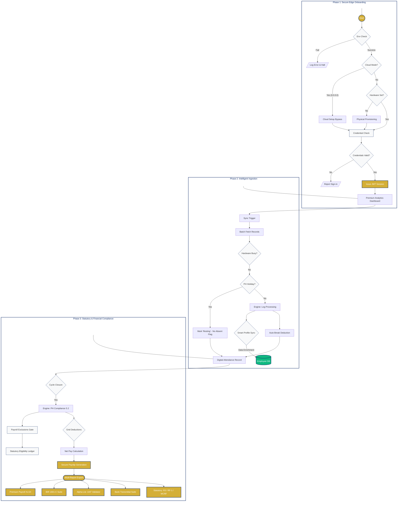
```mermaid
flowchart TD
    subgraph Init["Phase 1: Secure Edge Onboarding"]
        direction TB
        s1[ ] --- Start((Start))
        Start --> Env{Env Check}
        Env -- "Fail" --> Err1[/Log Error & Halt/]
        Env -- "Success" --> Mode{Cloud Mode?}
        Mode -- "Yes (0.0.0.0)" --> Bypass[Cloud Setup Bypass]
        Mode -- "No" --> Auth{Hardware Set?}
        Auth -- No --> Setup[Physical Provisioning]
        Auth -- Yes --> LoginCreds[Credential Check]
        Bypass --> LoginCreds
        Setup --> LoginCreds
        LoginCreds --> Login{Credentials Valid?}
        Login -- "No" --> Err2[/Reject Sign-in/]
        Login -- "Yes" --> Session[Issue JWT Session]
        Session --> Dashboard[Premium Analytics Dashboard]
    end

    subgraph Ops["Phase 2: Intelligent Ingestion"]
        direction TB
        s2[ ] --- Dashboard
        Dashboard --> Trigger[Sync Trigger]
        Trigger --> Sync[Batch Fetch Records]
        
        Sync --> Busy{Hardware Busy?}
        Busy -- No --> Hol{PH Holiday?}
        Hol -- Yes --> Resting[Mark 'Resting' - No Absent Flag]
        Hol -- No --> Proc[Engine: Log Processing]
        
        Proc --> SmartSync{Smart Profile Sync}
        SmartSync -->|Data Enrichment| Emp[(Employee DB)]
        Proc --> BreakTime[Auto-Break Deduction]
        BreakTime --> Rec[Digital Attendance Record]
        Resting --> Rec
    end

    subgraph Final["Phase 3: Statutory & Financial Compliance"]
        direction TB
        s3[ ] --- Rec
        Rec --> Cycle{Cycle Closure}
        Cycle -- Yes --> Engine[Engine: PH Compliance 5.2]
        Engine --> EXCL[Payroll Exclusions Gate]
        EXCL --> ELIG[Statutory Eligibility Ledger]
        Engine --> Tables{Grid Deductions}
        Tables --> Calc[Net Pay Calculation]
        Calc --> Gen[Secure Payslip Generation]
        Gen --> Export([Multi-Report Export])
        Export --> XLSX[Premium Payroll XLSX]
        Export --> PDF[BIR 1601-C Suite]
        Export --> DAT[Alpha-List .DAT Validator]
        Export --> CSV[Bank Transmittal Suite]
        Export --> REM["Statutory: R3 / RF-1 / MCRF"]
    end

    classDef bizGold fill:#D4AF37,stroke:#002060,stroke-width:2px,color:#fff
    classDef bizNavy fill:none,stroke:#002060,stroke-width:2px,color:#002060
    classDef bizEmerald fill:#10b981,stroke:#002060,stroke-width:2px,color:#fff
    classDef process fill:#f8f9fa,stroke:#002060,stroke-width:1px
    classDef spacer fill:none,stroke:none,color:none
    
    class Start,Export,Gen,XLSX,PDF,DAT,CSV,REM,Session bizGold
    class Init,Ops,Final bizNavy
    class Emp bizEmerald
    class Env,Auth,Busy,SmartSync,Cycle,Tables,Mode,Hol,LoginCreds,Login process
    class EXCL,ELIG process
    class s1,s2,s3 spacer
```

## System Processes

### Attendance & Payroll Flow
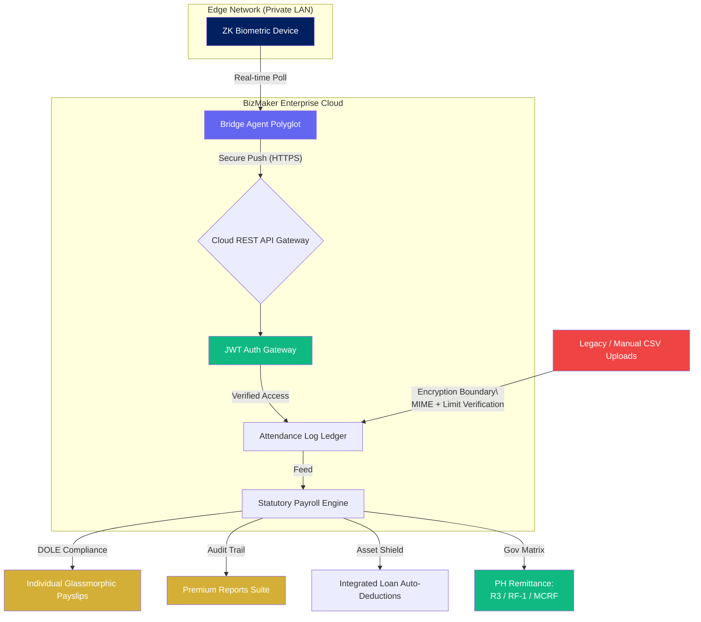
```mermaid
flowchart TD
    subgraph Local["Edge Network (Private LAN)"]
        direction LR
        HW[ZK Biometric Device]
    end
    
    subgraph Cloud["BizMaker Enterprise Cloud"]
        direction TB
        BRIDGE[Bridge Agent Polyglot]
        API{Cloud REST API Gateway}
        AUTH[JWT Auth Gateway]
        LOG[Attendance Log Ledger]
        PAY[Statutory Payroll Engine]
    end

    HW -->|Real-time Poll| BRIDGE
    BRIDGE -->|"Secure Push (HTTPS)"| API
    API --> AUTH
    AUTH -->|Verified Access| LOG
    
    LOG -->|Feed| PAY
    PAY -->|DOLE Compliance| SLIP[Individual Glassmorphic Payslips]
    PAY -->|Audit Trail| REP[Premium Reports Suite]
    PAY -->|Asset Shield| LOAN[Integrated Loan Auto-Deductions]
    PAY -->|Gov Matrix| REMIT["PH Remittance:\nR3 / RF-1 / MCRF"]
    
    UPL["Legacy / Manual CSV Uploads"] -->|"Encryption Boundary\\nMIME + Limit Verification"| LOG

    style HW fill:#002060,color:#fff
    style SLIP fill:#D4AF37,color:#fff
    style REP fill:#D4AF37,color:#fff
    style REMIT fill:#10b981,color:#fff
    style UPL fill:#ef4444,color:#fff
    style BRIDGE fill:#6366f1,color:#fff
    style AUTH fill:#10b981,color:#fff
```

### Fieldwork & Physical Attendance Overlap
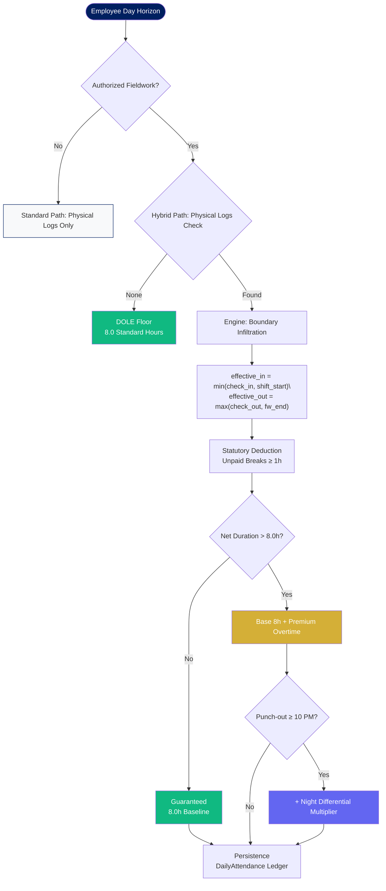
```mermaid
flowchart TD
    START([Employee Day Horizon]) --> FW{Authorized Fieldwork?}
    FW -- "No" --> PHYS[Standard Path: Physical Logs Only]
    FW -- "Yes" --> LOGS{Hybrid Path: Physical Logs Check}
    
    LOGS -- "None" --> BASE["DOLE Floor\n8.0 Standard Hours"]
    LOGS -- "Found" --> MERGE[Engine: Boundary Infiltration]
    
    MERGE --> EFF["effective_in = min(check_in, shift_start)\\neffective_out = max(check_out, fw_end)"]
    EFF --> BREAKS["Statutory Deduction\nUnpaid Breaks ≥ 1h"]
    BREAKS --> CALC{Net Duration > 8.0h?}
    
    CALC -- "Yes" --> OT[Base 8h + Premium Overtime]
    CALC -- "No" --> FLOOR["Guaranteed\n8.0h Baseline"]
    
    OT --> ND{Punch-out ≥ 10 PM?}
    FLOOR --> SAVE["Persistence\nDailyAttendance Ledger"]
    ND -- "Yes" --> NIGHT[+ Night Differential Multiplier]
    ND -- "No" --> SAVE
    NIGHT --> SAVE

    style START fill:#002060,color:#fff
    style BASE fill:#10b981,color:#fff
    style OT fill:#D4AF37,color:#fff
    style NIGHT fill:#6366f1,color:#fff
    style FLOOR fill:#10b981,color:#fff
    style PHYS fill:#f8f9fa,stroke:#002060
```

### Attendance Analytics Pipeline
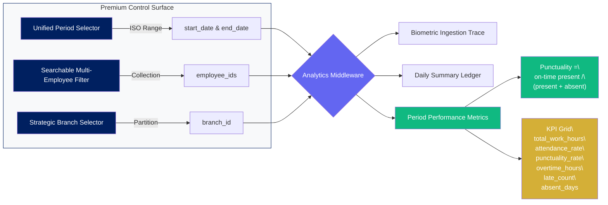
```mermaid
flowchart LR
    subgraph UI["Premium Control Surface"]
        direction TB
        P[Unified Period Selector] -->|ISO Range| DATES[start_date & end_date]
        E[Searchable Multi-Employee Filter] -->|Collection| IDS[employee_ids]
        B[Strategic Branch Selector] -->|Partition| BID[branch_id]
    end
    
    DATES --> API{Analytics Middleware}
    IDS --> API
    BID --> API
    
    API --> BIO[Biometric Ingestion Trace]
    API --> ATT[Daily Summary Ledger]
    API --> PER[Period Performance Metrics]

    PER --> PUNC["Punctuality =\\non-time present /\\n(present + absent)"]
    PER --> METRICS["KPI Grid\\ntotal_work_hours\\nattendance_rate\\npunctuality_rate\\novertime_hours\\nlate_count\\nabsent_days"]

    style UI fill:#f8f9fa,stroke:#002060
    style P fill:#002060,color:#fff
    style E fill:#002060,color:#fff
    style B fill:#002060,color:#fff
    style METRICS fill:#D4AF37,color:#fff
    style PUNC fill:#10b981,color:#fff
    style PER fill:#10b981,color:#fff
    style API fill:#6366f1,color:#fff
```

### Anomaly Detection Pipeline
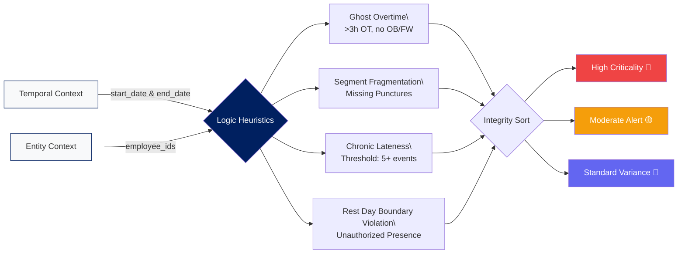
```mermaid
flowchart LR
    PERIOD[Temporal Context] -->|start_date & end_date| RULES{Logic Heuristics}
    EMP[Entity Context] -->|employee_ids| RULES
    
    RULES --> R1["Ghost Overtime\\n>3h OT, no OB/FW"]
    RULES --> R2["Segment Fragmentation\\nMissing Punctures"]
    RULES --> R3["Chronic Lateness\\nThreshold: 5+ events"]
    RULES --> R4["Rest Day Boundary Violation\\nUnauthorized Presence"]
    
    R1 --> SEV{Integrity Sort}
    R2 --> SEV
    R3 --> SEV
    R4 --> SEV
    
    SEV --> HIGH[High Criticality 🔴]
    SEV --> MED[Moderate Alert 🟡]
    SEV --> LOW[Standard Variance 🔵]

    style RULES fill:#002060,color:#fff
    style PERIOD fill:#f8f9fa,stroke:#002060
    style EMP fill:#f8f9fa,stroke:#002060
    style HIGH fill:#ef4444,color:#fff
    style MED fill:#f59e0b,color:#fff
    style LOW fill:#6366f1,color:#fff
```

### Labor Cost Aggregation (Stacked Analysis)
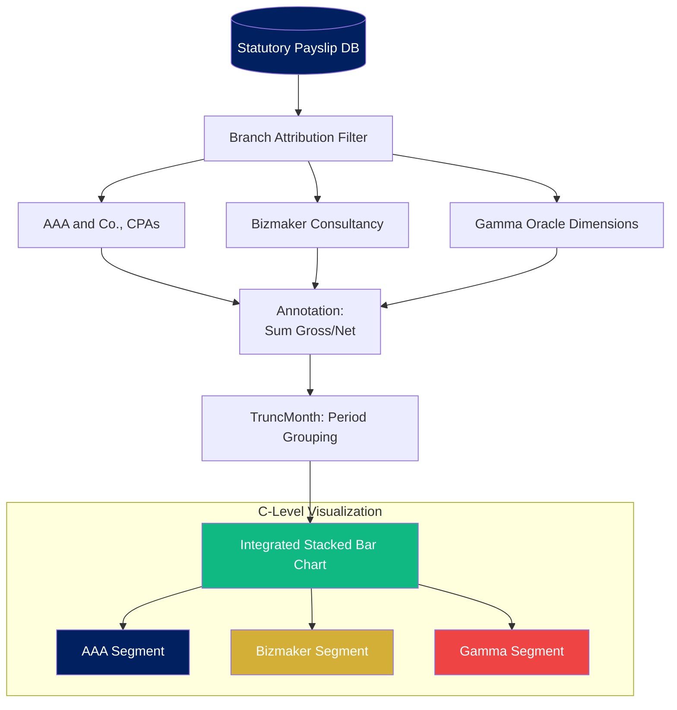
```mermaid
flowchart TD
    DB[(Statutory Payslip DB)] --> ATTR[Branch Attribution Filter]
    ATTR --> AAA[AAA and Co., CPAs]
    ATTR --> BIZ[Bizmaker Consultancy]
    ATTR --> GAM[Gamma Oracle Dimensions]
    
    AAA --> SUM["Annotation:\nSum Gross/Net"]
    BIZ --> SUM
    GAM --> SUM
    
    SUM --> TRUNC[TruncMonth: Period Grouping]
    TRUNC --> CHART[Integrated Stacked Bar Chart]
    
    subgraph View["C-Level Visualization"]
        CHART --> SEG1[AAA Segment]
        CHART --> SEG2[Bizmaker Segment]
        CHART --> SEG3[Gamma Segment]
    end

    style DB fill:#002060,color:#fff
    style SEG1 fill:#002060,color:#fff
    style SEG2 fill:#D4AF37,color:#fff
    style SEG3 fill:#ef4444,color:#fff
    style CHART fill:#10b981,color:#fff
```

### Loan Lifecycle
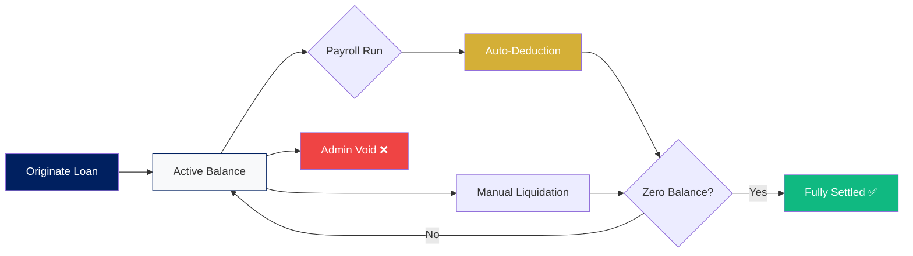
```mermaid
flowchart LR
    CREATE[Originate Loan] --> ACTIVE[Active Balance]
    ACTIVE --> PAYROLL{Payroll Run}
    PAYROLL --> DEDUCT[Auto-Deduction]
    DEDUCT --> BAL{Zero Balance?}
    BAL -- "Yes" --> PAID[Fully Settled ✅]
    BAL -- "No" --> ACTIVE
    ACTIVE --> MANUAL[Manual Liquidation]
    MANUAL --> BAL
    ACTIVE --> CANCEL[Admin Void ❌]

    style CREATE fill:#002060,color:#fff
    style PAID fill:#10b981,color:#fff
    style CANCEL fill:#ef4444,color:#fff
    style DEDUCT fill:#D4AF37,color:#fff
    style ACTIVE fill:#f8f9fa,stroke:#002060
```

### Shift Scheduling Flow
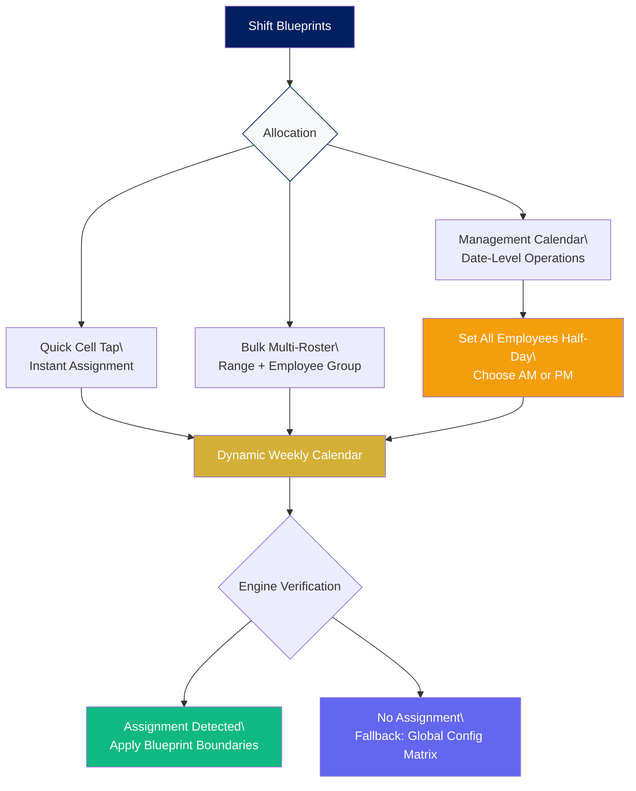
```mermaid
flowchart TD
    SHIFT[Shift Blueprints] --> ASSIGN{Allocation}
    ASSIGN --> SINGLE[Quick Cell Tap\\nInstant Assignment]
    ASSIGN --> BULK[Bulk Multi-Roster\\nRange + Employee Group]
    ASSIGN --> MGMT[Management Calendar\\nDate-Level Operations]
    
    SINGLE --> ROSTER[Dynamic Weekly Calendar]
    BULK --> ROSTER
    MGMT --> HALF[Set All Employees Half-Day\\nChoose AM or PM]
    HALF --> ROSTER
    
    ROSTER --> ATT{Engine Verification}
    ATT --> HAS[Assignment Detected\\nApply Blueprint Boundaries]
    ATT --> NO[No Assignment\\nFallback: Global Config Matrix]

    style SHIFT fill:#002060,color:#fff
    style ROSTER fill:#D4AF37,color:#fff
    style HALF fill:#f59e0b,color:#fff
    style HAS fill:#10b981,color:#fff
    style NO fill:#6366f1,color:#fff
    style ASSIGN fill:#f8f9fa,stroke:#002060
```

## Database Schema (ERD)

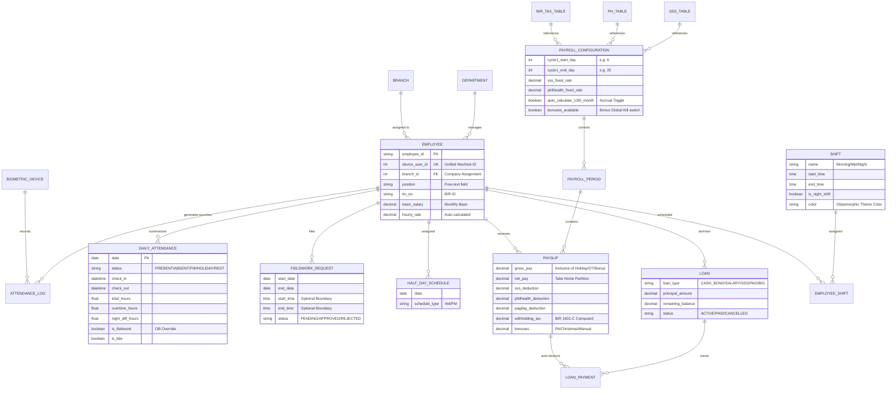
```mermaid
erDiagram
    DEPARTMENT ||--o{ EMPLOYEE : manages
    BRANCH ||--o{ EMPLOYEE : "assigned to"
    
    EMPLOYEE ||--o{ ATTENDANCE_LOG : "generates punches"
    BIOMETRIC_DEVICE ||--o{ ATTENDANCE_LOG : records
    
    EMPLOYEE ||--o{ DAILY_ATTENDANCE : summarizes
    EMPLOYEE ||--o{ FIELDWORK_REQUEST : files
    EMPLOYEE ||--o{ HALF_DAY_SCHEDULE : assigned
    
    PAYROLL_PERIOD ||--o{ PAYSLIP : contains
    EMPLOYEE ||--o{ PAYSLIP : receives
    
    PAYROLL_CONFIGURATION ||--o{ PAYROLL_PERIOD : controls
    SSS_TABLE ||--o{ PAYROLL_CONFIGURATION : references
    PH_TABLE ||--o{ PAYROLL_CONFIGURATION : references
    BIR_TAX_TABLE ||--o{ PAYROLL_CONFIGURATION : references

    EMPLOYEE {
        string employee_id PK
        int device_user_id UK "Unified Machine ID"
        int branch_id FK "Company Assignment"
        string position "Free-text field"
        string tin_no "BIR ID"
        decimal basic_salary "Monthly Base"
        decimal hourly_rate "Auto-calculated"
    }
    
    DAILY_ATTENDANCE {
        date date PK
        string status "PRESENT/ABSENT/FW/HOLIDAY/REST"
        datetime check_in
        datetime check_out
        float total_hours
        float overtime_hours
        float night_diff_hours
        boolean is_fieldwork "OB Override"
        boolean is_late
    }
    
    FIELDWORK_REQUEST {
        date start_date
        date end_date
        time start_time "Optional Boundary"
        time end_time "Optional Boundary"
        string status "PENDING/APPROVED/REJECTED"
    }

    HALF_DAY_SCHEDULE {
        date date
        string schedule_type "AM/PM"
    }
    
    PAYSLIP {
        decimal gross_pay "Inclusive of Holiday/OT/Bonus"
        decimal net_pay "Take Home Partition"
        decimal sss_deduction
        decimal philhealth_deduction
        decimal pagibig_deduction
        decimal withholding_tax "BIR 1601-C Computed"
        decimal bonuses "PA/Christmas/Manual"
    }

    PAYROLL_CONFIGURATION {
        int cycle1_start_day "e.g. 6"
        int cycle1_end_day "e.g. 20"
        decimal sss_fixed_rate
        decimal philhealth_fixed_rate
        boolean auto_calculate_13th_month "Accrual Toggle"
        boolean bonuses_available "Bonus Global Kill-switch"
    }

    EMPLOYEE ||--o{ LOAN : borrows
    LOAN ||--o{ LOAN_PAYMENT : tracks
    PAYSLIP ||--o{ LOAN_PAYMENT : "auto-deducts"
    
    SHIFT ||--o{ EMPLOYEE_SHIFT : assigned
    EMPLOYEE ||--o{ EMPLOYEE_SHIFT : scheduled

    LOAN {
        string loan_type "CASH_BOND/SALARY/SSS/PAGIBIG"
        decimal principal_amount
        decimal remaining_balance
        string status "ACTIVE/PAID/CANCELLED"
    }

    SHIFT {
        string name "Morning/Mid/Night"
        time start_time
        time end_time
        boolean is_night_shift
        string color "Glassmorphic Theme Color"
    }
```

## Technical Stack

### Backend
- **Engine**: Django 5.2.12 on Python 3.12
- **API Architecture**: Django REST Framework (DRF) with JWT
- **Cloud Infrastructure**: Render web services with PostgreSQL and Redis
- **Resilience**: Integrated Recovery & Import Restoration Logic
- **Hardening**: AES-256 Field Encryption + 25MB Multi-Layer Guard
- **Integration**: ZKAccess & PyZK Bridge Agent

### Frontend
- **Framework**: Vue 3.5 with Composition API
- **UI System**: Element Plus (Premium Glassmorphic Theme)
- **Visualization**: ApexCharts Enterprise (Reactive Transitions)
- **Deployment**: Vercel with hashed assets and stale-chunk auto-recovery
- **State Engine**: Pinia 3
- **Bundler**: Vite 8
- **Icons**: Element Plus, Lucide Vue, Dicebear Initials

## Core Features

### 1. Hybrid Cloud Edge Architecture
- **Statutory Backend**: Django 5.2 hosted on **Render** (Auto-scaling, Global Edge).
- **Glassmorphic Frontend**: Vue 3.4 hosted on **Vercel** (Global CDN, 100ms deployments).
- **Persistent Data**: **PostgreSQL** for cloud-native transactional storage.
- **Enterprise Bridge**: Biometric records are pushed from private office networks to the cloud via the **BizMaker Multi-Platform Bridge Agent** using secured HTTPS endpoints.
- **Resilience Layer**: The system features an integrated "Finalized Recovery" mechanism to restore mission-critical imports and logic automatically if repository corruption is detected.

### 2. Philippine Payroll Compliance
- **Payroll XLSX Export (Premium)**: Multi-sheet Excel workbook with live formulas, individual employee sheets, Master Summary, and dynamic statutory contribution lookups (SSS/PH/HDMF).
- **Semi-Monthly Processing**: Configurable 15-day pay cycles (e.g., 6th–20th / 21st–5th) via the Global Configuration.
- **Official BIR Reporting**: 
  - **BIR Form 1601-C (PDF)**: Professional PDF summaries for monthly remittance.
  - **Annual Alpha-List (.DAT)**: Mandatory BIR-compliant file format for validation modules.
- **Bank Transmittal (CSV)**: Grouped salary disbursement files with period identifiers.
- **Holiday Pay Matrix**: Automated Regular (200%), Special (130%), Local (130%), and Rest Day (130%) premiums with full DOLE-compliant stacking for double holidays, holiday+rest day combos, and mixed-type overlaps.
- **DOLE Overtime Stacking**: Dynamic OT multiplier computed from the day rate — handles all combinations automatically:

  | Day Type | Day Rate | OT Rate | Example (₱100/hr) |
  |----------|:---:|:---:|:---:|
  | Normal | 1.00× | 1.25× | ₱125 |
  | Rest Day | 1.30× | 1.69× | ₱169 |
  | Special Holiday | 1.30× | 1.69× | ₱169 |
  | Special + Rest Day | 1.50× | 1.95× | ₱195 |
  | Regular Holiday | 2.00× | 2.60× | ₱260 |
  | Regular + Special | 2.30× | 2.99× | ₱299 |
  | Holiday + Rest Day | 2.60× | 3.38× | ₱338 |
  | Double Holiday | 3.00× | 3.90× | ₱390 |
  | Dbl Holiday + Rest | 3.90× | 5.07× | ₱507 |

- **Night Shift Differential (NSD)**: 10% premium stacks multiplicatively on top of the applicable rate per DOLE:

  | Scenario | Rate | +NSD 10% | Total/hr (₱100) |
  |----------|:---:|:---:|:---:|
  | Normal OT + NSD | 1.25× | +₱12.50 | ₱137.50 |
  | Rest Day OT + NSD | 1.69× | +₱16.90 | ₱185.90 |
  | Holiday OT + NSD | 2.60× | +₱26.00 | ₱286.00 |
  | Special + Rest OT + NSD | 1.95× | +₱19.50 | ₱214.50 |
  | Double Holiday OT + NSD | 3.90× | +₱39.00 | ₱429.00 |

#### DOLE Pay Stacking Engine

```mermaid
flowchart TD
    DAY([Employee Work Day]) --> TYPE{Day Type?}
    
    TYPE -- "Normal" --> BASE1["Day Rate = 1.00×"]
    TYPE -- "Rest Day" --> BASE2["Day Rate = 1.30×"]
    TYPE -- "Special Holiday" --> BASE3["Day Rate = 1.30×"]
    TYPE -- "Special + Rest" --> BASE4["Day Rate = 1.50×"]
    TYPE -- "Regular Holiday" --> BASE5["Day Rate = 2.00×"]
    TYPE -- "Holiday + Rest" --> BASE6["Day Rate = 2.60×"]
    TYPE -- "Double Holiday" --> BASE7["Day Rate = 3.00×"]
    TYPE -- "Dbl Holiday + Rest" --> BASE8["Day Rate = 3.90×"]

    BASE1 --> HOURS{Hours > 8?}
    BASE2 --> HOURS
    BASE3 --> HOURS
    BASE4 --> HOURS
    BASE5 --> HOURS
    BASE6 --> HOURS
    BASE7 --> HOURS
    BASE8 --> HOURS

    HOURS -- "No" --> REG["Regular Pay\nhourly × day_rate × 8h"]
    HOURS -- "Yes" --> OT{OT Multiplier}
    
    OT -- "Normal Day" --> OT1["OT Rate = 1.25×\n(+25% of hourly)"]
    OT -- "Premium Day" --> OT2["OT Rate = day_rate × 1.30\n(+30% of day rate)"]

    OT1 --> ND{Work past 10 PM?}
    OT2 --> ND
    REG --> ND

    ND -- "No" --> FINAL[Total Day Pay]
    ND -- "Yes" --> NSD["+ NSD 10%\nof applicable rate\n(OT rate × 0.10)"]
    NSD --> FINAL

    style DAY fill:#002060,color:#fff
    style FINAL fill:#D4AF37,color:#fff
    style NSD fill:#6366f1,color:#fff
    style OT1 fill:#10b981,color:#fff
    style OT2 fill:#10b981,color:#fff
    style REG fill:#f8f9fa,stroke:#002060
    style BASE5 fill:#ef4444,color:#fff
    style BASE6 fill:#ef4444,color:#fff
    style BASE7 fill:#ef4444,color:#fff
    style BASE8 fill:#ef4444,color:#fff
```

- **Government Tables**: Automated SSS, PhilHealth, and Pag-IBIG deduction rules.
- **Resilience Recovery**: The engine includes a surgical self-healing layer that restores missing Python imports and logic (e.g., `loans/views.py`, `shifts/views.py`) to prevent system-wide payroll failures during codebase migrations.
- **Admin Configuration Toggles**:
    - **Auto-accrue 14th–16th Month Pay**: 13th month accrues from earned basic pay across the year and is released during December payroll periods. When toggled ON, all employees receive 14th–16th accrual eligibility and toggles are LOCKED.
  - **Enable Bonus Management**: Master switch for Christmas, Perfect Attendance, and Manual bonuses.

#### Admin Config Toggle Flow
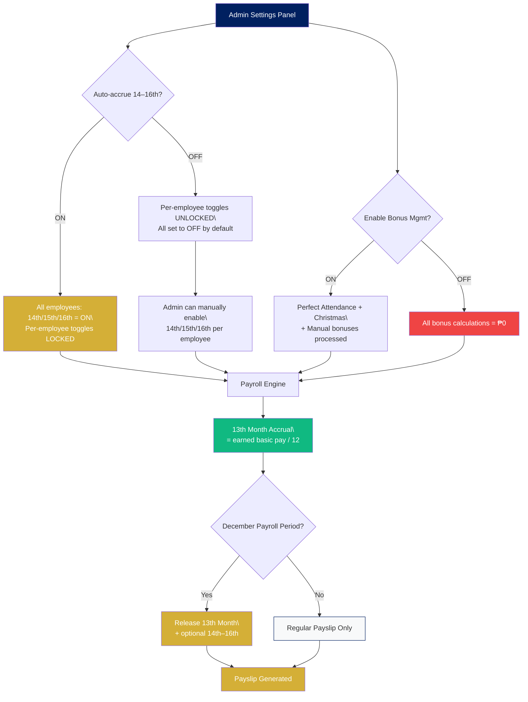
```mermaid
flowchart TD
    CFG[Admin Settings Panel] --> A13{Auto-accrue 14–16th?}
    
    A13 -- ON --> LOCK["All employees: 14th/15th/16th = ON\\nPer-employee toggles LOCKED"]
    A13 -- OFF --> MANUAL["Per-employee toggles UNLOCKED\\nAll set to OFF by default"]
    MANUAL --> ADMIN["Admin can manually enable\\n14th/15th/16th per employee"]
    
    LOCK --> ENGINE[Payroll Engine]
    ADMIN --> ENGINE
    
    CFG --> BONUS{Enable Bonus Mgmt?}
    BONUS -- ON --> BPROC["Perfect Attendance + Christmas\\n+ Manual bonuses processed"]
    BONUS -- OFF --> BSKIP["All bonus calculations = ₱0"]
    
    BPROC --> ENGINE
    BSKIP --> ENGINE
    
    ENGINE --> ACCRUAL["13th Month Accrual\\n= earned basic pay / 12"]
    ACCRUAL --> DEC{December Payroll Period?}
    DEC -- Yes --> RELEASE["Release 13th Month\\n+ optional 14th–16th"]
    DEC -- No --> HOLD[Regular Payslip Only]
    RELEASE --> SLIP[Payslip Generated]
    HOLD --> SLIP

    style CFG fill:#002060,color:#fff
    style ACCRUAL fill:#10b981,color:#fff
    style RELEASE fill:#D4AF37,color:#fff
    style LOCK fill:#D4AF37,color:#fff
    style SLIP fill:#D4AF37,color:#fff
    style BSKIP fill:#ef4444,color:#fff
    style HOLD fill:#f8f9fa,stroke:#002060
```

### 2. Smart Biometric Integration
- **"Smart Sync" Profiling**: Automatically updates "Unknown" employee profiles with data from biometric logs, enriching the database on the fly.
- **Break Time Manager**: Global break intervals (e.g., 12:00-13:00) automatically subtracted from work hours if overlapped.
- **Real-time Monitoring**: Instant dashboard updates as employees punch in/out.
- **Hardware Protection**: Prevents "Device Busy" errors when external software (ZKAccess) is connected.

### 3. Advanced Attendance Analytics
- **Unified Period Picker**: Single selector with Day, Week, Month, Year, and Custom Range options. All selections are converted into `start_date` and `end_date` for unified backend filtering.
- **Branch-Level Organization**: A new dedicated Branch Filter allows admins to "sort" all attendance data by company (`AAA and Co., CPAs`, `Bizmaker Consultancy, Inc.`, or `Gamma Oracle Dimensions Inc.`), instantly updating logs and summaries.
- **Multi-Select Employee Filter**: Searchable dropdown supporting filtering by employee name or position. Select multiple employees to generate custom group analytics.
- **Period Summary Dashboard**: Aggregated metrics including total work hours, attendance rate, punctuality rate, overtime, late counts, and undertime — all dynamically scoped to the selected period.
- **Punctuality Formula**: Punctuality now reflects both lateness and absences. The rate is calculated from on-time present days over total expected workdays (`present + absent`).
- **Real-Time Period Capping**: If the selected month or year hasn't ended, the backend caps expected workdays to today's date, preventing inflated absence counts. A brief notification informs the admin that figures are still updating.
- **Dynamic Dashboard KPIs**: The "Logs" stat card on the main dashboard dynamically updates its label and count based on the selected trend period (Today/This Week/This Month/This Year).

### 4. Fieldwork & Hybrid Attendance
- **Admin-Controlled Approval**: All fieldwork requests default to `PENDING` status and require explicit admin approval, even if the admin initiated the request.
- **Guaranteed 8-Hour Baseline**: Approved fieldwork guarantees a minimum of 8.0 standard work hours for the day.
- **Custom Request Durations**: Admins can specify custom start/end times per fieldwork request, overriding standard shift windows for granular project-based tracking.
- **Hybrid Overlap Processing**: If an employee clocks into the biometric device on a fieldwork day, the engine merges the two timelines by unioning the shift boundaries (`max(check_in, shift_start)` to `max(check_out, fw_end)`), preventing double-counting while capturing all extended work.
- **Overtime on Extended Days**: Physical presence beyond the standard 8-hour threshold on a fieldwork day correctly generates overtime hours.
- **Night Differential Preservation**: Physical clock-out timestamps past 10 PM on fieldwork days still trigger night differential calculations.
- **Late Excusal**: Employees on approved fieldwork are automatically excused from late penalties.

### 5. Dynamic Attendance Logic
- **Early Punch Capping**: Biometric check-ins before the scheduled shift start (e.g., punching in at 7:00 AM for an 8:30 AM shift) are automatically capped to the shift start time. This prevents early arrivals from artificially inflating `total_hours` or triggering unintended overtime.
- **Dynamic Shift End Projection**: The system no longer assumes a fixed 9-hour gross shift. It dynamically calculates the shift end as `Shift Start + 8.0 (net hours) + Sum of all active unpaid breaks (≥ 1 hour)`.
- **Automated Break Subtraction**: Any active break defined in settings with a duration of 1 hour or more is automatically deducted from total hours if the employee's work interval overlaps with the break window.

### 6. Security & Reliability
- **Direct JWT Sign-In**: Login uses credential-based JWT token issuance through the standard `/api/token/` endpoint — no email OTP required.
- **Email-Verified Sign-Up**: New account creation requires a 6-digit email verification code. Registration data is held in a `PendingRegistration` record until the code is confirmed, preventing unverified accounts from being created.
- **Secure File Uploads**:
  - **Size Hardening**: Integrated 25MB enforced limit on both frontend (immediate feedback) and backend (security boundary).
  - **MIME & Extension Guards**: Strict verification of file contents for images (photos) and CSV/Excel (rosters).
  - **Filename Obfuscation**: Personal employee photos are automatically renamed to non-predictable UUIDs to prevent directory traversal and metadata leakage.
  - **Storage Isolation**: Media files are stored in `payroll_uploads/` outside the project root for better data isolation.
- **Authenticated Exports**: All reports secured behind JWT, preventing unauthorized data access.
- **Encrypted Comm Keys**: AES-256 encryption for hardware communication keys stored in the database.
- **Defensive Downloads**: Blob-based download logic with race-condition protection.
- **Frontend Deploy Recovery**: The SPA auto-reloads once when a stale Vite chunk is requested after a new deploy, reducing blank-screen failures.
- **Secure Password Change**: Verified identity check requiring current password for admin password resets.
- **Production Validation**: Enforced environment safety checks ensuring all encryption keys are present and valid before the system starts.
- **API Throttling**: Protection against brute-force and scraping.
- **Secure Headers**: HSTS, XSS Filter, and Content-Type Sniffing protection.

### 7. Cash Bond & Loan Tracker
- **Multiple Loan Types**: Cash Bond, Salary Loan, SSS Loan, Pag-IBIG Loan, Company Loan.
- **Auto-Deduction**: Active loans are automatically deducted from net pay during payroll processing (split by 2 for semi-monthly).
- **Payment Tracking**: Full payment history per loan — auto-deducted payments linked to payslips, manual payments with notes.
- **Auto-Close**: Loans automatically marked as "Fully Paid" when remaining balance hits zero.
- **Dashboard Summary**: Total active loans, outstanding balance, monthly deduction totals.

### 8. Shift Scheduling & Roster
- **Shift Templates**: Create reusable shifts (Morning, Mid, Night, Custom) with start/end times, break windows, and color coding.
- **Weekly Calendar Roster**: Visual grid showing all employees × 7 days. Click any cell to quick-assign a shift.
- **Bulk Assignment**: Assign a shift to multiple employees across a date range, with automatic rest-day skipping.
- **Management Calendar Actions**: Click any date in the management calendar to open day-level controls and summaries.
- **All-Employees Half-Day Assignment**: From the date drawer, apply half-day to all listed employees and choose the time slot (`AM` or `PM`) before saving.
- **Global Fallback**: If no shift is assigned, the system falls back to the global `standard_shift_start/end` (8:30 AM to 5:30 PM default) from PayrollConfiguration.

### 9. Payroll Exclusions in Payroll Center
- **Centralized Exclusions Panel**: Payroll Exclusions now live in Payroll Center above Statutory Eligibility for faster payroll-run validation.
- **Branch-Scoped Visibility**: Exclusions list follows the selected branch context.
- **Post-Processing Refresh**: Exclusions auto-refresh after payroll processing to keep the table synchronized with the latest server state.

### 10. Anomaly Detection
  - **Zero AI / Zero RAM Overhead**: Pure SQL queries and threshold rules — no machine learning libraries.
  - **Unified Filtering**: Optimized to support the same date range and multi-employee filters as the rest of the analytics suite.
  - **Ghost OT Detection**: Flags overtime > 3 hours on days with no approved fieldwork.
  - **Missing Checkout**: Flags clock-in records with no corresponding clock-out.
  - **Excessive Lateness**: Flags employees late 5+ times in a single pay period.
  - **Unapproved Rest Day Work**: Flags work logged on rest days without fieldwork approval.
  - **Severity Badges**: High 🔴, Medium 🟡, Low 🔵 — sorted by priority.

### 11. Payroll Simulation Mode
- **Dry-Run Engine**: Preview payroll results without saving — no data is committed.
- **Salary Adjustments**: Apply percentage-based salary changes to see their impact.
- **Bonus Overrides**: Test bonus amounts before committing.
- **Fully-Absent Protection**: If an employee earns no basic pay in the selected period, the simulation keeps gross, net, and statutory deductions at `₱0.00` instead of producing negative net pay.
- **December-Only 13th Month Release**: Accrual is tracked from earned basic pay, but simulated payout only appears in December payroll periods.
- **SC Preview Column**: The simulation table groups SSS, PhilHealth, and Pag-IBIG into a single **SC (Statutory Contribution)** view for faster review.
- **Comparison View**: Side-by-side simulated payslips with totals.

### 12. Responsive Mobile Architecture
- **Dedicated Mobile UX**: Complete parallel mobile interface utilizing dynamically injected wrapper components, preserving the integrity of the desktop UI.
- **Floating Glassmorphic Navbar**: Enhanced bottom navigation matching premium native mobile app paradigms.
- **Intelligent Switching**: Components and data views dynamically pivot between desktop tables and mobile-optimized cards based on viewport detection.
- **Smart Data Culling**: Dense matrices like Payroll ledgers provide clear CTA redirects to the desktop view, ensuring mobile device rendering stays fast and lightweight.

### 13. Real-Time Analytics & Privacy Guard
- **Strategic Visualization**: Glassmorphic analytics suite with reactive-key transitions for Donut and Stacked Bar charts.
- **Multi-Tenant Privacy Guard**: Sensitive financial metrics (Branch Overview, Labor Cost, YTD) are protected by a master password-reveal lock.
  - **Session Persistence**: 3-hour auto-reveal window for convenience.
  - **Instant Lockdown**: Dedicated 🔒 button for immediate re-blurring.
  - **Branch Cost Attribution**: Interactive **Stacked Bar Chart** for multi-branch labor cost comparison (`AAA`, `Bizmaker`, and `Gamma`).
  - **System Override Integration**: Secure password protection (`B!zm@k3r2026`) for critical data purging and system overrides.

### 14. Government Remittance Files
- **SSS R3 Report**: CSV export with EE/ER shares and EC contributions.
- **PhilHealth RF-1**: CSV export with premium splits per employee.
- **Pag-IBIG MCRF**: CSV export with contribution breakdowns.
- **One-Click Download**: Dropdown menu on processed payroll periods for instant generation.
- **Automatic Branch Cost Comparison**: Side-by-side analytics for `AAA and Co., CPAs`, `Bizmaker Consultancy, Inc.`, and `Gamma Oracle Dimensions Inc.`, including headcount, average salary, and budget utilization.
- **Monthly Total Aggregation**: Combines both semi-monthly cycles into a single remittance file, aggregating per employee.

### 15. Global Holiday Synchronization
- **Nager.Date API Integration**: Automatically synchronizes official Philippine public holidays for any given year into the local database.
- **Holy Week Readiness**: Native handling for Maundy Thursday, Good Friday, and Black Saturday.
- **"Resting" Logic**: Employees are automatically categorized as "Resting" instead of "Absent" on official holidays, preventing false-positive attendance reports.
- **One-Click Sync**: Admin-accessible sync button in settings to pull latest government-declared dates.

### 16. Motion Strategy
- **Reactive Chart Re-renders**: Analytics charts (Donut, Stacked Bar) keep their controlled load animations because they help data readability.
- **Reduced Motion UI**: Hover lift effects were removed from tabs, cards, and standard controls so the interface stays visually stable during navigation.

### 17. Employee Registry & Branch Operations
- **Bulk Branch Transfer**: Move selected employees to another branch from the registry using a single bulk action.
- **Same-Branch Guard**: Employees already assigned to the target branch are skipped automatically to prevent no-op moves.
- **Registry Pagination**: The Employees registry paginates at 20 records per page for cleaner browsing and faster scanning.
- **Delete Loading Guards**: Both single-row and bulk delete actions display loading spinners and disable all delete controls while the API call is in flight, preventing duplicate deletion requests from repeated clicks.

#### Employee Branch Transfer Flow
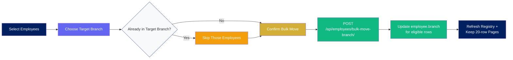
```mermaid
flowchart LR
    SELECT[Select Employees] --> TARGET[Choose Target Branch]
    TARGET --> CHECK{Already in Target Branch?}
    CHECK -- Yes --> SKIP[Skip Those Employees]
    CHECK -- No --> CONFIRM[Confirm Bulk Move]
    SKIP --> CONFIRM
    CONFIRM --> API["POST\n/api/employees/bulk-move-branch/"]
    API --> UPDATE["Update employee.branch\nfor eligible rows"]
    UPDATE --> REFRESH["Refresh Registry +\nKeep 20-row Pages"]

    style SELECT fill:#002060,color:#fff
    style TARGET fill:#6366f1,color:#fff
    style CHECK fill:#f8f9fa,stroke:#002060
    style SKIP fill:#f59e0b,color:#fff
    style CONFIRM fill:#D4AF37,color:#fff
    style API fill:#10b981,color:#fff
    style UPDATE fill:#10b981,color:#fff
    style REFRESH fill:#002060,color:#fff
```

#### Employee Delete Safety Flow
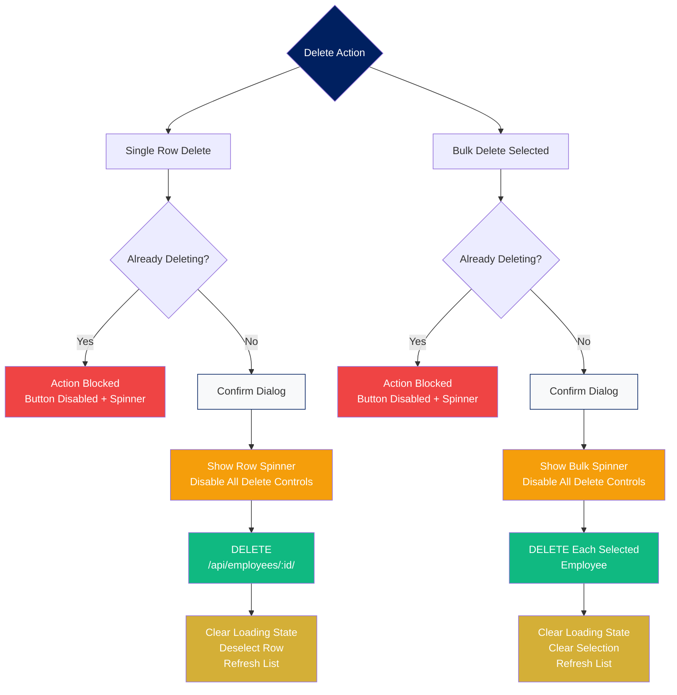
```mermaid
flowchart TD
    ACTION{Delete Action} --> SINGLE[Single Row Delete]
    ACTION --> BULK[Bulk Delete Selected]

    SINGLE --> GUARD1{Already Deleting?}
    GUARD1 -- Yes --> BLOCK1[Action Blocked\nButton Disabled + Spinner]
    GUARD1 -- No --> CONFIRM1[Confirm Dialog]
    CONFIRM1 --> SPIN1[Show Row Spinner\nDisable All Delete Controls]
    SPIN1 --> API1["DELETE\n/api/employees/:id/"]
    API1 --> CLEAN1[Clear Loading State\nDeselect Row\nRefresh List]

    BULK --> GUARD2{Already Deleting?}
    GUARD2 -- Yes --> BLOCK2[Action Blocked\nButton Disabled + Spinner]
    GUARD2 -- No --> CONFIRM2[Confirm Dialog]
    CONFIRM2 --> SPIN2[Show Bulk Spinner\nDisable All Delete Controls]
    SPIN2 --> API2["DELETE Each Selected\nEmployee"]
    API2 --> CLEAN2[Clear Loading State\nClear Selection\nRefresh List]

    style ACTION fill:#002060,color:#fff
    style BLOCK1 fill:#ef4444,color:#fff
    style BLOCK2 fill:#ef4444,color:#fff
    style SPIN1 fill:#f59e0b,color:#fff
    style SPIN2 fill:#f59e0b,color:#fff
    style API1 fill:#10b981,color:#fff
    style API2 fill:#10b981,color:#fff
    style CLEAN1 fill:#D4AF37,color:#fff
    style CLEAN2 fill:#D4AF37,color:#fff
    style CONFIRM1 fill:#f8f9fa,stroke:#002060
    style CONFIRM2 fill:#f8f9fa,stroke:#002060
```

### 18. Collaborator Invitations & Access Control
- **Email Invitation Delivery**: Owners can invite collaborators by email and the system sends a join link with an invitation code.
- **Quick Share Choices**: Owners can generate either a **shareable link** or a **standalone short invite code** from the Collaborators page.
- **Join Link + Auth Gate**: Invite links route users to the collaborators page with prefilled code. If the recipient is not authenticated, they are redirected to Login or Register and then returned to complete acceptance.
- **Fallback Invite Code**: Invitations always include a code that can be entered manually in-app.
- **Permission Scoping**: Owners can assign module-level permissions (Employees, Attendance, Shifts, Payroll, Loans, Tax Tables, Settings).

#### Sign-Up Email Verification Flow
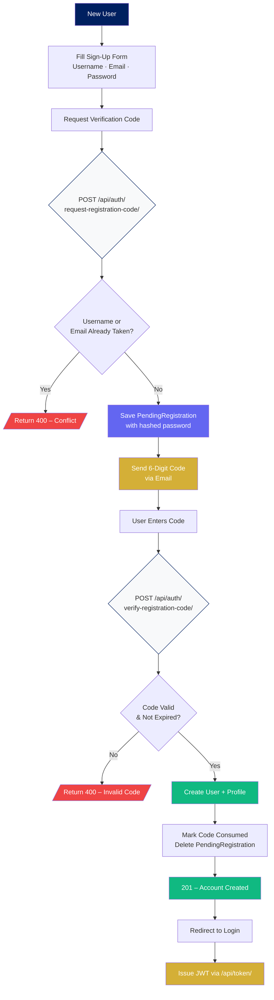
```mermaid
flowchart TD
    VISITOR[New User] --> FORM[Fill Sign-Up Form\nUsername · Email · Password]
    FORM --> SEND[Request Verification Code]
    SEND --> API{POST /api/auth/\nrequest-registration-code/}
    API --> EXIST{Username or\nEmail Already Taken?}
    EXIST -- Yes --> ERR1[/Return 400 – Conflict/]
    EXIST -- No --> PEND[Save PendingRegistration\nwith hashed password]
    PEND --> EMAIL[Send 6-Digit Code\nvia Email]
    EMAIL --> STEP2[User Enters Code]
    STEP2 --> VERIFY{POST /api/auth/\nverify-registration-code/}
    VERIFY --> CODE{Code Valid\n& Not Expired?}
    CODE -- No --> ERR2[/Return 400 – Invalid Code/]
    CODE -- Yes --> CREATE[Create User + Profile]
    CREATE --> CONSUME[Mark Code Consumed\nDelete PendingRegistration]
    CONSUME --> DONE[201 – Account Created]
    DONE --> LOGIN[Redirect to Login]
    LOGIN --> JWT[Issue JWT via /api/token/]

    style VISITOR fill:#002060,color:#fff
    style PEND fill:#6366f1,color:#fff
    style EMAIL fill:#D4AF37,color:#fff
    style CREATE fill:#10b981,color:#fff
    style DONE fill:#10b981,color:#fff
    style ERR1 fill:#ef4444,color:#fff
    style ERR2 fill:#ef4444,color:#fff
    style JWT fill:#D4AF37,color:#fff
    style API fill:#f8f9fa,stroke:#002060
    style VERIFY fill:#f8f9fa,stroke:#002060
```

### Collaborator Invite Journey
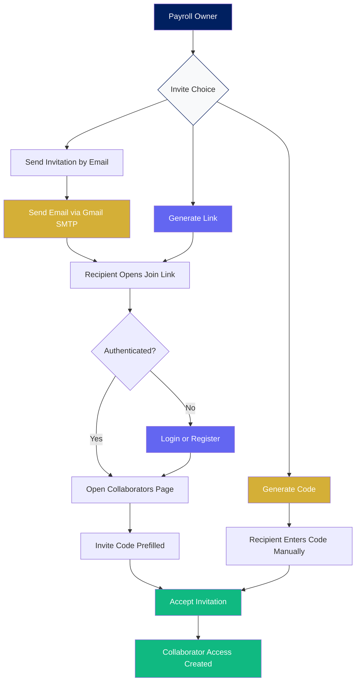
```mermaid
flowchart TD
    OWNER[Payroll Owner] --> CHOICE{Invite Choice}
    CHOICE --> EMAIL[Send Invitation by Email]
    CHOICE --> CODE[Generate Code]
    CHOICE --> LINK[Generate Link]

    EMAIL --> SEND[Send Email via Gmail SMTP]
    SEND --> RECIPIENT[Recipient Opens Join Link]
    CODE --> MANUAL[Recipient Enters Code Manually]
    LINK --> RECIPIENT

    RECIPIENT --> AUTH{Authenticated?}
    AUTH -- Yes --> COLLAB[Open Collaborators Page]
    AUTH -- No --> LOGIN[Login or Register]
    LOGIN --> COLLAB

    COLLAB --> PREFILL[Invite Code Prefilled]
    PREFILL --> ACCEPT[Accept Invitation]
    MANUAL --> ACCEPT
    ACCEPT --> ACCESS[Collaborator Access Created]

    style OWNER fill:#002060,color:#fff
    style CHOICE fill:#f8f9fa,stroke:#002060
    style CODE fill:#D4AF37,color:#fff
    style LINK fill:#6366f1,color:#fff
    style SEND fill:#D4AF37,color:#fff
    style LOGIN fill:#6366f1,color:#fff
    style ACCEPT fill:#10b981,color:#fff
    style ACCESS fill:#10b981,color:#fff
```

## License

Copyright (c) 2026 BizMaker.
