# BizMaker Premium Payroll & ERP Suite

A high-performance, enterprise-grade payroll management system engineered for the Philippine regulatory landscape. Featuring seamless **ZKTeco Biometric Integration**, automated **PH Holiday Compliance**, multi-tenant **Branch Attribution**, and a stunning **Glassmorphic Analytics Dashboard**.

## Project Overview

BizMaker Payroll is a robust full-stack ecosystem that bridge-syncs real-time attendance data from edge devices to a secured cloud infrastructure. It automates the end-to-end payroll lifecycle—from raw biometric ingestion and anomaly detection to generating BIR-compliant reporting and bank-ready disbursement files.

## System Lifecycle Flowchart

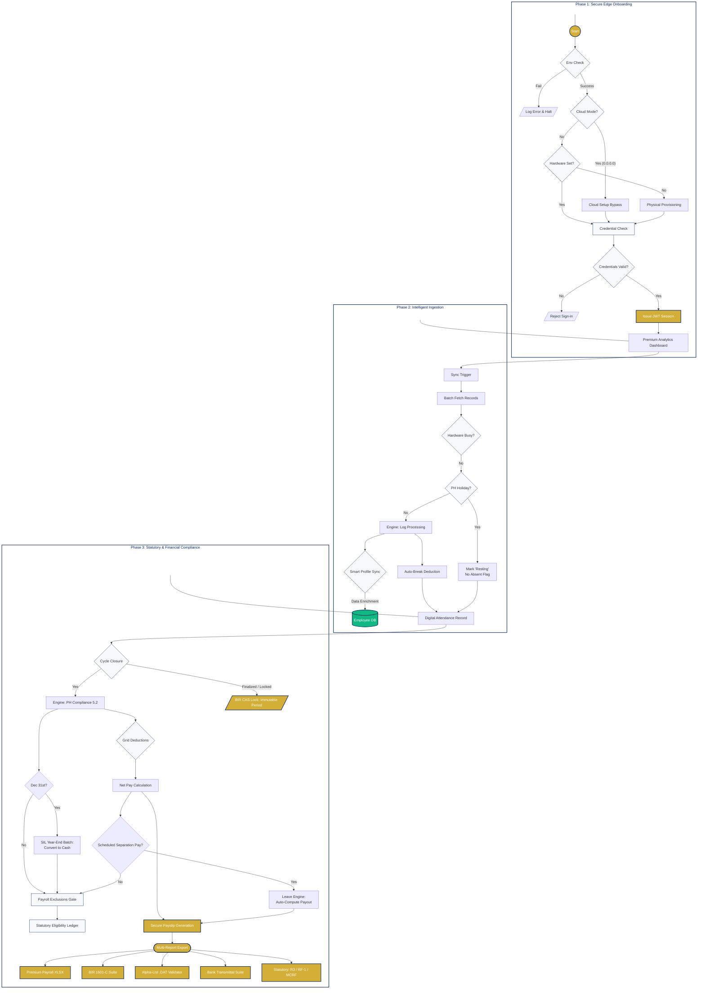
```mermaid
flowchart TD
    subgraph Init["Phase 1: Secure Edge Onboarding"]
        direction TB
        s1[ ] --- Start((Start))
        Start --> Env{Env Check}
        Env -- "Fail" --> Err1[/Log Error & Halt/]
        Env -- "Success" --> Mode{Cloud Mode?}
        Mode -- "Yes (0.0.0.0)" --> Bypass[Cloud Setup Bypass]
        Mode -- "No" --> Auth{Hardware Set?}
        Auth -- No --> Setup[Physical Provisioning]
        Auth -- Yes --> LoginCreds[Credential Check]
        Bypass --> LoginCreds
        Setup --> LoginCreds
        LoginCreds --> Login{Credentials Valid?}
        Login -- "No" --> Err2[/Reject Sign-in/]
        Login -- "Yes" --> Session[Issue JWT Session]
        Session --> Dashboard[Premium Analytics Dashboard]
    end

    subgraph Ops["Phase 2: Intelligent Ingestion"]
        direction TB
        s2[ ] --- Dashboard
        Dashboard --> Trigger[Sync Trigger]
        Trigger --> Sync[Batch Fetch Records]
        
        Sync --> Busy{Hardware Busy?}
        Busy -- No --> Hol{PH Holiday?}
        Hol -- Yes --> Resting["Mark 'Resting'<br/>No Absent Flag"]
        Hol -- No --> Proc[Engine: Log Processing]
        
        Proc --> SmartSync{Smart Profile Sync}
        SmartSync -->|Data Enrichment| Emp[(Employee DB)]
        Proc --> BreakTime[Auto-Break Deduction]
        BreakTime --> Rec[Digital Attendance Record]
        Resting --> Rec
    end

    subgraph Final["Phase 3: Statutory & Financial Compliance"]
        direction TB
        s3[ ] --- Rec
        Rec --> Cycle{Cycle Closure}
        Cycle -- Yes --> Engine[Engine: PH Compliance 5.2]
        Cycle -- "Finalized / Locked" --> Lock[/BIR CAS Lock: Immutable Period/]
        Engine --> SIL_YE{Dec 31st?}
        SIL_YE -- Yes --> SIL_PROC[SIL Year-End Batch:<br/>Convert to Cash]
        SIL_YE -- No --> EXCL[Payroll Exclusions Gate]
        SIL_PROC --> EXCL
        EXCL --> ELIG[Statutory Eligibility Ledger]
        Engine --> Tables{Grid Deductions}
        Tables --> Calc[Net Pay Calculation]
        Calc --> Gen[Secure Payslip Generation]
        Gen --> Export([Multi-Report Export])
        Export --> XLSX[Premium Payroll XLSX]
        Export --> PDF[BIR 1601-C Suite]
        Export --> DAT[Alpha-List .DAT Validator]
        Export --> CSV[Bank Transmittal Suite]
        Export --> REM["Statutory: R3 / RF-1 / MCRF"]
        
        Calc --> SEP{Scheduled Separation Pay?}
        SEP -- Yes --> SEP_L["Leave Engine:<br/>Auto-Compute Payout"]
        SEP_L --> Gen
        SEP -- No --> EXCL
    end

    classDef bizGold fill:#D4AF37,stroke:#002060,stroke-width:2px,color:#fff
    classDef bizNavy fill:none,stroke:#002060,stroke-width:2px,color:#002060
    classDef bizEmerald fill:#10b981,stroke:#002060,stroke-width:2px,color:#fff
    classDef process fill:#f8f9fa,stroke:#002060,stroke-width:1px
    classDef spacer fill:none,stroke:none,color:none
    
    class Start,Export,Gen,XLSX,PDF,DAT,CSV,REM,Session,Lock bizGold
    class Init,Ops,Final bizNavy
    class Emp bizEmerald
    class Env,Auth,Busy,SmartSync,Cycle,Tables,Mode,Hol,LoginCreds,Login process
    class EXCL,ELIG process
    class s1,s2,s3 spacer
```

## System Processes

### Attendance & Payroll Flow

```mermaid
flowchart TD
    subgraph Local["Edge Network (Private LAN)"]
        direction LR
        HW[ZK Biometric Device]
    end
    
    subgraph Cloud["BizMaker Enterprise Cloud"]
        direction TB
        BRIDGE[Bridge Agent Polyglot]
        API{Cloud REST API Gateway}
        AUTH[JWT Auth Gateway]
        LOG[Attendance Log Ledger]
        PAY[Statutory Payroll Engine]
    end

    HW -->|Real-time Poll| BRIDGE
    BRIDGE -->|"Secure Push (HTTPS)"| API
    API --> AUTH
    AUTH -->|Verified Access| LOG
    
    LOG -->|Feed| PAY
    PAY -->|DOLE Compliance| SLIP[Individual Glassmorphic Payslips]
    PAY -->|Audit Trail| REP[Premium Reports Suite]
    PAY -->|Asset Shield| LOAN[Integrated Loan Auto-Deductions]
    PAY -->|Gov Matrix| REMIT["PH Remittance:<br/>R3 / RF-1 / MCRF"]
    
    UPL["Legacy / Manual CSV Uploads"] -->|"Encryption Boundary<br/>MIME + Limit Verification"| LOG

    style HW fill:#002060,color:#fff
    style SLIP fill:#D4AF37,color:#fff
    style REP fill:#D4AF37,color:#fff
    style REMIT fill:#10b981,color:#fff
    style UPL fill:#ef4444,color:#fff
    style BRIDGE fill:#6366f1,color:#fff
    style AUTH fill:#10b981,color:#fff
```

### Fieldwork & Physical Attendance Overlap

```mermaid
flowchart TD
    START([Employee Day Horizon]) --> FW{Authorized Fieldwork?}
    FW -- "No" --> PHYS["Standard Path:<br/>Physical Logs Only"]
    FW -- "Yes" --> LOGS{"Hybrid Path:<br/>Physical Logs Check"}
    
    LOGS -- "None" --> BASE["DOLE Floor<br/>8.0 Standard Hours"]
    LOGS -- "Found" --> MERGE["Engine:<br/>Boundary Infiltration"]
    
    MERGE --> EFF["eff_in = min(in, shift)<br/>eff_out = max(out, fw)"]
    EFF --> BREAKS["Statutory Deduction<br/>Unpaid Breaks ≥ 1h"]
    BREAKS --> CALC{Net Duration > 8.0h?}
    
    CALC -- "Yes" --> OT[Base 8h + Premium Overtime]
    CALC -- "No" --> FLOOR["Guaranteed<br/>8.0h Baseline"]
    
    OT --> ND{Punch-out ≥ 10 PM?}
    FLOOR --> SAVE["Persistence<br/>DailyAttendance Ledger"]
    ND -- "Yes" --> NIGHT["+ Night Differential<br/>Multiplier"]
    ND -- "No" --> SAVE
    NIGHT --> SAVE

    style START fill:#002060,color:#fff
    style BASE fill:#10b981,color:#fff
    style OT fill:#D4AF37,color:#fff
    style NIGHT fill:#6366f1,color:#fff
    style FLOOR fill:#10b981,color:#fff
    style PHYS fill:#f8f9fa,stroke:#002060
```

### Attendance Analytics Pipeline
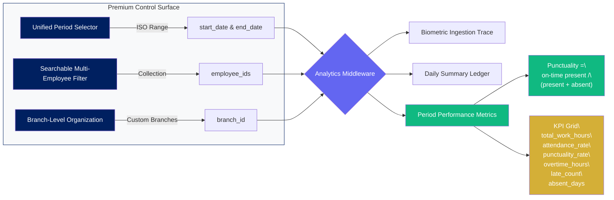
```mermaid
flowchart LR
    subgraph UI["Premium Control Surface"]
        direction TB
        P[Unified Period Selector] -->|ISO Range| DATES[start_date & end_date]
        E[Searchable Multi-Employee Filter] -->|Collection| IDS[employee_ids]
        B[Branch-Level Organization] -->|Custom Branches| BID[branch_id]
    end
    
    DATES --> API{Analytics Middleware}
    IDS --> API
    BID --> API
    
    API --> BIO[Biometric Ingestion Trace]
    API --> ATT[Daily Summary Ledger]
    API --> PER[Period Performance Metrics]

    PER --> PUNC["Punctuality =\\non-time present /\\n(present + absent)"]
    PER --> METRICS["KPI Grid\\ntotal_work_hours\\nattendance_rate\\npunctuality_rate\\novertime_hours\\nlate_count\\nabsent_days"]

    style UI fill:#f8f9fa,stroke:#002060
    style P fill:#002060,color:#fff
    style E fill:#002060,color:#fff
    style B fill:#002060,color:#fff
    style METRICS fill:#D4AF37,color:#fff
    style PUNC fill:#10b981,color:#fff
    style PER fill:#10b981,color:#fff
    style API fill:#6366f1,color:#fff
```

## Role-Based Access Control (RBAC)

BizMaker features a tiered permission architecture designed for multi-tenant scalability and secure data isolation.

### System Roles
1.  **Superadmin**:
    *   **Scope**: Global System.
    *   **Capabilities**: Manual tenant provisioning, sales summary analytics, global configuration management, and cross-tenant auditing.
2.  **Admin (Business Owner)**:
    *   **Scope**: Specific Tenant Workspace.
    *   **Capabilities**: Full management of the payroll ecosystem (Employees, Attendance, Payroll, Shifts, etc.) within their own organization.
3.  **Employee**:
    *   **Scope**: Personal Self-Service.
    *   **Capabilities**: View own payslips, attendance history, and leave balances via the dedicated Employee Portal.

### User Lifecycle & Role Transition

```mermaid
flowchart TD
    START([Visitor / New User]) --> REG[Register Account]
    REG --> DEFAULT["Default Role: EMPLOYEE<br/>(No Workspace)"]
    
    DEFAULT --> CHOICE{Action?}
    
    CHOICE -- "Create Workspace" --> UPGRADE["Upgrade to ADMIN<br/>(14-Day Free Trial)"]
    CHOICE -- "Join Workspace" --> LINK["Stay as EMPLOYEE<br/>(Link via HR Invite Code)"]
    
    UPGRADE --> WIZARD[Admin Setup Wizard]
    WIZARD --> READY[Full Admin Access]
    
    LINK --> PORTAL[Self-Service Portal Access]
    PORTAL --> FIRST_ONB{First Time Onboarding?}
    FIRST_ONB -- "Yes" --> SAVE_BYPASS[Direct Profile Update<br/>is_onboarded = True]
    FIRST_ONB -- "No" --> SUBMIT_REQ[Submit Name/Gender Change]
    SUBMIT_REQ --> ADMIN_QUEUE[Admin Verification Queue]
    ADMIN_QUEUE -->|Approve| UPDATE_DB[Apply Profile Changes &<br/>Write Change Log Receipt]
    ADMIN_QUEUE -->|Reject| NOTIFY_REJECT[Notify Employee with Reason]
    SAVE_BYPASS --> UPDATE_DB
    
    SUPER[Superadmin] --> PROV["Provision Tenant<br/>(Create Admin Account)"]
    PROV --> UPGRADE

    style START fill:#002060,color:#fff
    style UPGRADE fill:#D4AF37,color:#fff
    style LINK fill:#10b981,color:#fff
    style READY fill:#10b981,color:#fff
    style SUPER fill:#ef4444,color:#fff
    style CHOICE fill:#f8f9fa,stroke:#002060
```

### Subscription & Trial Lifecycle
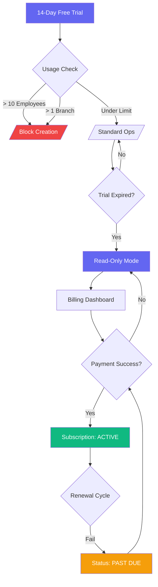
```mermaid
flowchart TD
    TRIAL[14-Day Free Trial] --> LIMITS{Usage Check}
    LIMITS -- "> 10 Employees" --> BLOCK[/Block Creation/]
    LIMITS -- "> 1 Branch" --> BLOCK
    LIMITS -- "Under Limit" --> ALLOW[/Standard Ops/]
    
    ALLOW --> EXP{Trial Expired?}
    EXP -- "No" --> ALLOW
    EXP -- "Yes" --> FROZEN[Read-Only Mode]
    
    FROZEN --> BILL[Billing Dashboard]
    BILL --> PAY{Payment Success?}
    PAY -- "Yes" --> ACTIVE[Subscription: ACTIVE]
    PAY -- "No" --> FROZEN

    ACTIVE --> RENEW{Renewal Cycle}
    RENEW -- "Fail" --> DUE[Status: PAST DUE]
    DUE --> PAY
    
    style TRIAL fill:#6366f1,color:#fff
    style BLOCK fill:#ef4444,color:#fff
    style FROZEN fill:#6366f1,color:#fff
    style ACTIVE fill:#10b981,color:#fff
    style DUE fill:#f59e0b,color:#fff
```

### SaaS Subscription Plans & Superadmin Management

BizMaker operates as a pure usage-based SaaS. All core software features (Payroll, Compliance, Analytics, Biometrics, etc.) are available to paid tenants. The tier structure solely enforces operational capacity.

The platform includes a dynamic **Superadmin Plan Management UI** (accessible via `/superadmin/plans`), allowing system administrators to fully manage pricing tiers without code redeployments. Superadmins can create, edit, reorder, and toggle the active status of plans on the fly.

The default seeded plans include:
1. **Starter Plan** (`₱1,500/mo` / `₱15,000/yr`)
   * **Limits**: Up to 10 Employees & 1 Branch
   * **Features**: Standard Payroll Processing, PH Holiday Compliance, Basic Analytics
2. **Pro Plan** (`₱5,000/mo` / `₱50,000/yr`)
   * **Limits**: Up to 50 Employees & 3 Branches
   * **Features**: Advanced Overtime Stacking, Automated Bio-Device Sync, Statutory PDF/DAT Export
3. **Enterprise Plan** (`₱15,000/mo` / `₱150,000/yr`)
   * **Limits**: Up to 1000 Employees & 20 Branches
   * **Features**: Up to 1000 Employees & 20 Branches, Advanced Audit Logs, Bulk Data Imports & Exports

### Anomaly Detection Pipeline

```mermaid
flowchart LR
    PERIOD[Temporal Context] -->|start_date & end_date| RULES{Logic Heuristics}
    EMP[Entity Context] -->|employee_ids| RULES
    
    RULES --> R1["Ghost Overtime<br/>>3h OT, no OB/FW"]
    RULES --> R2["Segment Fragmentation<br/>Missing Punctures"]
    RULES --> R3["Chronic Lateness<br/>Threshold: 5+ events"]
    RULES --> R4["Rest Day Boundary Violation<br/>Unauthorized Presence"]
    
    R1 --> SEV{Integrity Sort}
    R2 --> SEV
    R3 --> SEV
    R4 --> SEV
    
    SEV --> HIGH[High Criticality 🔴]
    SEV --> MED[Moderate Alert 🟡]
    SEV --> LOW[Standard Variance 🔵]

    style RULES fill:#002060,color:#fff
    style PERIOD fill:#f8f9fa,stroke:#002060
    style EMP fill:#f8f9fa,stroke:#002060
    style HIGH fill:#ef4444,color:#fff
    style MED fill:#f59e0b,color:#fff
    style LOW fill:#6366f1,color:#fff
```

### Labor Cost Aggregation (Stacked Analysis)
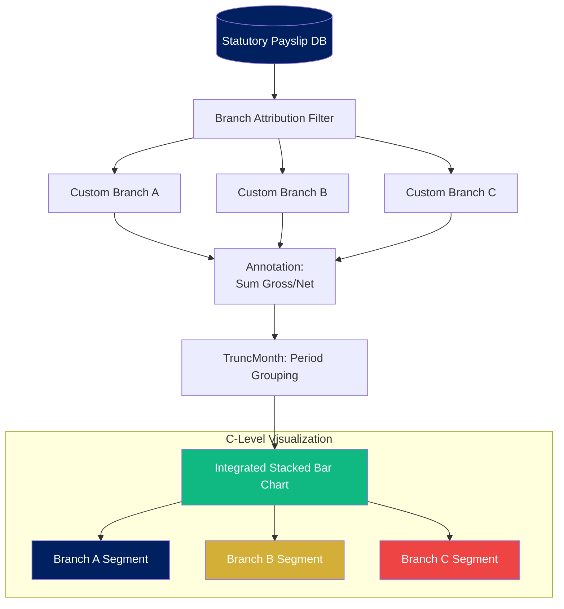
```mermaid
flowchart TD
    DB[(Statutory Payslip DB)] --> ATTR[Branch Attribution Filter]
    ATTR --> BR1[Custom Branch A]
    ATTR --> BR2[Custom Branch B]
    ATTR --> BR3[Custom Branch C]
    
    BR1 --> SUM["Annotation:<br/>Sum Gross/Net"]
    BR2 --> SUM
    BR3 --> SUM
    
    SUM --> TRUNC[TruncMonth: Period Grouping]
    TRUNC --> CHART[Integrated Stacked Bar Chart]
    
    subgraph View["C-Level Visualization"]
        CHART --> SEG1[Branch A Segment]
        CHART --> SEG2[Branch B Segment]
        CHART --> SEG3[Branch C Segment]
    end

    style DB fill:#002060,color:#fff
    style SEG1 fill:#002060,color:#fff
    style SEG2 fill:#D4AF37,color:#fff
    style SEG3 fill:#ef4444,color:#fff
    style CHART fill:#10b981,color:#fff
```

### Loan Lifecycle
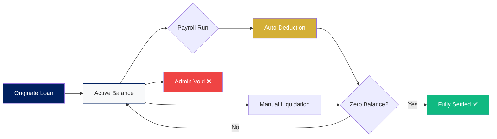
```mermaid
flowchart LR
    CREATE[Originate Loan] --> ACTIVE[Active Balance]
    ACTIVE --> PAYROLL{Payroll Run}
    PAYROLL --> DEDUCT[Auto-Deduction]
    DEDUCT --> BAL{Zero Balance?}
    BAL -- "Yes" --> PAID[Fully Settled ✅]
    BAL -- "No" --> ACTIVE
    ACTIVE --> MANUAL[Manual Liquidation]
    MANUAL --> BAL
    ACTIVE --> CANCEL[Admin Void ❌]

    style CREATE fill:#002060,color:#fff
    style PAID fill:#10b981,color:#fff
    style CANCEL fill:#ef4444,color:#fff
    style DEDUCT fill:#D4AF37,color:#fff
    style ACTIVE fill:#f8f9fa,stroke:#002060
```

### Shift Scheduling & Branch Archetypes
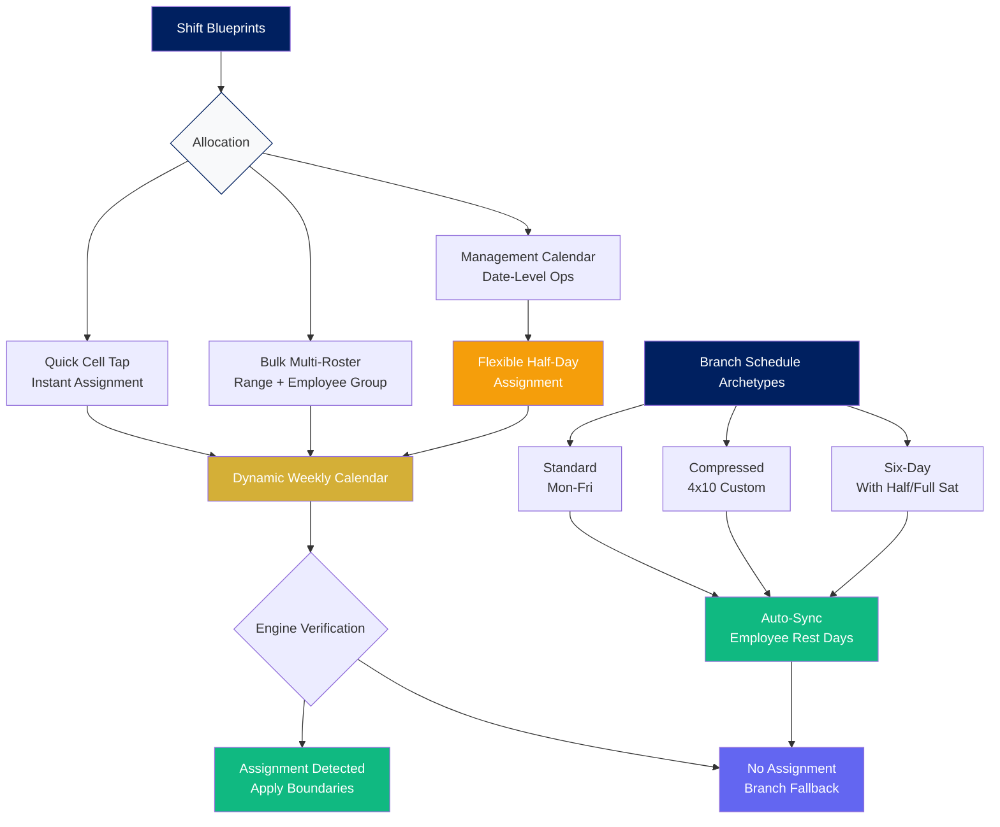
```mermaid
flowchart TD
    ARCH[Branch Schedule Archetypes] --> STD[Standard\nMon-Fri]
    ARCH --> COMP[Compressed\n4x10 Custom]
    ARCH --> SIX["Six-Day<br/>With Half/Full Sat"]
    
    STD --> SYNC["Auto-Sync<br/>Employee Rest Days"]
    COMP --> SYNC
    SIX --> SYNC
    
    SHIFT[Shift Blueprints] --> ASSIGN{Allocation}
    ASSIGN --> SINGLE["Quick Cell Tap<br/>Instant Assignment"]
    ASSIGN --> BULK["Bulk Multi-Roster<br/>Range + Employee Group"]
    ASSIGN --> MGMT["Management Calendar<br/>Date-Level Ops"]
    
    SINGLE --> ROSTER[Dynamic Weekly Calendar]
    BULK --> ROSTER
    MGMT --> HALF["Flexible Half-Day<br/>Assignment"]
    HALF --> ROSTER
    
    ROSTER --> ATT{Engine Verification}
    ATT --> HAS["Assignment Detected<br/>Apply Boundaries"]
    ATT --> NO["No Assignment<br/>Branch Fallback"]
    
    SYNC --> NO

    style ARCH fill:#002060,color:#fff
    style SHIFT fill:#002060,color:#fff
    style ROSTER fill:#D4AF37,color:#fff
    style HALF fill:#f59e0b,color:#fff
    style HAS fill:#10b981,color:#fff
    style NO fill:#6366f1,color:#fff
    style SYNC fill:#10b981,color:#fff
    style ASSIGN fill:#f8f9fa,stroke:#002060
```

### Leave Management & OT Integration
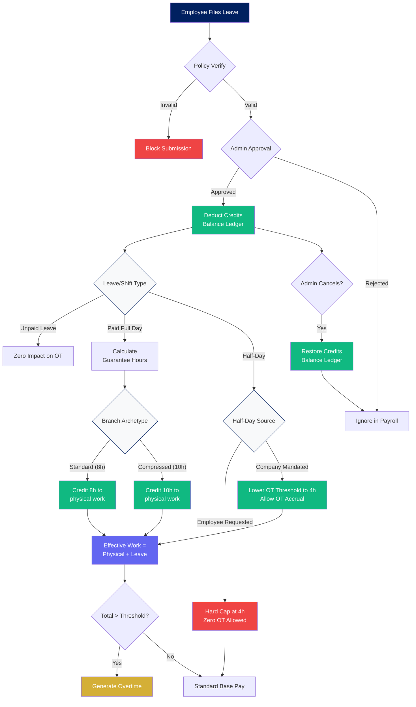
```mermaid
flowchart TD
    FILE[Employee Files Leave] --> POLICY{Policy Verify}
    POLICY -- "Invalid" --> REJECT_UI[Block Submission]
    POLICY -- "Valid" --> APPROVAL{Admin Approval}
    
    APPROVAL -- "Approved" --> DEDUCT["Deduct Credits<br/>Balance Ledger"]
    DEDUCT --> TYPE{Leave/Shift Type}
    
    APPROVAL -- "Rejected" --> IGNORE[Ignore in Payroll]
    
    TYPE -- "Unpaid Leave" --> NO_OT[Zero Impact on OT]
    TYPE -- "Paid Full Day" --> HOURS["Calculate<br/>Guarantee Hours"]
    TYPE -- "Half-Day" --> HALF{Half-Day Source}
    
    HOURS --> ARCH{Branch Archetype}
    ARCH -- "Standard (8h)" --> CRED_8["Credit 8h to<br/>physical work"]
    ARCH -- "Compressed (10h)" --> CRED_10["Credit 10h to<br/>physical work"]
    
    CRED_8 --> CALC["Effective Work =<br/>Physical + Leave"]
    CRED_10 --> CALC
    
    HALF -- "Employee Requested" --> CAP["Hard Cap at 4h<br/>Zero OT Allowed"]
    HALF -- "Company Mandated" --> LOWER["Lower OT Threshold to 4h<br/>Allow OT Accrual"]
    
    LOWER --> CALC
    CAP --> BASE[Standard Base Pay]

    CALC --> OT_THRESH{Total > Threshold?}
    OT_THRESH -- "Yes" --> OT_GEN[Generate Overtime]
    OT_THRESH -- "No" --> BASE
    
    CANCEL{Admin Cancels?}
    DEDUCT --> CANCEL
    CANCEL -- "Yes" --> RESTORE["Restore Credits<br/>Balance Ledger"]
    RESTORE --> IGNORE

    style FILE fill:#002060,color:#fff
    style REJECT_UI fill:#ef4444,color:#fff
    style DEDUCT fill:#10b981,color:#fff
    style RESTORE fill:#10b981,color:#fff
    style TYPE fill:#f8f9fa,stroke:#002060
    style ARCH fill:#f8f9fa,stroke:#002060
    style HALF fill:#f8f9fa,stroke:#002060
    style CAP fill:#ef4444,color:#fff
    style LOWER fill:#10b981,color:#fff
    style CRED_8 fill:#10b981,color:#fff
    style CRED_10 fill:#10b981,color:#fff
    style CALC fill:#6366f1,color:#fff
    style OT_GEN fill:#D4AF37,color:#fff
```

### Employee Separation & Archival Lifecycle
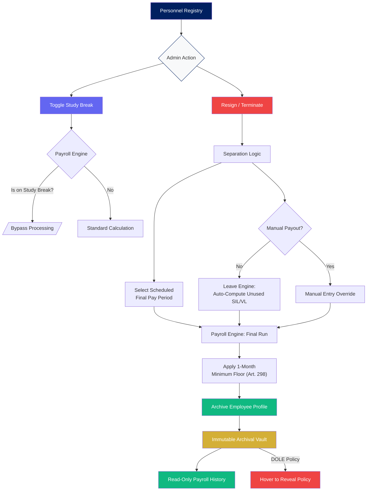
```mermaid
flowchart TD
    REGISTRY[Personnel Registry] --> ACTION{Admin Action}
    
    ACTION --> STUDY[Toggle Study Break]
    STUDY --> PAY_GATE{Payroll Engine}
    PAY_GATE -- "Is on Study Break?" --> SKIP[/Bypass Processing/]
    PAY_GATE -- "No" --> PROC[Standard Calculation]
    
    ACTION --> SEP[Resign / Terminate]
    SEP --> DIALOG[Separation Logic]
    
    DIALOG --> PERIOD["Select Scheduled<br/>Final Pay Period"]
    DIALOG --> LEAVE{"Manual Payout?"}
    
    LEAVE -- No --> AUTO["Leave Engine:<br/>Auto-Compute Unused SIL/VL"]
    LEAVE -- Yes --> MANUAL["Manual Entry Override"]
    
    PERIOD --> ENGINE[Payroll Engine: Final Run]
    AUTO --> ENGINE
    MANUAL --> ENGINE
    
    ENGINE --> FLOOR["Apply 1-Month<br/>Minimum Floor (Art. 298)"]
    FLOOR --> ARCHIVE[Archive Employee Profile]
    ARCHIVE --> VAULT[Immutable Archival Vault]
    VAULT --> HISTORY[Read-Only Payroll History]
    VAULT -- "DOLE Policy" --> PROTECT[Hover to Reveal Policy]

    style REGISTRY fill:#002060,color:#fff
    style ACTION fill:#f8f9fa,stroke:#002060
    style STUDY fill:#6366f1,color:#fff
    style SEP fill:#ef4444,color:#fff
    style ARCHIVE fill:#10b981,color:#fff
    style VAULT fill:#D4AF37,color:#fff
    style PROTECT fill:#ef4444,color:#fff
    style HISTORY fill:#10b981,color:#fff
```

## Database Schema (ERD)

```mermaid
erDiagram
    DEPARTMENT ||--o{ EMPLOYEE : manages
    BRANCH ||--o{ EMPLOYEE : "assigned to"
    
    EMPLOYEE ||--o{ ATTENDANCE_LOG : "generates punches"
    BIOMETRIC_DEVICE ||--o{ ATTENDANCE_LOG : records
    
    EMPLOYEE ||--o{ DAILY_ATTENDANCE : summarizes
    EMPLOYEE ||--o{ FIELDWORK_REQUEST : files
    EMPLOYEE ||--o{ HALF_DAY_SCHEDULE : assigned
    EMPLOYEE ||--o{ LEAVE_REQUEST : files
    EMPLOYEE ||--o{ OVERTIME_REQUEST : files
    EMPLOYEE ||--o{ TIME_ADJUSTMENT : files
    EMPLOYEE ||--o{ LEAVE_BALANCE : "has credits"
    LEAVE_POLICY ||--o{ LEAVE_BALANCE : "defines rules"
    
    PAYROLL_PERIOD ||--o{ PAYSLIP : contains
    EMPLOYEE ||--o{ PAYSLIP : receives
    
    PAYROLL_CONFIGURATION ||--o{ PAYROLL_PERIOD : controls
    SSS_TABLE ||--o{ PAYROLL_CONFIGURATION : references
    PH_TABLE ||--o{ PAYROLL_CONFIGURATION : references
    BIR_TAX_TABLE ||--o{ PAYROLL_CONFIGURATION : references
    USER ||--o{ LEAVE_REQUEST : approves
    USER ||--o{ OVERTIME_REQUEST : approves
    USER ||--o{ TIME_ADJUSTMENT : approves
    USER ||--o{ INVITATION : "sends (as inviter)"
    USER ||--o{ INVITATION : "accepts"
    USER ||--o{ COLLABORATOR_ACCESS : "grants (as inviter)"
    USER ||--o{ COLLABORATOR_ACCESS : "receives (as collaborator)"
    INVITATION ||--o| COLLABORATOR_ACCESS : "results in"
    USER ||--o{ COLLABORATOR_AUDIT_LOG : "performs action"
    USER ||--o{ EMAIL_VERIFICATION_CODE : receives
    EMPLOYEE ||--o{ PROFILE_UPDATE_REQUEST : "submits change request"
    USER ||--o{ PROFILE_UPDATE_REQUEST : "creates/reviews"
    EMPLOYEE ||--o{ EMPLOYEE_CHANGE_LOG : "has change logs"
    USER ||--o{ EMPLOYEE_CHANGE_LOG : "modified by"

    TENANT ||--o| TENANT_SUBSCRIPTION : holds
    SUBSCRIPTION_PLAN ||--o{ TENANT_SUBSCRIPTION : defines
    TENANT ||--o{ PAYMENT_TRANSACTION : "makes payments"
    TENANT ||--o{ INVOICE : receives
    PAYMENT_TRANSACTION ||--o| INVOICE : generates

    TENANT {
        string name
        string slug UK
        string payment_status "TRIAL/ACTIVE/PAST_DUE/etc"
        datetime trial_ends_at
    }

    TENANT_SUBSCRIPTION {
        string status "ACTIVE/EXPIRED/TRIAL"
        string billing_cycle "MONTHLY/ANNUAL"
        datetime current_period_start
        datetime current_period_end
    }

    OVERTIME_REQUEST {
        date date
        decimal hours_requested
        string status "PENDING/APPROVED/REJECTED"
        string reason
    }

    TIME_ADJUSTMENT {
        string adjustment_type "MISSED_IN/MISSED_OUT/CORRECTION"
        date date
        time requested_time
        string status "PENDING/APPROVED/REJECTED"
    }

    EMPLOYEE {
        string employee_id PK
        int device_user_id UK "Unified Machine ID"
        int branch_id FK "Company Assignment"
        string position "Free-text field"
        string sss_no "Encrypted (SSS Number)"
        string tin_no "Encrypted (TIN)"
        string philhealth_no "Encrypted (PhilHealth Number)"
        string pagibig_no "Encrypted (Pag-IBIG Number)"
        string bank_name "Bank Name"
        string bank_account_no "Encrypted (Bank Account Number)"
        decimal basic_salary "Monthly Base"
        decimal hourly_rate "Auto-calculated"
        string employment_status "ACTIVE/RESIGNED/TERMINATED/ARCHIVED"
        string separation_type "RESIGNATION/LABOR_SAVING/etc"
        date separation_date
        decimal leave_conversion_amount "SIL/VL Cash Value"
        int maternity_delivery_count "RA 8187 Cap Tracker"
        boolean is_on_study_break "Payroll Exclusion Flag"
        string invite_code UK "Portal Linkage Code"
        datetime invite_expires_at "Security TTL"
        datetime archived_at
    }
    
    DAILY_ATTENDANCE {
        date date PK
        string status "PRESENT/ABSENT/FW/HOLIDAY/REST"
        datetime check_in
        datetime check_out
        float total_hours
        float overtime_hours
        float night_diff_hours
        boolean is_fieldwork "OB Override"
        boolean is_late
    }
    
    FIELDWORK_REQUEST {
        date start_date
        date end_date
        time start_time "Optional Boundary"
        time end_time "Optional Boundary"
        string status "PENDING/APPROVED/REJECTED"
    }

    HALF_DAY_SCHEDULE {
        date date
        string schedule_type "AM/PM"
    }

    LEAVE_REQUEST {
        string leave_type "SIL/VL/SL/MATERNITY/etc"
        date start_date
        date end_date
        boolean is_paid
        boolean is_half_day
        string half_day_period "AM/PM"
        string status "PENDING/APPROVED/REJECTED"
        datetime approved_at
    }
    
    LEAVE_POLICY {
        string leave_type "SIL/VL/SL"
        decimal annual_credits
        string year_end_rule "CASH_CONVERT/CARRY_OVER/FORFEIT"
        boolean is_mandatory "DOLE SIL Flag"
        boolean is_active
        int min_tenure_months
    }
    
    LEAVE_BALANCE {
        int year "Fiscal Year"
        string leave_type "Policy reference"
        decimal total_credits
        decimal carried_over "From prev year"
        decimal used_credits
        decimal converted_to_cash
        decimal cash_conversion_amount
        boolean is_year_end_processed
        decimal remaining_credits "Property: total - used"
    }
    
    PAYSLIP {
        decimal gross_pay "Inclusive of Holiday/OT/Bonus"
        decimal net_pay "Take Home Partition"
        decimal sss_deduction
        decimal philhealth_deduction
        decimal pagibig_deduction
        decimal withholding_tax "BIR 1601-C Computed"
        decimal employer_sss_share "Remittance Tracking"
        decimal employer_ec_contribution "EC Program"
        decimal employer_philhealth_share "Remittance Tracking"
        decimal employer_pagibig_share "Remittance Tracking"
        decimal bonuses "PA/Christmas/Manual"
    }

    PAYROLL_CONFIGURATION {
        int branch_id FK
        string work_schedule_type "STANDARD/COMPRESSED/SIX_DAY_HALF/SIX_DAY_FULL"
        string saturday_half_day_session "AM/PM"
        boolean auto_calculate_13th_month "Accrual Toggle"
        boolean bonuses_available "Bonus Global Kill-switch"
        decimal late_deduction_per_minute
    }

    EMPLOYEE ||--o{ LOAN : borrows
    LOAN ||--o{ LOAN_PAYMENT : tracks
    PAYSLIP ||--o{ LOAN_PAYMENT : "auto-deducts"
    
    SHIFT ||--o{ EMPLOYEE_SHIFT : assigned
    EMPLOYEE ||--o{ EMPLOYEE_SHIFT : scheduled

    LOAN {
        string loan_type "CASH_BOND/SALARY/SSS/PAGIBIG"
        decimal principal_amount
        decimal remaining_balance
        string status "ACTIVE/PAID/CANCELLED"
    }

    COLLABORATOR_ACCESS {
        int id PK
        int inviter_id FK
        int collaborator_id FK
        string employees_permission "NONE/VIEW/EDIT"
        string attendance_permission "NONE/VIEW/EDIT"
        string shifts_permission "NONE/VIEW/EDIT"
        string payroll_permission "NONE/VIEW/EDIT"
        string loans_permission "NONE/VIEW/EDIT"
        string tax_tables_permission "NONE/VIEW/EDIT"
        string settings_permission "NONE/VIEW/EDIT"
        string leaves_permission "NONE/VIEW/EDIT"
        string status "ACTIVE/REVOKED/SUSPENDED"
        datetime created_at
        datetime updated_at
        datetime revoked_at
        int invitation_used_id FK
    }

    INVITATION {
        int id PK
        int inviter_id FK
        string email
        boolean is_link_invite
        string invite_code
        string qr_code "Base64 PNG"
        string status "PENDING/ACCEPTED/EXPIRED/REVOKED"
        boolean is_used
        int accepted_by_id FK
        datetime accepted_at
        datetime created_at
        datetime expires_at
    }

    COLLABORATOR_AUDIT_LOG {
        int id PK
        int inviter_id FK
        int collaborator_id FK
        string action "INVITE_SENT/ACCEPTED/REVOKED/etc"
        json previous_permissions
        json new_permissions
        string reason
        int performed_by_id FK
        datetime performed_at
        string ip_address
    }

    SHIFT {
        string name "Morning/Mid/Night"
        time start_time
        time end_time
        boolean is_night_shift
        string color "Glassmorphic Theme Color"
    }

    EMAIL_VERIFICATION_CODE {
        int id PK
        int user_id FK
        string purpose "login/register/password_reset"
        string code_hash
        datetime expires_at
        datetime consumed_at
        string pending_email
        int failed_attempts
    }

    PENDING_REGISTRATION {
        int id PK
        string username
        string email
        string password_hash
        datetime expires_at
    }

    PROFILE_UPDATE_REQUEST {
        int id PK
        int employee_id FK
        int requested_by_id FK
        int reviewed_by_id FK
        json requested_changes
        json old_values
        string status "PENDING/APPROVED/REJECTED"
        datetime created_at
        datetime reviewed_at
        string rejection_reason
    }

    EMPLOYEE_CHANGE_LOG {
        int id PK
        int employee_id FK
        int changed_by_id FK
        json changed_fields
        datetime created_at
    }
```

## Technical Stack

### Backend
- **Engine**: Django 5.2.12 on Python 3.12
- **API Architecture**: Django REST Framework (DRF) with JWT
- **Cloud Infrastructure**: Render web services with PostgreSQL and Redis
- **Resilience**: Integrated Recovery & Import Restoration Logic
- **Hardening**: AES-256 Field Encryption + 25MB Multi-Layer Guard
- **Integration**: ZKAccess & PyZK Bridge Agent

### Frontend
- **Framework**: Vue 3.5 with Composition API
- **UI System**: Element Plus (Premium Glassmorphic Theme)
- **Visualization**: ApexCharts Enterprise (Reactive Transitions)
- **Deployment**: Vercel with hashed assets and stale-chunk auto-recovery
- **State Engine**: Pinia 3
- **Bundler**: Vite 8
- **Icons**: Element Plus, Lucide Vue, Dicebear Initials

## Core Features

### DOLE EEMR & Schedule-Aware Salary Engine (2026)

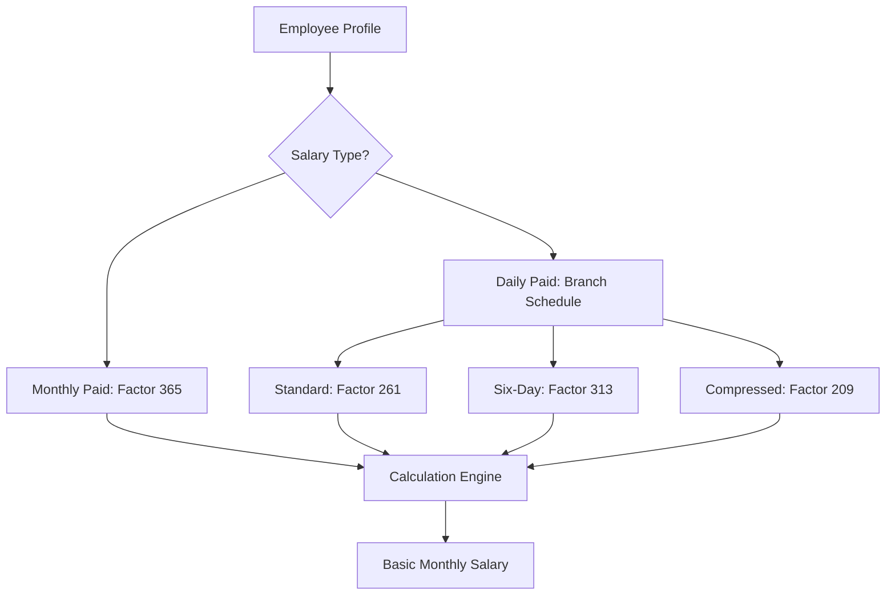
```mermaid
graph TD
A["Employee Profile"] --> B{"Salary Type?"}
B --> C["Monthly Paid: Factor 365"]
B --> D["Daily Paid: Branch Schedule"]
D --> E["Standard: Factor 261"]
D --> F["Six-Day: Factor 313"]
D --> G["Compressed: Factor 209"]
C --> H["Calculation Engine"]
E --> H
F --> H
G --> H
H --> I["Basic Monthly Salary"]
```

- **Live EEMR Forecasting**: The Personnel Registry features a **real-time reactive engine** that computes EEMR Monthly and Daily rates instantly as you type. 
- **Schedule-Aware Multipliers**: The system automatically detects the **Branch Archetype** (Standard, Compressed, or Six-Day) and applies official DOLE mathematical factors (**30.42, 26.08, 21.75, 17.42**) for perfect monthly forecasting.
- **Bi-Directional Editing**: Admins can enter a target value in any field (e.g., Target Monthly Salary), and the system will **inverse-calculate** the required Hourly Rate while preserving mathematical integrity for OT/Holiday pay.
- **Interactive Factor Selection**: Seamlessly toggle between DOLE-suggested factors (**395, 313, 305, 261**) based on company policy and witness the salary impact in real-time.
- **DOLE Handbook Alignment**: All implemented formulas are strictly derived from Section 6, Chapter I of the Rules Implementing Republic Act No. 6727, including 10-hour day support for compressed work weeks.

### 1. Hybrid Cloud Edge Architecture
- **Statutory Backend**: Django 5.2 hosted on **Render** (Auto-scaling, Global Edge).
- **Glassmorphic Frontend**: Vue 3.4 hosted on **Vercel** (Global CDN, 100ms deployments).
- **Persistent Data**: **PostgreSQL** for cloud-native transactional storage.
- **Enterprise Bridge**: Biometric records are pushed from private office networks to the cloud via the **BizMaker Multi-Platform Bridge Agent** using secured HTTPS endpoints.
- **Resilience Layer**: The system features an integrated "Finalized Recovery" mechanism to restore mission-critical imports and logic automatically if repository corruption is detected.

### 2. Philippine Payroll Compliance
- **Payroll XLSX Export (Premium)**: Multi-sheet Excel workbook with live formulas, a Master Summary, and dynamic statutory contribution lookups (SSS/PH/HDMF). Individual employee calculation sheets are generated but securely hidden to ensure a clean, executive-level layout without breaking complex formulas.
- **EEMR Logic:** All salary computations for both monthly-paid and daily-paid employees now follow the official DOLE EEMR formulas, with selectable factors and UI visibility for computed values.
- **Semi-Monthly Processing**: Configurable 15-day pay cycles (e.g., 6th–20th / 21st–5th) via the Global Configuration.
- **Official BIR Reporting**: 
  - **BIR Form 1601-C (PDF)**: Professional PDF summaries for monthly remittance.
  - **Annual Alpha-List (.DAT)**: Mandatory BIR-compliant file format for validation modules.
- **Bank Transmittal (CSV)**: Grouped salary disbursement files with period identifiers.
- **Holiday Pay Matrix**: Automated Regular (200%), Special (130%), Local (130%), and Rest Day (130%) premiums with full DOLE-compliant stacking for double holidays, holiday+rest day combos, and mixed-type overlaps.
- **Unworked Regular Holiday Pay**: Eligible daily-paid employees who do not work on a single regular holiday automatically receive a 100% daily rate unworked premium to fulfill the DOLE "no work, still paid" mandate.
- **Service Charge Distribution**: 100% of collected service charges are distributed equally among covered employees in a locked, atomic transaction during payroll generation (RA 11360).
- **Separation Pay Minimums**: The engine enforces a strict minimum floor—regardless of the authorized cause (e.g., retrenchment at 0.5x, or labor-saving devices at 1.0x), separation pay will never be less than one month's basic salary (Art. 298/299).
- **13th Month Pay Base**: Basic salary is calculated strictly according to PD 851, explicitly excluding overtime pay, night shift differential, holiday premiums, COLA, leave equivalents, and profit-sharing from the annualized base.
- **DOLE Overtime Stacking**: Dynamic OT multiplier computed from the day rate — handles all combinations automatically:

  | Day Type | Day Rate | OT Rate | Example (₱100/hr) |
  |----------|:---:|:---:|:---:|
  | Normal | 1.00× | 1.25× | ₱125 |
  | Rest Day | 1.30× | 1.69× | ₱169 |
  | Special Holiday | 1.30× | 1.69× | ₱169 |
  | Special + Rest Day | 1.50× | 1.95× | ₱195 |
  | Regular Holiday | 2.00× | 2.60× | ₱260 |
  | Regular + Special | 2.30× | 2.99× | ₱299 |
  | Holiday + Rest Day | 2.60× | 3.38× | ₱338 |
  | Double Holiday | 3.00× | 3.90× | ₱390 |
  | Dbl Holiday + Rest | 3.90× | 5.07× | ₱507 |

- **Night Shift Differential (NSD)**: 10% premium stacks multiplicatively on top of the applicable rate per DOLE:

  | Scenario | Rate | +NSD 10% | Total/hr (₱100) |
  |----------|:---:|:---:|:---:|
  | Normal OT + NSD | 1.25× | +₱12.50 | ₱137.50 |
  | Rest Day OT + NSD | 1.69× | +₱16.90 | ₱185.90 |
  | Holiday OT + NSD | 2.60× | +₱26.00 | ₱286.00 |
  | Special + Rest OT + NSD | 1.95× | +₱19.50 | ₱214.50 |
  | Double Holiday OT + NSD | 3.90× | +₱39.00 | ₱429.00 |
  | Dbl Holiday + Rest OT + NSD | 5.07× | +₱50.70 | ₱557.70 |

### 3. Employee Self-Service (ESS) & Modern SaaS Onboarding
- **Unified Registration Portal**: All users enter through a single, streamlined registration flow. The system intelligently forks their experience based on whether they are joining a workspace or starting their own.
- **Interactive "Empty State" Dashboard**: New users who haven't yet joined a company are greeted with a premium glassmorphic dashboard featuring two primary paths:
  - **Join Company**: Link to an existing HR profile using a secure, 12-character Invite Code.
  - **Start Workspace**: Instantly provision a new Tenant, upgrade to Admin role, and launch the Setup Wizard.
- **Secure Employee Invite System**:
  - **Frictionless Quick-Draft Add**: Admins can instantly register a tenant-isolated placeholder employee named `Employee #[Count+1]` with default basic parameters with a single click, generating a secure onboarding Invite Code (e.g. `BIZ-XXXX-YYYY`) immediately.
  - **Invites Lifecycle**: Codes are valid for 7 days, and are automatically invalidated/cleared in the database as soon as the employee joins, preventing reuse or unauthorized linkage.
  - **Robust Fallback**: If invite generation fails, the system automatically rolls back database operations by deleting the draft placeholder, preventing orphaned, code-less employees.
- **Self-Service Profile Management & Admin Verification**:
  - **First-time Onboarding Bypass**: When employees log in for the first time using their Invite Code, they can set their names (including middle name), gender, and bank/tax details immediately without requiring approval, ensuring a smooth setup.
  - **Admin Approval Queue**: After initial onboarding, any subsequent changes to legal name (First, Middle, Last) or Gender are routed to the **Verification Requests Queue** for Admin approval. Bank accounts, SSS, PhilHealth, TIN, and Pag-IBIG numbers update directly.
  - **Locked Contract Parameters**: Employees can transparently view their basic salary, rates (daily, hourly), department, branch, and position under lock indicators, but cannot edit them.
  - **Real-Time Change Receipts (`EmployeeChangeLog`)**: Every direct profile modification by an admin or approved request creates a detailed log. Employees see a historical side-by-side comparison (strike-through of old values next to new highlighted ones) showing exactly who changed their profile parameters and when.
- **Comprehensive Transparency**:
  - **Digital Payslips**: Instant access to historical payslips with detailed earnings and deduction breakdowns.
  - **Attendance History**: View past 30 days of clock-in/out records with daily status indicators.
  - **Real-Time Leave Credits**: Track remaining SIL/VL/SL balances with interactive progress visualization.
- **Self-Service Filing (ESS)**:
  - **Leave Filing**: Submit leave requests with auto-verification against credit balances.
  - **Overtime Filing**: Record OT hours for specific dates with reason tracking.
  - **Time Adjustments**: File corrections for missed clock-ins/outs to ensure accurate payroll.
  - **Loan Applications**: Apply for salary or emergency loans directly from the portal.

### 4. Enterprise SaaS & Billing (2026)
- **14-Day Free Trial**: Every new workspace starts with a full-featured 14-day trial to explore the ecosystem.
- **SaaS Guardrails**:
  - **Employee Cap**: Trial accounts are limited to **10 employees**.
  - **Branch Cap**: Trial accounts are limited to **1 branch**.
  - **Feature Freeze**: Upon trial expiry, the system enters a **read-only mode**. Admins can view data but cannot create new employees, attendance, or payroll until a subscription is active.
- **Flexible Subscription Plans**:
  - **Starter / Pro / Enterprise** tiers with tiered pricing and capacity limits.
  - **Monthly & Annual Billing**: Automated cycle management and discounts for annual commitments.
- **Self-Serve Billing Dashboard**: Manage plan selection, view current usage vs limits, and track payment history.
- **Automated Invoicing**: Professional invoice generation for every transaction, tracking subtotal, tax, and total payments.

#### DOLE Pay Stacking Engine
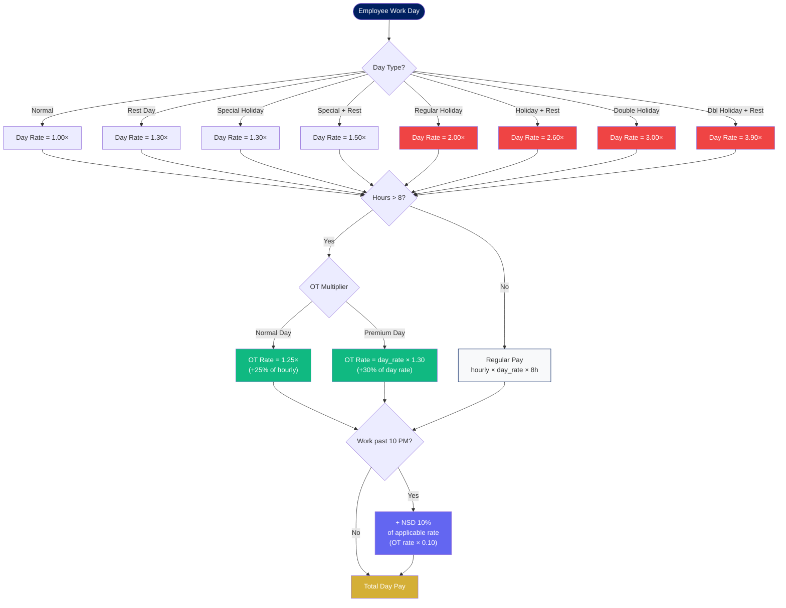
```mermaid
flowchart TD
    DAY([Employee Work Day]) --> TYPE{Day Type?}
    
    TYPE -- "Normal" --> BASE1["Day Rate = 1.00×"]
    TYPE -- "Rest Day" --> BASE2["Day Rate = 1.30×"]
    TYPE -- "Special Holiday" --> BASE3["Day Rate = 1.30×"]
    TYPE -- "Special + Rest" --> BASE4["Day Rate = 1.50×"]
    TYPE -- "Regular Holiday" --> BASE5["Day Rate = 2.00×"]
    TYPE -- "Holiday + Rest" --> BASE6["Day Rate = 2.60×"]
    TYPE -- "Double Holiday" --> BASE7["Day Rate = 3.00×"]
    TYPE -- "Dbl Holiday + Rest" --> BASE8["Day Rate = 3.90×"]

    BASE1 --> HOURS{Hours > 8?}
    BASE2 --> HOURS
    BASE3 --> HOURS
    BASE4 --> HOURS
    BASE5 --> HOURS
    BASE6 --> HOURS
    BASE7 --> HOURS
    BASE8 --> HOURS

    HOURS -- "No" --> REG["Regular Pay\nhourly × day_rate × 8h"]
    HOURS -- "Yes" --> OT{OT Multiplier}
    
    OT -- "Normal Day" --> OT1["OT Rate = 1.25×\n(+25% of hourly)"]
    OT -- "Premium Day" --> OT2["OT Rate = day_rate × 1.30\n(+30% of day rate)"]

    OT1 --> ND{Work past 10 PM?}
    OT2 --> ND
    REG --> ND

    ND -- "No" --> FINAL[Total Day Pay]
    ND -- "Yes" --> NSD["+ NSD 10%\nof applicable rate\n(OT rate × 0.10)"]
    NSD --> FINAL

    style DAY fill:#002060,color:#fff
    style FINAL fill:#D4AF37,color:#fff
    style NSD fill:#6366f1,color:#fff
    style OT1 fill:#10b981,color:#fff
    style OT2 fill:#10b981,color:#fff
    style REG fill:#f8f9fa,stroke:#002060
    style BASE5 fill:#ef4444,color:#fff
    style BASE6 fill:#ef4444,color:#fff
    style BASE7 fill:#ef4444,color:#fff
    style BASE8 fill:#ef4444,color:#fff
```

- **Government Tables**: Automated SSS, PhilHealth, and Pag-IBIG deduction rules. The engine now records both employee deductions and **Employer Statutory Contributions** (including EC) on the payslip to facilitate precise remittance reporting.
- **Resilience Recovery**: The engine includes a surgical self-healing layer that restores missing Python imports and logic (e.g., `loans/views.py`, `shifts/views.py`) to prevent system-wide payroll failures during codebase migrations.
- **Admin Configuration Toggles**:
    - **Auto-accrue 14th–16th Month Pay**: 13th month accrues from earned basic pay across the year and is released during December payroll periods. When toggled ON, all employees receive 14th–16th accrual eligibility and toggles are LOCKED.
  - **Enable Bonus Management**: Master switch for Christmas, Perfect Attendance, and Manual bonuses.

#### Admin Config Toggle Flow
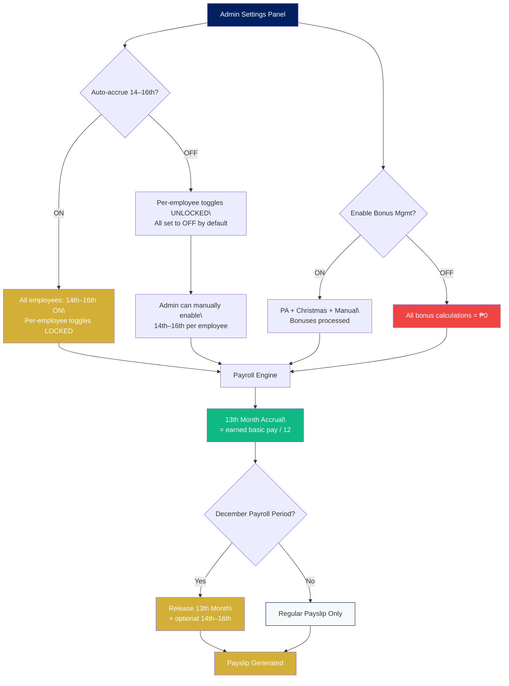
```mermaid
flowchart TD
    CFG[Admin Settings Panel] --> A13{Auto-accrue 14–16th?}
    
    A13 -- ON --> LOCK["All employees: 14th–16th ON\\nPer-employee toggles LOCKED"]
    A13 -- OFF --> MANUAL["Per-employee toggles UNLOCKED\\nAll set to OFF by default"]
    MANUAL --> ADMIN["Admin can manually enable\\n14th–16th per employee"]
    
    LOCK --> ENGINE[Payroll Engine]
    ADMIN --> ENGINE
    
    CFG --> BONUS{Enable Bonus Mgmt?}
    BONUS -- ON --> BPROC["PA + Christmas + Manual\\nBonuses processed"]
    BONUS -- OFF --> BSKIP["All bonus calculations = ₱0"]
    
    BPROC --> ENGINE
    BSKIP --> ENGINE
    
    ENGINE --> ACCRUAL["13th Month Accrual\\n= earned basic pay / 12"]
    ACCRUAL --> DEC{December Payroll Period?}
    DEC -- Yes --> RELEASE["Release 13th Month\\n+ optional 14th–16th"]
    DEC -- No --> HOLD[Regular Payslip Only]
    RELEASE --> SLIP[Payslip Generated]
    HOLD --> SLIP

    style CFG fill:#002060,color:#fff
    style ACCRUAL fill:#10b981,color:#fff
    style RELEASE fill:#D4AF37,color:#fff
    style LOCK fill:#D4AF37,color:#fff
    style SLIP fill:#D4AF37,color:#fff
    style BSKIP fill:#ef4444,color:#fff
    style HOLD fill:#f8f9fa,stroke:#002060
```

### 5. Smart Biometric Integration
- **"Smart Sync" Profiling**: Automatically updates "Unknown" employee profiles with data from biometric logs, enriching the database on the fly.
- **Break Time Manager**: Global break intervals (e.g., 12:00-13:00) automatically subtracted from work hours if overlapped.
- **Real-time Monitoring**: Instant dashboard updates as employees punch in/out.
- **Hardware Protection**: Prevents "Device Busy" errors when external software (ZKAccess) is connected.

### 6. Advanced Attendance Analytics
- **Unified Period Picker**: Single selector with Day, Week, Month, Year, and Custom Range options. All selections are converted into `start_date` and `end_date` for unified backend filtering.
- **Branch-Level Organization**: A new dedicated Branch Filter allows admins to "sort" all attendance data by customizable company branches, instantly updating logs and summaries.
- **Multi-Select Employee Filter**: Searchable dropdown supporting filtering by employee name or position. Select multiple employees to generate custom group analytics.
- **Period Summary Dashboard**: Aggregated metrics including total work hours, attendance rate, punctuality rate, overtime, late counts, and undertime — all dynamically scoped to the selected period.
- **Punctuality Formula**: Punctuality now reflects both lateness and absences. The rate is calculated from on-time present days over total expected workdays (`present + absent`).
- **Real-Time Period Capping**: If the selected month or year hasn't ended, the backend caps expected workdays to today's date, preventing inflated absence counts. A brief notification informs the admin that figures are still updating.
- **Dynamic Dashboard KPIs**: The "Logs" stat card on the main dashboard dynamically updates its label and count based on the selected trend period (Today/This Week/This Month/This Year).

### 7. Fieldwork & Hybrid Attendance
- **Admin-Controlled Approval**: All fieldwork requests default to `PENDING` status and require explicit admin approval, even if the admin initiated the request.
- **Guaranteed 8-Hour Baseline**: Approved fieldwork guarantees a minimum of 8.0 standard work hours for the day.
- **Custom Request Durations**: Admins can specify custom start/end times per fieldwork request, overriding standard shift windows for granular project-based tracking.
- **Hybrid Overlap Processing**: If an employee clocks into the biometric device on a fieldwork day, the engine merges the two timelines by unioning the shift boundaries (`max(check_in, shift_start)` to `max(check_out, fw_end)`), preventing double-counting while capturing all extended work.
- **Overtime on Extended Days**: Physical presence beyond the standard 8-hour threshold on a fieldwork day correctly generates overtime hours.
- **Night Differential Preservation**: Physical clock-out timestamps past 10 PM on fieldwork days still trigger night differential calculations.
- **Late Excusal**: Employees on approved fieldwork are automatically excused from late penalties.

### 8. Dynamic Attendance Logic
- **Early Punch Capping**: Biometric check-ins before the scheduled shift start (e.g., punching in at 7:00 AM for an 8:30 AM shift) are automatically capped to the shift start time. This prevents early arrivals from artificially inflating `total_hours` or triggering unintended overtime.
- **Explicit Shift Boundaries**: The system no longer assumes fixed 8 or 9-hour shifts. Shift durations are strictly bound by the `standard_shift_start` and `standard_shift_end` times configured per branch, allowing for highly flexible custom timeframes (e.g., 6, 8, or 10-hour shifts).
- **Intelligent Break Subtraction**: Any active break defined in settings with a duration of 1 hour or more is automatically deducted from `total_hours` only if the employee's physical presence actually *overlaps* with the designated break window.

### 9. Security & Reliability
- **Direct JWT Sign-In**: Login uses credential-based JWT token issuance through the standard `/api/token/` endpoint — no email OTP required.
- **DPA (RA 10173) Field-Level Encryption**: Enforces encryption at rest for sensitive employee personal identifiable information (PII) including SSS, TIN, PhilHealth, Pag-IBIG numbers, and bank account numbers using the AES-256 Fernet protocol. Plaintext values are decoupled and transparently decrypted at the ORM layer on verified model access.
- **BIR CAS (RMO 9-2006) Immutable Payroll Locking**: Once a payroll period is finalized (`is_processed=True`), the system locks the period automatically. Direct modifications, deletion (`perform_destroy`), or reprocessing of the period are strictly blocked at the API view level to fulfill computerized accounting auditing standards. Secondary read-only serializing enforces data integrity.
- **Email-Verified Sign-Up**: New account creation requires a 6-digit email verification code. Registration data is held in a `PendingRegistration` record until the code is confirmed, preventing unverified accounts from being created.
- **Secure File Uploads**:
  - **Size Hardening**: Integrated 25MB enforced limit on both frontend (immediate feedback) and backend (security boundary).
  - **MIME & Extension Guards**: Strict verification of file contents for images (photos) and CSV/Excel (rosters).
  - **Filename Obfuscation**: Personal employee photos are automatically renamed to non-predictable UUIDs to prevent directory traversal and metadata leakage.
  - **Storage Isolation**: Media files are stored in `payroll_uploads/` outside the project root for better data isolation.
- **Authenticated Exports**: All reports secured behind JWT, preventing unauthorized data access.
- **Encrypted Comm Keys**: AES-256 encryption for hardware communication keys stored in the database.
- **Defensive Downloads**: Blob-based download logic with race-condition protection.
- **Frontend Deploy Recovery**: The SPA auto-reloads once when a stale Vite chunk is requested after a new deploy, reducing blank-screen failures.
- **Secure Password Change**: Verified identity check requiring current password for admin password resets.
- **Production Validation**: Enforced environment safety checks ensuring all encryption keys are present and valid before the system starts.
- **API Throttling**: Protection against brute-force and scraping.
- **Secure Headers**: HSTS, XSS Filter, and Content-Type Sniffing protection.
- **Forgot Password Verification Security**: The forgot password verification endpoint prevents email enumeration by returning a generic `Invalid reset request.` error response across all failure paths (user not found, active code record not found, and incorrect code entered).
- **Cookie Security Startup Validation**: Django configuration startup validation raises an explicit configuration error if `COOKIE_SAMESITE == 'None'` and cross-origin security requirements are not satisfied (i.e. `COOKIE_SECURE` is false in production).

### 10. Cash Bond & Loan Tracker
- **Multiple Loan Types**: Cash Bond, Salary Loan, SSS Loan, Pag-IBIG Loan, Company Loan.
- **Auto-Deduction**: Active loans are automatically deducted from net pay during payroll processing (split by 2 for semi-monthly).
- **Payment Tracking**: Full payment history per loan — auto-deducted payments linked to payslips, manual payments with notes.
- **Auto-Close**: Loans automatically marked as "Fully Paid" when remaining balance hits zero.
- **Dashboard Summary**: Total active loans, outstanding balance, monthly deduction totals.

### 11. Shift Scheduling & Roster
- **Branch-Specific Work Schedules (Archetypes)**: Enforce Standard (5-day), Compressed (4/10), or Six-Day (Half/Full Saturday) schedules at the branch level. Changing an archetype automatically syncs rest days for all employees in that branch.
- **Shift Templates**: Create reusable shifts (Morning, Mid, Night, Custom) with start/end times, break windows, and color coding.
- **Weekly Calendar Roster**: Visual grid showing all employees × 7 days. Click any cell to quick-assign a shift.
- **Bulk Assignment**: Assign a shift to multiple employees across a date range, with automatic rest-day skipping.
- **Management Calendar Actions**: Click any date in the management calendar to open day-level controls and summaries.
- **Flexible Half-Day Assignment**: From the date drawer or attendance log, apply half-day to employees and choose the time slot (`Morning` or `Afternoon`). The time slots seamlessly adjust their boundaries based on the branch's configuration.
- **Branch Fallback Configuration**: If no shift is assigned, the system relies on the branch-specific work schedule archetype and standard shift boundaries.

### 12. DOLE-Compliant Leave Management System
- **Configurable Policy Engine**: Define rules for each leave type across the company.
  - Set **Annual Credits** (e.g., 5 days for SIL, 15 for VL/SL).
  - Configure **Year-End Rules**: Convert to Cash (Monetize), Carry Over, or Forfeit ("Use it or lose it").
  - Flag **Mandatory Leaves** (like DOLE Service Incentive Leave - SIL) which automatically integrate with payroll and separation pay.
- **Persistent Balance Tracking**: Each employee has yearly ledgers (`LeaveBalance`) for every active policy.
  - Real-time tracking of `total_credits`, `used_credits`, `remaining_credits`, and `carried_over_credits`.
  - Approved leaves automatically deduct from the remaining balance. Cancelling an approved leave restores the credits seamlessly.
- **10 Statutory Leave Types**: Native support for SIL, Vacation, Sick, Maternity (RA 11210), Paternity (RA 8187 with auto-tracking for the 4-delivery cap), Solo Parent (RA 8972), VAWC (RA 9262), Magna Carta (RA 9710), Bereavement, and Emergency leaves.
- **Year-End Batch Processing**: 
  - Executes the configured policies across the entire organization at the end of the fiscal year.
  - Mandated SIL credits are converted to cash and directly injected into the December payslip as a non-taxable (if under ₱90k limit) bonus.
  - Generates comprehensive previews (cash conversion totals, carry-over days) before committing.
- **Integrated Separation Payout**: When an employee is marked as Resigned or Terminated, the system queries all monetizable unused credits (e.g., SIL, VL) and automatically calculates the `leave_conversion_amount` to be included in their final payslip.
- **Integrated Overtime Calculation**: Paid leave hours are intelligently credited toward the employee's daily OT threshold. Taking a paid leave (or half-day paid leave) physically counts as "worked hours" when stacking with actual physical presence to calculate overtime.
  - **Dynamic OT Thresholds**: The threshold adapts to the branch archetype. A full-day paid leave on a 4/10 compressed schedule credits 10 hours toward OT, while standard schedules credit 8 hours.
  - **Half-Day Overtime Compliance**: 
    - **Employee-Requested Half-Days**: Hard-capped at 4 physical hours to prevent unauthorized OT accrual per DOLE standard.
    - **Company-Mandated Half-Days (SIX_DAY_HALF)**: Dynamically lowers the OT threshold to 4.0 for that specific day, allowing any extra physical hours to overflow natively into Overtime payout.
- **Approval Workflow**: Leaves are filed as PENDING and require explicit approval by an administrator with `leaves_permission`. Rejected or cancelled leaves have zero impact on payroll.
- **Leave Dashboard**: Glassmorphic UI featuring live balance cards with animated meters, policy management, and year-end processing tools.

#### Leave Credit Lifecycle
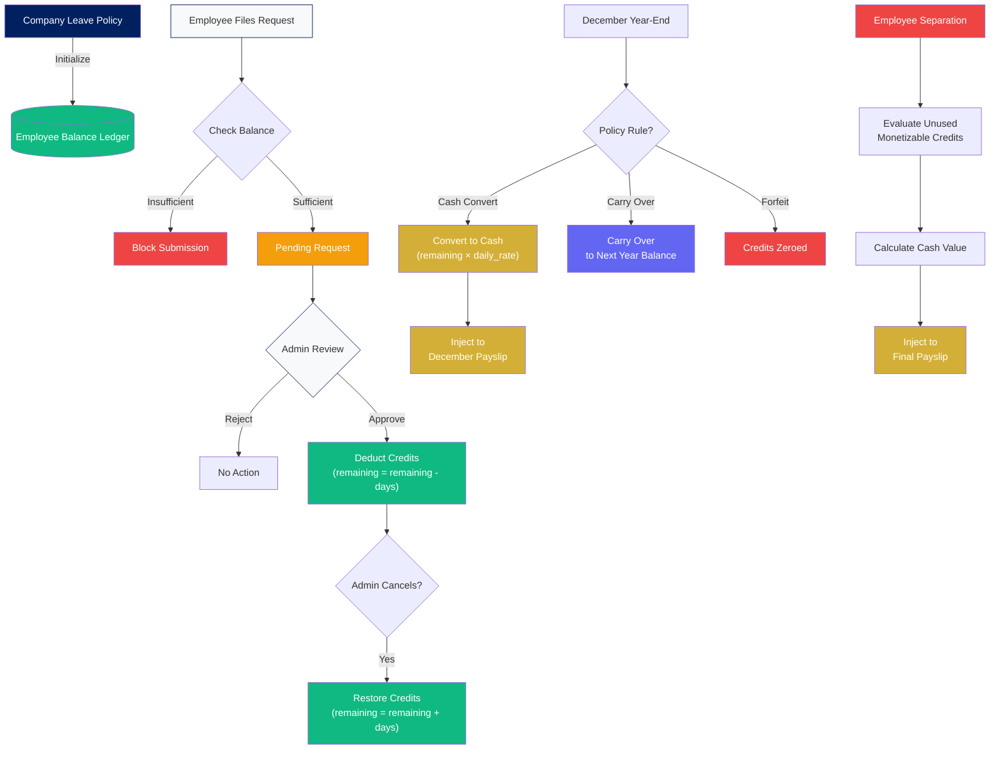
```mermaid
flowchart TD
    POLICY[Company Leave Policy] --> |Initialize| BAL[(Employee Balance Ledger)]
    
    FILE[Employee Files Request] --> BAL_CHECK{Check Balance}
    BAL_CHECK -- Insufficient --> REJECT_UI[Block Submission]
    BAL_CHECK -- Sufficient --> PENDING[Pending Request]
    
    PENDING --> APPROVAL{Admin Review}
    APPROVAL -- Reject --> END1[No Action]
    APPROVAL -- Approve --> DEDUCT["Deduct Credits<br/>(remaining = remaining - days)"]
    
    DEDUCT --> CANCEL{Admin Cancels?}
    CANCEL -- Yes --> RESTORE["Restore Credits<br/>(remaining = remaining + days)"]
    
    YEAREND[December Year-End] --> RULE{Policy Rule?}
    RULE -- Cash Convert --> CASH["Convert to Cash<br/>(remaining × daily_rate)"]
    RULE -- Carry Over --> CARRY["Carry Over<br/>to Next Year Balance"]
    RULE -- Forfeit --> FORFEIT["Credits Zeroed"]
    
    CASH --> PAYROLL["Inject to<br/>December Payslip"]
    
    SEP[Employee Separation] --> EVAL["Evaluate Unused<br/>Monetizable Credits"]
    EVAL --> CALC_SEP["Calculate Cash Value"]
    CALC_SEP --> FINAL_PAY["Inject to<br/>Final Payslip"]

    style POLICY fill:#002060,color:#fff
    style BAL fill:#10b981,color:#fff
    style FILE fill:#f8f9fa,stroke:#002060
    style REJECT_UI fill:#ef4444,color:#fff
    style PENDING fill:#f59e0b,color:#fff
    style APPROVAL fill:#f8f9fa,stroke:#002060
    style DEDUCT fill:#10b981,color:#fff
    style RESTORE fill:#10b981,color:#fff
    style CASH fill:#D4AF37,color:#fff
    style CARRY fill:#6366f1,color:#fff
    style FORFEIT fill:#ef4444,color:#fff
    style PAYROLL fill:#D4AF37,color:#fff
    style SEP fill:#ef4444,color:#fff
    style FINAL_PAY fill:#D4AF37,color:#fff
```

### 13. Payroll Exclusions in Payroll Center
- **Centralized Exclusions Panel**: Payroll Exclusions now live in Payroll Center above Statutory Eligibility for faster payroll-run validation.
- **Branch-Scoped Visibility**: Exclusions list follows the selected branch context.
- **Post-Processing Refresh**: Exclusions auto-refresh after payroll processing to keep the table synchronized with the latest server state.

### 14. Anomaly Detection
  - **Zero AI / Zero RAM Overhead**: Pure SQL queries and threshold rules — no machine learning libraries.
  - **Unified Filtering**: Optimized to support the same date range and multi-employee filters as the rest of the analytics suite.
  - **Ghost OT Detection**: Flags overtime > 3 hours on days with no approved fieldwork.
  - **Missing Checkout**: Flags clock-in records with no corresponding clock-out.
  - **Excessive Lateness**: Flags employees late 5+ times in a single pay period.
  - **Unapproved Rest Day Work**: Flags work logged on rest days without fieldwork approval.
  - **Severity Badges**: High 🔴, Medium 🟡, Low 🔵 — sorted by priority.

### 15. Payroll Simulation Mode
- **Dry-Run Engine**: Preview payroll results without saving — no data is committed.
- **Salary Adjustments**: Apply percentage-based salary changes to see their impact.
- **Bonus Overrides**: Test bonus amounts before committing.
- **Fully-Absent Protection**: If an employee earns no basic pay in the selected period, the simulation keeps gross, net, and statutory deductions at `₱0.00` instead of producing negative net pay.
- **December-Only 13th Month Release**: Accrual is tracked from earned basic pay, but simulated payout only appears in December payroll periods.
- **SC Preview Column**: The simulation table groups SSS, PhilHealth, and Pag-IBIG into a single **SC (Statutory Contribution)** view for faster review.
- **Comparison View**: Side-by-side simulated payslips with totals.

### 16. Responsive Mobile Architecture
- **Dedicated Mobile UX**: Complete parallel mobile interface utilizing dynamically injected wrapper components, preserving the integrity of the desktop UI.
- **Floating Glassmorphic Navbar**: Enhanced bottom navigation matching premium native mobile app paradigms.
- **Intelligent Switching**: Components and data views dynamically pivot between desktop tables and mobile-optimized cards based on viewport detection.
- **Smart Data Culling**: Dense matrices like Payroll ledgers provide clear CTA redirects to the desktop view, ensuring mobile device rendering stays fast and lightweight.

### 17. Real-Time Analytics & Privacy Guard
- **Strategic Visualization**: Glassmorphic analytics suite with reactive-key transitions for Donut and Stacked Bar charts.
- **Multi-Tenant Privacy Guard**: Sensitive financial metrics (Branch Overview, Labor Cost, YTD) are protected by a master password-reveal lock.
  - **Session Persistence**: 3-hour auto-reveal window for convenience.
  - **Instant Lockdown**: Dedicated 🔒 button for immediate re-blurring.
  - **Branch Cost Attribution**: Interactive **Stacked Bar Chart** for multi-branch labor cost comparison dynamically aggregating your custom branches.
  - **System Override Integration**: Secure password protection (`B!zm@k3r2026`) for critical data purging and system overrides.

### 18. Government Remittance Files
- **SSS R3 Report**: CSV export with EE/ER shares and EC contributions.
- **PhilHealth RF-1**: CSV export with premium splits per employee.
- **Pag-IBIG MCRF**: CSV export with contribution breakdowns.
- **One-Click Download**: Dropdown menu on processed payroll periods for instant generation.
- **Automatic Branch Cost Comparison**: Side-by-side analytics for dynamically generated custom branches, including headcount, average salary, and budget utilization.
- **Monthly Total Aggregation**: Combines both semi-monthly cycles into a single remittance file, aggregating per employee.

### 19. Global Holiday Synchronization
- **Nager.Date API Integration**: Automatically synchronizes official Philippine public holidays for any given year into the local database.
- **Holy Week Readiness**: Native handling for Maundy Thursday, Good Friday, and Black Saturday.
- **"Resting" Logic**: Employees are automatically categorized as "Resting" instead of "Absent" on official holidays, preventing false-positive attendance reports.
- **Dynamic Action Bar**: The **Sync Official PH Holidays** and **Translate Names** controls are relocated to the top search bar for permanent visibility, ensuring they remain accessible even as the holiday list grows.
- **One-Click Sync**: Admin-accessible sync button in settings to pull latest government-declared dates.

### 20. Motion Strategy
- **Reactive Chart Re-renders**: Analytics charts (Donut, Stacked Bar) keep their controlled load animations because they help data readability.
- **Reduced Motion UI**: Hover lift effects were removed from tabs, cards, and standard controls so the interface stays visually stable during navigation.

### 21. Employee Registry & Branch Operations
- **Bulk Branch Transfer**: Move selected employees to another branch from the registry using a single bulk action.
- **Same-Branch Guard**: Employees already assigned to the target branch are skipped automatically to prevent no-op moves.
- **Registry Pagination**: The Employees registry paginates at 20 records per page for cleaner browsing and faster scanning.
- **DOLE-Compliant Separation & Archival**:
  - **Final Pay Automation**: Admins select a future payroll period for final pay. The engine automatically excludes the employee from all periods *except* the designated one.
  - **Leave Conversion**: Unused leave credits (SIL/VL) are automatically computed by the **Leave Engine** based on persistent balances and daily rates, ensuring DOLE-compliant final pay with zero manual entry required.
  - **Study Break Logic**: Direct toggle to exclude employees from payroll for study leaves without formally separating them.
  - **Immutable Registry**: Archived employees are moved to a separate vault where their records and payroll history become read-only.
  - **Interactive Compliance Badge**: The **DOLE Compliant** badge in the archive now features a hover-reveal disclosure ("Archived records and payroll history cannot be deleted") to maintain a clean interface while ensuring legal transparency.
- **Delete Loading Guards**: Both single-row and bulk delete actions display loading spinners and disable all delete controls while the API call is in flight, preventing duplicate deletion requests from repeated clicks.

#### Employee Branch Transfer Flow
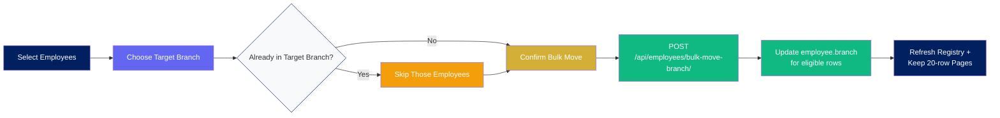
```mermaid
flowchart LR
    SELECT[Select Employees] --> TARGET[Choose Target Branch]
    TARGET --> CHECK{Already in Target Branch?}
    CHECK -- Yes --> SKIP[Skip Those Employees]
    CHECK -- No --> CONFIRM[Confirm Bulk Move]
    SKIP --> CONFIRM
    CONFIRM --> API["POST<br/>/api/employees/bulk-move-branch/"]
    API --> UPDATE["Update employee.branch<br/>for eligible rows"]
    UPDATE --> REFRESH["Refresh Registry +<br/>Keep 20-row Pages"]

    style SELECT fill:#002060,color:#fff
    style TARGET fill:#6366f1,color:#fff
    style CHECK fill:#f8f9fa,stroke:#002060
    style SKIP fill:#f59e0b,color:#fff
    style CONFIRM fill:#D4AF37,color:#fff
    style API fill:#10b981,color:#fff
    style UPDATE fill:#10b981,color:#fff
    style REFRESH fill:#002060,color:#fff
```

#### Employee Delete Safety Flow
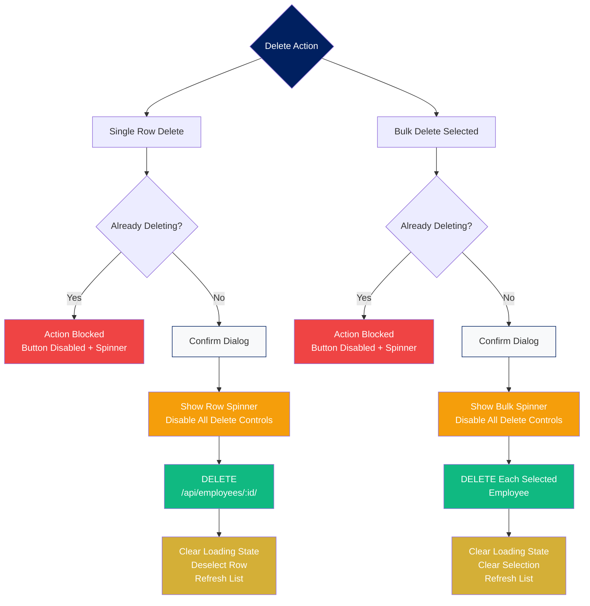
```mermaid
flowchart TD
    ACTION{Delete Action} --> SINGLE[Single Row Delete]
    ACTION --> BULK[Bulk Delete Selected]

    SINGLE --> GUARD1{Already Deleting?}
    GUARD1 -- Yes --> BLOCK1["Action Blocked<br/>Button Disabled + Spinner"]
    GUARD1 -- No --> CONFIRM1[Confirm Dialog]
    CONFIRM1 --> SPIN1["Show Row Spinner<br/>Disable All Delete Controls"]
    SPIN1 --> API1["DELETE<br/>/api/employees/:id/"]
    API1 --> CLEAN1["Clear Loading State<br/>Deselect Row<br/>Refresh List"]

    BULK --> GUARD2{Already Deleting?}
    GUARD2 -- Yes --> BLOCK2["Action Blocked<br/>Button Disabled + Spinner"]
    GUARD2 -- No --> CONFIRM2[Confirm Dialog]
    CONFIRM2 --> SPIN2["Show Bulk Spinner<br/>Disable All Delete Controls"]
    SPIN2 --> API2["DELETE Each Selected<br/>Employee"]
    API2 --> CLEAN2["Clear Loading State<br/>Clear Selection<br/>Refresh List"]

    style ACTION fill:#002060,color:#fff
    style BLOCK1 fill:#ef4444,color:#fff
    style BLOCK2 fill:#ef4444,color:#fff
    style SPIN1 fill:#f59e0b,color:#fff
    style SPIN2 fill:#f59e0b,color:#fff
    style API1 fill:#10b981,color:#fff
    style API2 fill:#10b981,color:#fff
    style CLEAN1 fill:#D4AF37,color:#fff
    style CLEAN2 fill:#D4AF37,color:#fff
    style CONFIRM1 fill:#f8f9fa,stroke:#002060
    style CONFIRM2 fill:#f8f9fa,stroke:#002060
```

### 22. Collaborator Invitations & Access Control
- **Email Invitation Delivery**: Owners can invite collaborators by email and the system sends a join link with an invitation code.
- **Quick Share Choices**: Owners can generate either a **shareable link** or a **standalone short invite code** from the Collaborators page.
- **Join Link + Auth Gate**: Invite links route users to the collaborators page with prefilled code. If the recipient is not authenticated, they are redirected to Login or Register and then returned to complete acceptance.
- **Fallback Invite Code**: Invitations always include a code that can be entered manually in-app.
- **Permission Scoping**: Owners can assign module-level permissions (Employees, Attendance, Shifts, Payroll, Loans, Tax Tables, Settings, Leaves).

#### Collaborator System Architecture
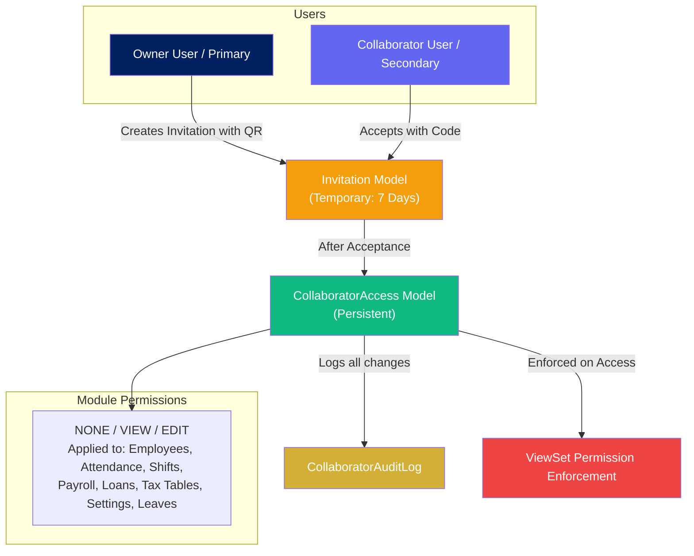
```mermaid
flowchart TD
    subgraph Users
        O[Owner User / Primary]
        C[Collaborator User / Secondary]
    end

    O -->|Creates Invitation with QR| INV["Invitation Model<br/>(Temporary: 7 Days)"]
    C -->|Accepts with Code| INV

    INV -->|After Acceptance| ACC["CollaboratorAccess Model<br/>(Persistent)"]
    
    subgraph Permissions [Module Permissions]
        direction TB
        P["NONE / VIEW / EDIT<br/>Applied to: Employees, Attendance, Shifts,<br/>Payroll, Loans, Tax Tables, Settings, Leaves"]
    end

    ACC --> P
    ACC -->|Logs all changes| AUD[CollaboratorAuditLog]
    ACC -->|Enforced on Access| ENF[ViewSet Permission Enforcement]

    style O fill:#002060,color:#fff
    style C fill:#6366f1,color:#fff
    style INV fill:#f59e0b,color:#fff
    style ACC fill:#10b981,color:#fff
    style AUD fill:#D4AF37,color:#fff
    style ENF fill:#ef4444,color:#fff
```

#### Sign-Up Email Verification Flow
```mermaid
flowchart TD
    VISITOR[New User] --> FORM["Fill Sign-Up Form<br/>User · Email · Password"]
    FORM --> SEND[Request Verification Code]
    SEND --> API{"POST /api/auth/<br/>request-code/"}
    API --> EXIST{Username or<br/>Email Taken?}
    EXIST -- Yes --> ERR1[/Return 400 – Conflict/]
    EXIST -- No --> PEND["Save Registration<br/>(Hashed Password)"]
    PEND --> EMAIL["Deliver 6-Digit Code<br/>via Brevo API"]
    EMAIL --> STEP2[User Enters Code]
    STEP2 --> VERIFY{"POST /api/auth/<br/>verify-code/"}
    VERIFY --> CODE{Code Valid<br/>& Not Expired?}
    CODE -- No --> ERR2[/Return 400 – Invalid Code/]
    CODE -- Yes --> CREATE[Create User + Profile]
    CREATE --> CONSUME["Mark Code Consumed<br/>Delete Registration"]
    CONSUME --> DONE[201 – Account Created]
    DONE --> LOGIN[Redirect to Login]
    LOGIN --> JWT["Issue JWT via<br/>/api/token/"]

    style VISITOR fill:#002060,color:#fff
    style PEND fill:#6366f1,color:#fff
    style EMAIL fill:#D4AF37,color:#fff
    style CREATE fill:#10b981,color:#fff
    style DONE fill:#10b981,color:#fff
    style ERR1 fill:#ef4444,color:#fff
    style ERR2 fill:#ef4444,color:#fff
    style JWT fill:#D4AF37,color:#fff
    style API fill:#f8f9fa,stroke:#002060
    style VERIFY fill:#f8f9fa,stroke:#002060
```

#### Forgot Password Verification Flow
```mermaid
flowchart TD
    USER_REQ[User Forgot Password] --> EMAIL_FORM["Enter Email Address"]
    EMAIL_FORM --> REQ_API{"POST /api/auth/<br/>request-password-reset/"}
    REQ_API --> REQ_CHECK{User exists?}
    REQ_CHECK -- Yes/No --> GENERIC_RESP["Return generic response<br/>'If an account with that email exists...'"]
    REQ_CHECK -- Yes --> GEN_CODE["Generate & Hash Code<br/>Save to EmailVerificationCode"]
    GEN_CODE --> SEND_EMAIL["Send 6-Digit Code via Brevo/Postmark"]
    SEND_EMAIL --> VERIFY_FORM["Enter Code & New Password"]
    GENERIC_RESP --> VERIFY_FORM
    
    VERIFY_FORM --> SUBMIT_CHECK{Frontend Checklist met?<br/>Length, Uppercase, Number}
    SUBMIT_CHECK -- No --> BLOCK["Disable Button / Warning"]
    SUBMIT_CHECK -- Yes --> VERIFY_API{"POST /api/auth/<br/>verify-password-reset/"}
    
    VERIFY_API --> DB_CHECK{Email exists? &&<br/>Active code exists?}
    DB_CHECK -- No --> ERR_RESP["Return 'Invalid reset request.'"]
    DB_CHECK -- Yes --> LOCK_CHECK{Failed attempts >= 3?}
    LOCK_CHECK -- Yes --> LOCK_RESP["Return 'Too many failed attempts.'"]
    LOCK_CHECK -- No --> MATCH_CHECK{Code matches code_hash?}
    
    MATCH_CHECK -- No --> INC_ERR["Increment failed_attempts<br/>Return 'Invalid reset request.'"]
    MATCH_CHECK -- Yes --> SUCCESS["Update User Password<br/>Mark Code Consumed"]
    SUCCESS --> DONE[200 OK - Password Reset Successfully]
    DONE --> LOGIN[Redirect to Login]

    style USER_REQ fill:#002060,color:#fff
    style REQ_CHECK fill:#f8f9fa,stroke:#002060
    style GENERIC_RESP fill:#D4AF37,color:#fff
    style SUBMIT_CHECK fill:#f8f9fa,stroke:#002060
    style VERIFY_API fill:#f8f9fa,stroke:#002060
    style DB_CHECK fill:#f8f9fa,stroke:#002060
    style LOCK_CHECK fill:#f8f9fa,stroke:#002060
    style MATCH_CHECK fill:#f8f9fa,stroke:#002060
    style ERR_RESP fill:#ef4444,color:#fff
    style LOCK_RESP fill:#ef4444,color:#fff
    style INC_ERR fill:#ef4444,color:#fff
    style SUCCESS fill:#10b981,color:#fff
    style DONE fill:#10b981,color:#fff
```

### Collaborator Invite Journey
```mermaid
flowchart TD
    OWNER[Payroll Owner] --> CHOICE{Invite Choice}
    CHOICE --> EMAIL[Send Invitation by Email]
    CHOICE --> CODE[Generate Code]
    CHOICE --> LINK[Generate Link]

    EMAIL --> SEND["Deliver Email<br/>via Brevo API"]
    SEND --> RECIPIENT["Recipient Opens<br/>Join Link"]
    CODE --> MANUAL["Recipient Enters<br/>Code Manually"]
    LINK --> RECIPIENT

    RECIPIENT --> AUTH{Authenticated?}
    AUTH -- Yes --> COLLAB[Open Collaborators Page]
    AUTH -- No --> LOGIN[Login or Register]
    LOGIN --> COLLAB

    COLLAB --> PREFILL[Invite Code Prefilled]
    PREFILL --> ACCEPT[Accept Invitation]
    MANUAL --> ACCEPT
    ACCEPT --> ACCESS["Collaborator Access<br/>Created"]

    style OWNER fill:#002060,color:#fff
    style CHOICE fill:#f8f9fa,stroke:#002060
    style CODE fill:#D4AF37,color:#fff
    style LINK fill:#6366f1,color:#fff
    style SEND fill:#D4AF37,color:#fff
    style LOGIN fill:#6366f1,color:#fff
    style ACCEPT fill:#10b981,color:#fff
    style ACCESS fill:#10b981,color:#fff
```

## License

Copyright (c) 2026 BizMaker. 
